# ROG-Dia Benchmark Report

**Date:** 2026-04-03

## 1. Evaluated Models
* **diar sortformer 4spk v1** (`nvidia/diar_sortformer_4spk-v1`) - [HuggingFace](https://huggingface.co/nvidia/diar_sortformer_4spk-v1)
* **diar streaming sortformer 4spk v2** (`nvidia/diar_streaming_sortformer_4spk-v2`) - [HuggingFace](https://huggingface.co/nvidia/diar_streaming_sortformer_4spk-v2)
* **diar streaming sortformer 4spk v2.1** (`nvidia/diar_streaming_sortformer_4spk-v2.1`) - [HuggingFace](https://huggingface.co/nvidia/diar_streaming_sortformer_4spk-v2.1)
* **pyannote 3 1** (`pyannote/speaker-diarization-3.1`) - [HuggingFace](https://huggingface.co/pyannote/speaker-diarization-3.1)
* **pyannote community 1** (`pyannote/speaker-diarization-community-1`) - [HuggingFace](https://huggingface.co/pyannote/speaker-diarization-community-1)
* **reverb diarization v2** (`Revai/reverb-diarization-v2`) - [HuggingFace](https://huggingface.co/Revai/reverb-diarization-v2)
* **speaker diarization precision 2** (`pyannote/speaker-diarization-precision-2`) - [HuggingFace](https://huggingface.co/pyannote/speaker-diarization-precision-2)

## 2. Executive Summary

| Model                               |   Collar | DER       | Purity    | Cover     | Miss     | FA       | Conf     | RTF        | VRAM (GB)   | Completed   |
|-------------------------------------|----------|-----------|-----------|-----------|----------|----------|----------|------------|-------------|-------------|
| speaker diarization precision 2     |     0.25 | **17.83** | **87.31** | 89.44     | 14.88    | 1.42     | **1.20** | 0.03       | **0.0**     | 12/12       |
| diar streaming sortformer 4spk v2   |     0.25 | 19.82     | 86.92     | 89.30     | 16.40    | 1.53     | 1.44     | **< 0.01** | 1.6         | 12/12       |
| pyannote community 1                |     0.25 | 22.74     | 81.51     | 86.88     | 13.23    | 2.14     | 8.25     | 0.06       | 1.6         | 12/12       |
| pyannote 3 1                        |     0.25 | 22.79     | 81.77     | 86.74     | 13.23    | 2.14     | 8.26     | 0.06       | 1.6         | 12/12       |
| diar streaming sortformer 4spk v2.1 |     0.25 | 26.65     | 86.03     | 84.92     | 19.92    | **1.30** | 4.46     | < 0.01     | 1.6         | 12/12       |
| reverb diarization v2               |     0.25 | 29.61     | 74.33     | **92.18** | **7.18** | 4.58     | 18.77    | 0.10       | 4.3         | 12/12       |
| diar sortformer 4spk v1             |     0.25 | 56.76     | 80.71     | 48.05     | 16.15    | 2.51     | 8.62     | 0.03       | 104.4       | 8/12        |

### Terminology & Methodology
* **DER (Diarization Error Rate):** Primary metric. Lower is better. Sum of Missed, False Alarm, and Confusion rates.
* **Miss (%):** Speech present in Gold Standard but missed by the model.
* **FA (False Alarm %):** Model predicted speech where Gold Standard is silent.
* **Conf (Confusion %):** Speech correctly detected but assigned to the wrong speaker.
* **Purity (%):** Evaluates cluster purity. High purity = when a model identifies a speaker, it is consistently the same person.
* **Cover (Coverage %):** Evaluates how much of the original speaker's speech was captured under a single hypothesis cluster.
* **RTF (Real Time Factor):** Processing time divided by audio length. e.g., `< 0.01` means exceptionally fast processing.
* **VRAM (GB):** Peak GPU memory utilized. `0.0 GB` indicates an API/Cloud-based model.

## 3. Dataset Errata (Corrections Applied)
Corrections automatically applied via Universal Evaluation Maps (UEM) to account for transcription errors. Models are not penalized for predictions outside these boundaries.

* **`ROG-Dia-GSO-P0016`**: Evaluated only up to 1172.092s. *Reason: Zlati standard se zaključi predčasno pri 19:32 (potrdila avtorica). Preostanek posnetka se ignorira pri izračunu metrik.*

## 4. Visual & Domain Analysis
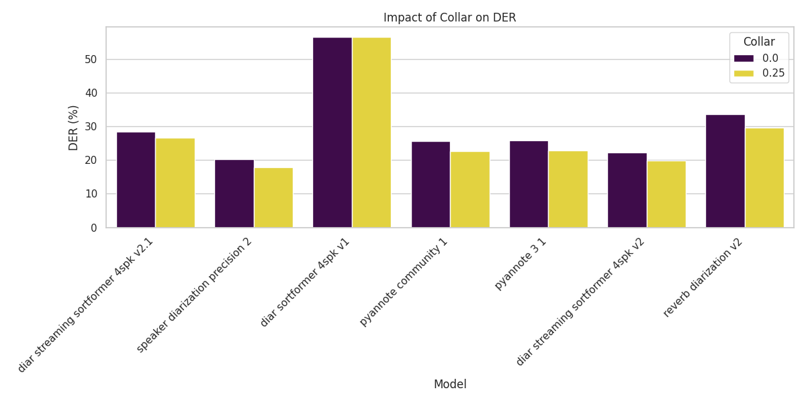

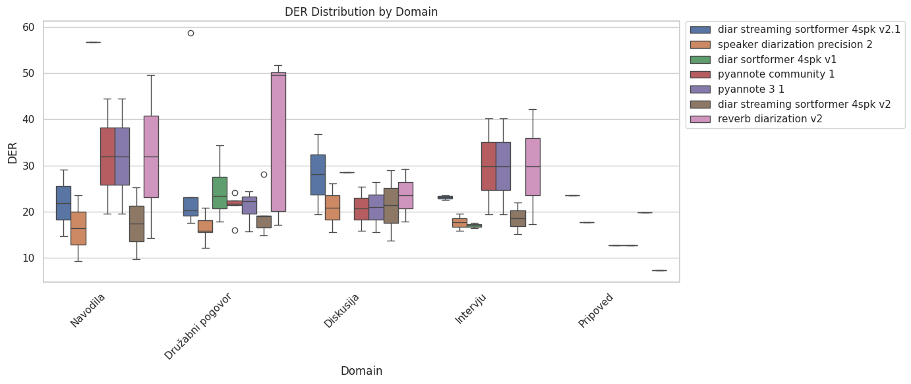

### Domain Comparison (DER %)
Average DER per domain. **Bold** highlights the best model for each domain.

| Domain           | A         |     B |     C |     D | E         | F        | G         |   AVG |
|------------------|-----------|-------|-------|-------|-----------|----------|-----------|-------|
| Diskusija        | 28.47     | 21.38 | 28.08 | 21.02 | **20.67** | 23.55    | 20.89     | 23.44 |
| Družabni pogovor | 24.77     | 19.54 | 27.71 | 21.06 | 21.14     | 37.72    | **16.48** | 24.06 |
| Intervju         | **17.02** | 18.55 | 23.09 | 29.82 | 29.83     | 29.76    | 17.67     | 23.68 |
| Navodila         | 56.60     | 17.47 | 21.9  | 31.96 | 31.99     | 31.92    | **16.41** | 29.75 |
| Pripoved         | nan       | 19.81 | 23.5  | 12.68 | 12.72     | **7.30** | 17.78     | 15.63 |

* **A**: diar sortformer 4spk v1
* **B**: diar streaming sortformer 4spk v2
* **C**: diar streaming sortformer 4spk v2.1
* **D**: pyannote 3 1
* **E**: pyannote community 1
* **F**: reverb diarization v2
* **G**: speaker diarization precision 2

## 5. Deep Dive: File-by-File Analysis
Detailed breakdown for every file. *For metric definitions, see Executive Summary.*

### File: ROG-Dia-GSO-P0005

**Domain:** Navodila | **Quality:** 4 | **Device:** tablični računalnik Samsung Galaxy S6 Lite

> *Z govorkama smo se predhodno dogovorile za snemanje. Da je bil pogovor sproščen, smo govor snemale na domu ene izmed njiju. Pogovor je potekal o temah, ki govorki zanimajo, da sta si lahko izmenjevali navodila.*

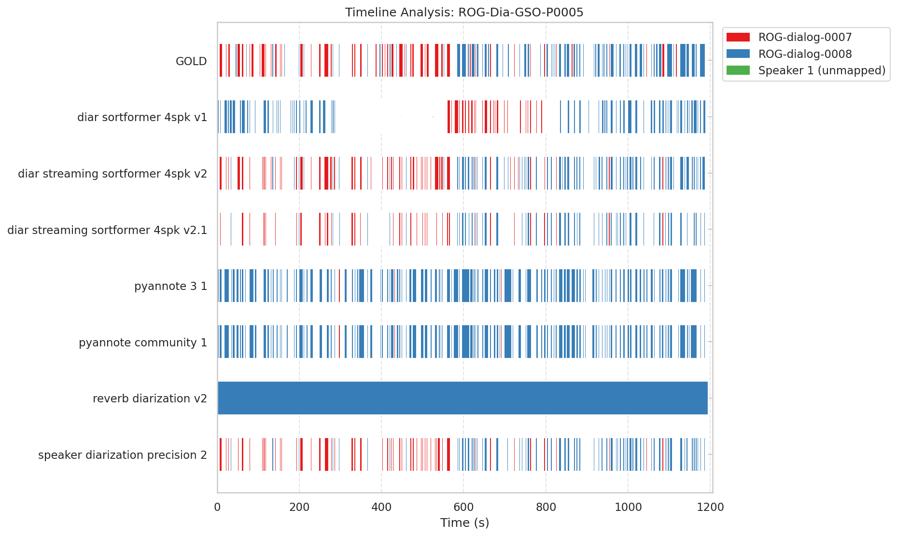

#### 60-Second Snippets (Zoom-in)
Below are 60-second zoomed-in windows showing where the models performed best and worst (based on average DER).

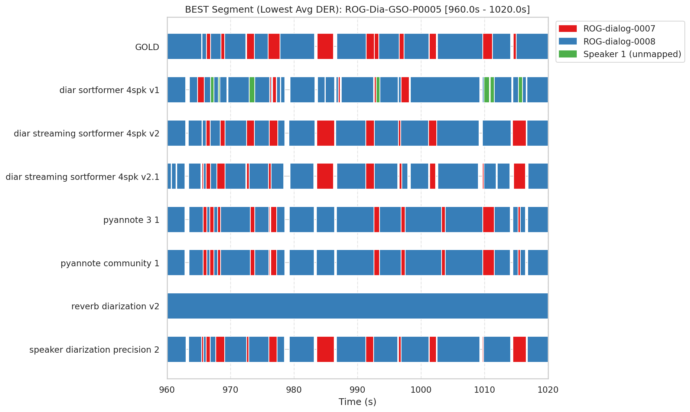

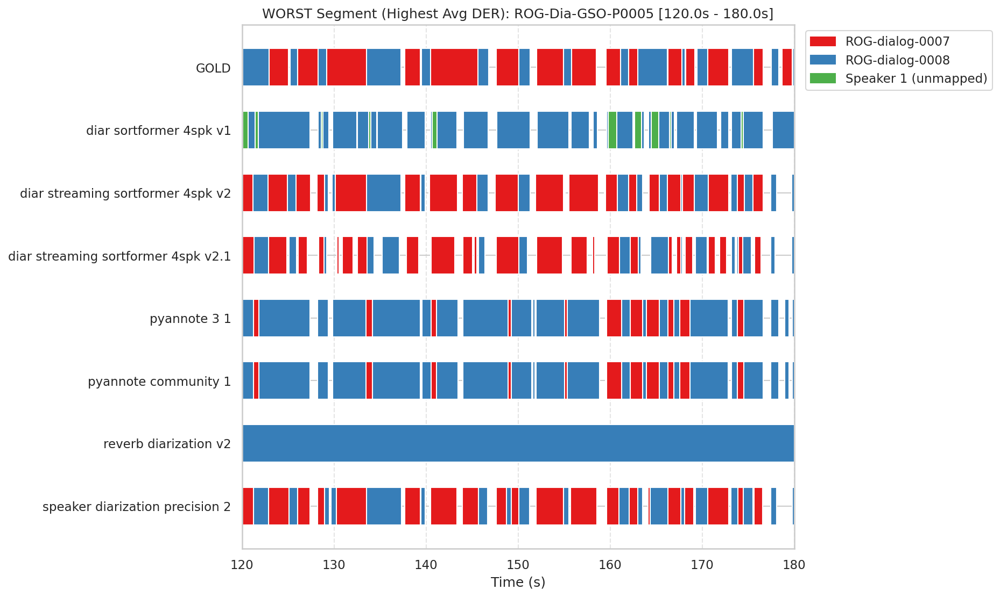

| Model                               | DER      | Miss     | FA       | Conf     | Pur       | Cov        | VRAM (GB)   |
|-------------------------------------|----------|----------|----------|----------|-----------|------------|-------------|
| speaker diarization precision 2     | **9.31** | 7.05     | 1.84     | **0.42** | 83.02     | 84.89      | **0.0**     |
| diar streaming sortformer 4spk v2   | 9.76     | 6.39     | 2.75     | 0.62     | 82.57     | 84.21      | 1.1         |
| diar streaming sortformer 4spk v2.1 | 14.75    | 12.88    | **1.30** | 0.57     | **83.47** | 87.12      | 1.1         |
| pyannote community 1                | 44.38    | **5.97** | 5.30     | 33.11    | 53.47     | 85.52      | 1.6         |
| pyannote 3 1                        | 44.38    | **5.97** | 5.30     | 33.11    | 53.47     | 85.52      | 1.6         |
| reverb diarization v2               | 49.56    | 9.65     | 3.75     | 36.15    | 54.19     | **100.00** | 4.3         |
| diar sortformer 4spk v1             | 56.60    | 16.78    | 3.11     | 36.71    | 57.07     | 62.98      | 47.9        |

---

### File: ROG-Dia-GSO-P0007

**Domain:** Družabni pogovor | **Quality:** 5 | **Device:** Apple iPhone 13

> *Ena sogovornica je obiskala drugo in v kuhinji za mizo sta opravile pogovor, ki se je snemal.*

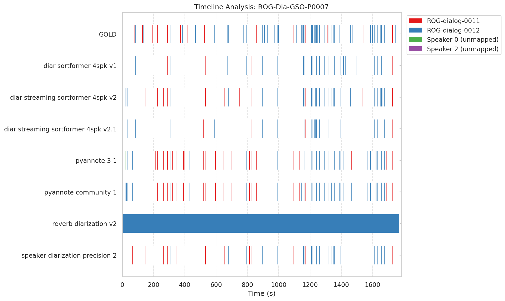

#### 60-Second Snippets (Zoom-in)
Below are 60-second zoomed-in windows showing where the models performed best and worst (based on average DER).

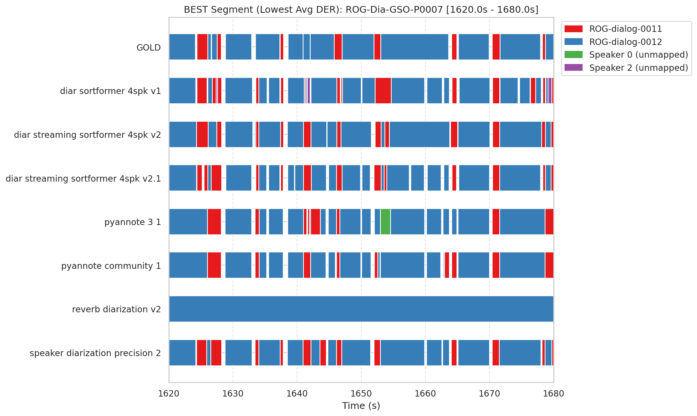

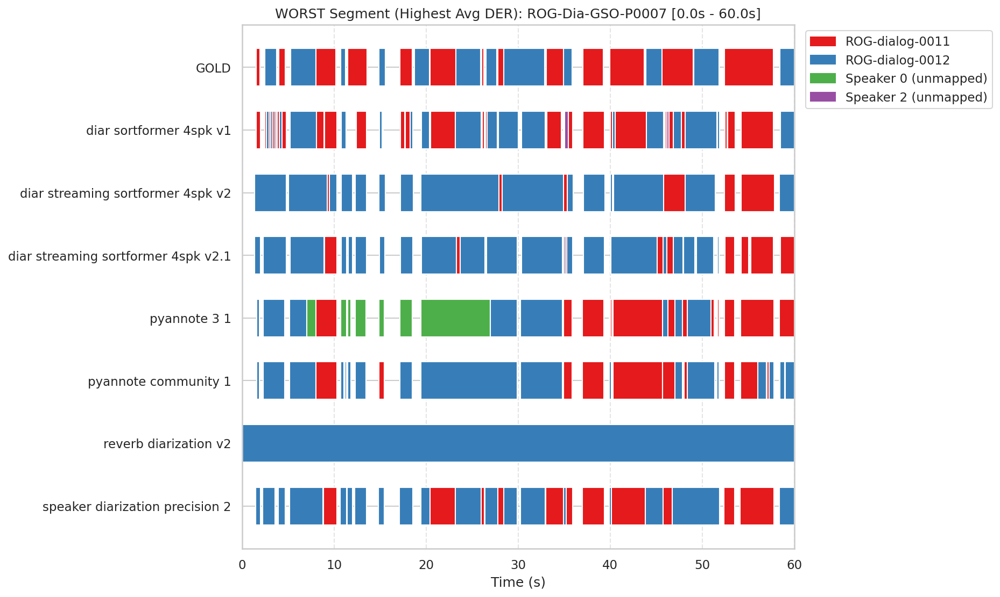

| Model                               | DER       | Miss      | FA       | Conf     | Pur       | Cov        | VRAM (GB)   |
|-------------------------------------|-----------|-----------|----------|----------|-----------|------------|-------------|
| speaker diarization precision 2     | **15.86** | 12.31     | 1.81     | **1.74** | **77.54** | 80.29      | **0.0**     |
| diar streaming sortformer 4spk v2   | 16.58     | 11.63     | 2.47     | 2.48     | 76.39     | 79.00      | 1.5         |
| diar streaming sortformer 4spk v2.1 | 19.12     | 14.77     | **1.68** | 2.67     | 76.30     | 79.65      | 1.5         |
| pyannote community 1                | 21.42     | 12.09     | 2.76     | 6.58     | 72.52     | 73.68      | 1.6         |
| diar sortformer 4spk v1             | 21.70     | **10.74** | 5.58     | 5.38     | 74.68     | 78.16      | 104.4       |
| pyannote 3 1                        | 24.40     | 12.09     | 2.76     | 9.56     | 72.14     | 71.20      | 1.6         |
| reverb diarization v2               | 50.15     | 14.74     | 3.42     | 31.98    | 53.27     | **100.00** | 4.3         |

---

### File: ROG-Dia-GSO-P0008

**Domain:** Diskusija | **Quality:** 4 | **Device:** Iphone 13 mini

> *Pogovor med bratoma o kosilu ter o tehnologiji ter argumentiranje prednosti in slabosti.*

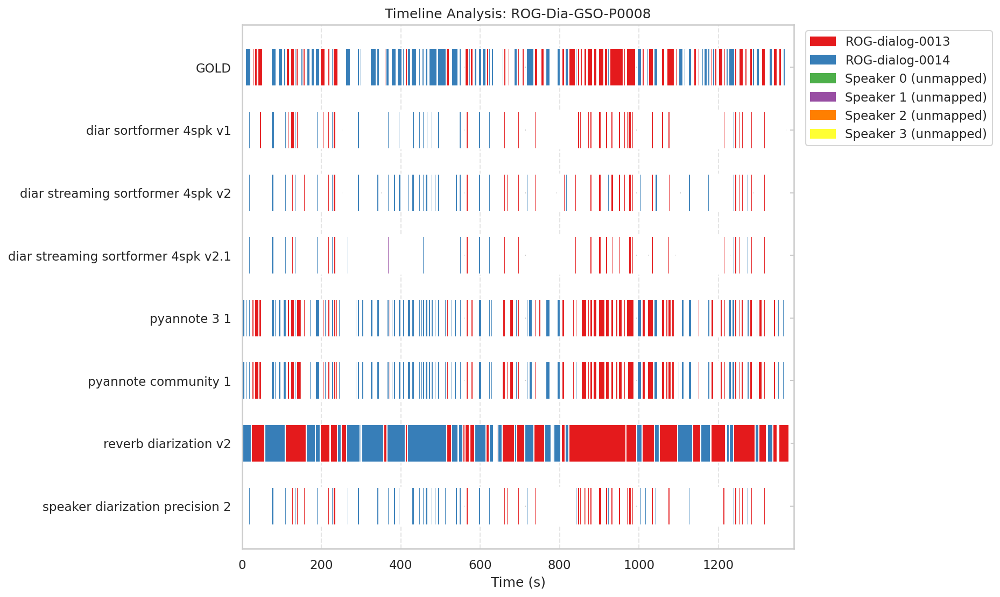

#### 60-Second Snippets (Zoom-in)
Below are 60-second zoomed-in windows showing where the models performed best and worst (based on average DER).

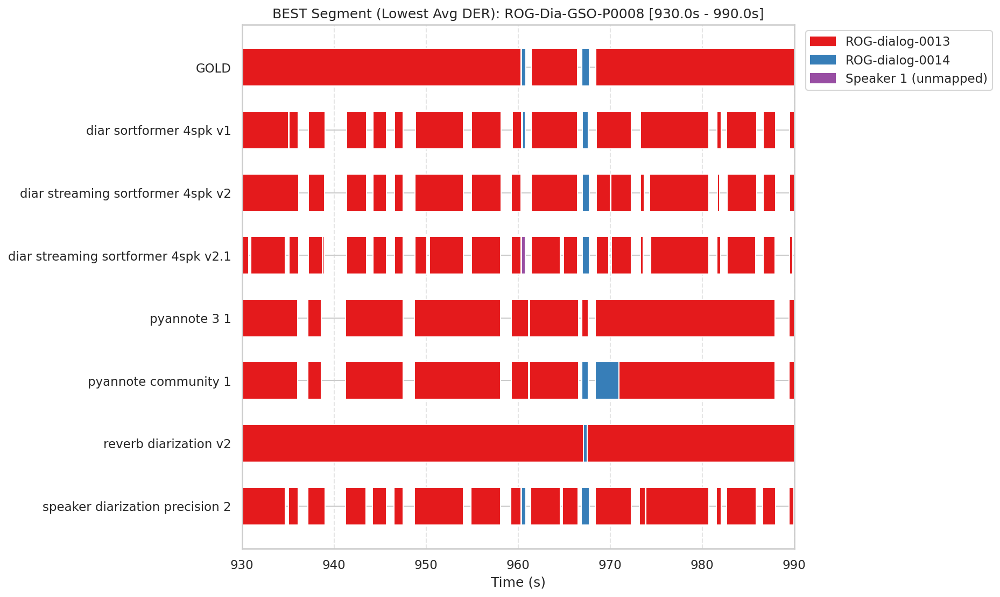

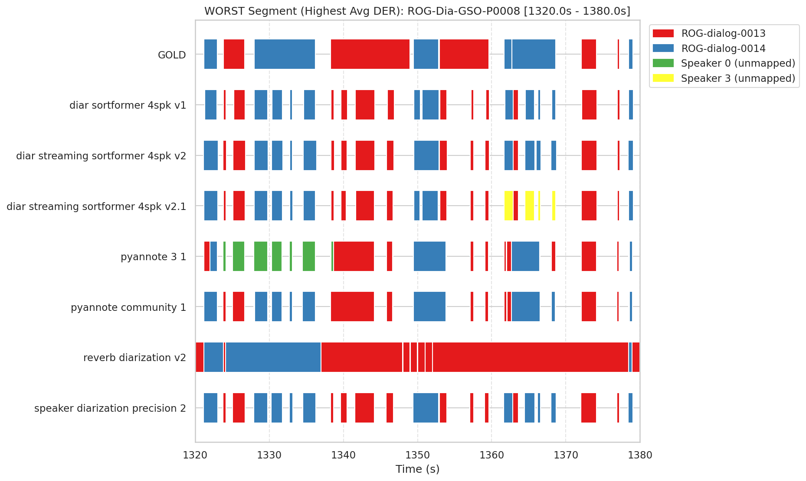

| Model                               | DER       | Miss     | FA       | Conf     | Pur       | Cov       | VRAM (GB)   |
|-------------------------------------|-----------|----------|----------|----------|-----------|-----------|-------------|
| pyannote community 1                | **25.40** | 17.26    | 2.57     | 5.57     | 87.13     | 87.11     | 1.6         |
| speaker diarization precision 2     | 26.16     | 25.13    | **0.53** | **0.50** | 93.71     | **94.78** | **0.0**     |
| pyannote 3 1                        | 26.42     | 17.26    | 2.57     | 6.59     | 87.06     | 85.97     | 1.6         |
| diar sortformer 4spk v1             | 28.47     | 25.90    | 1.45     | 1.12     | 91.55     | 93.25     | 63.9        |
| diar streaming sortformer 4spk v2   | 28.98     | 27.09    | 0.83     | 1.06     | 93.13     | 93.88     | 1.3         |
| reverb diarization v2               | 29.18     | **3.92** | 12.20    | 13.06    | 82.53     | 81.11     | 4.3         |
| diar streaming sortformer 4spk v2.1 | 36.73     | 31.05    | 1.08     | 4.60     | **94.16** | 89.18     | 1.3         |

---

### File: ROG-Dia-GSO-P0009

**Domain:** Družabni pogovor | **Quality:** 5 | **Device:** Mobilni telefon Iphone SE 2020

> *Posnetek je nastal v domačem okolju enega izmed govorcev med njim in njegovim dolgoletnim sosedom in prijateljem na pobudo snemalke. *

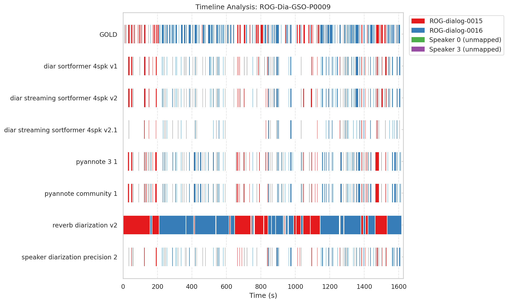

#### 60-Second Snippets (Zoom-in)
Below are 60-second zoomed-in windows showing where the models performed best and worst (based on average DER).

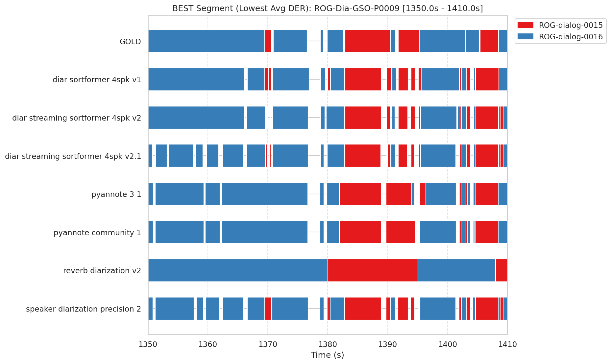

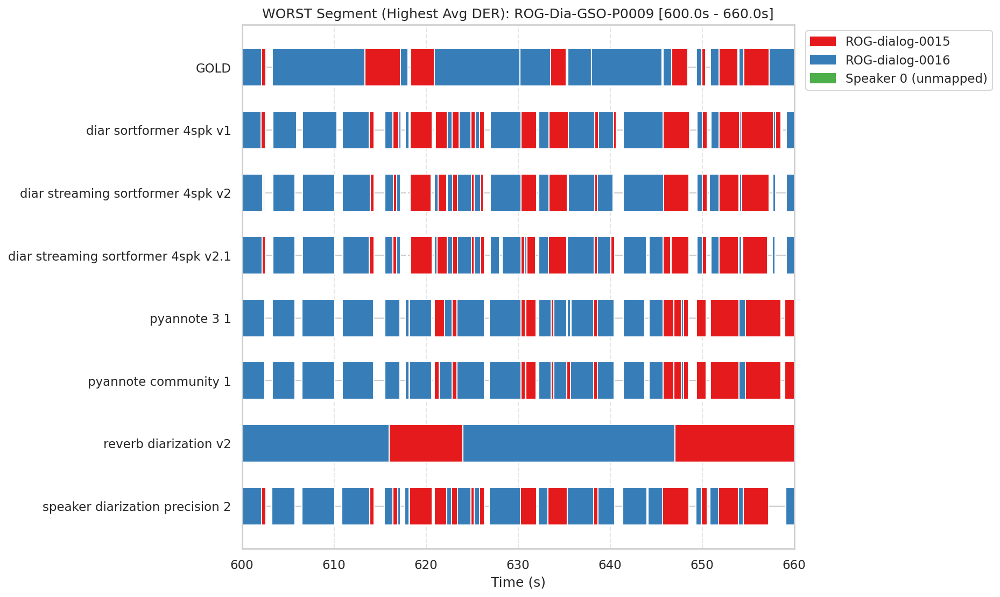

| Model                               | DER       | Miss      | FA       | Conf     | Pur       | Cov       | VRAM (GB)   |
|-------------------------------------|-----------|-----------|----------|----------|-----------|-----------|-------------|
| diar sortformer 4spk v1             | **17.87** | 14.87     | 2.29     | 0.72     | 81.36     | 84.80     | 87.1        |
| speaker diarization precision 2     | 18.09     | 15.52     | 1.97     | **0.60** | 81.21     | 84.49     | **0.0**     |
| diar streaming sortformer 4spk v2   | 19.08     | 16.81     | 1.61     | 0.66     | 82.14     | 85.80     | 1.4         |
| reverb diarization v2               | 20.15     | **11.41** | 3.53     | 5.22     | **82.72** | 81.11     | 4.3         |
| pyannote 3 1                        | 22.27     | 17.36     | 1.86     | 3.04     | 79.77     | 80.62     | 1.6         |
| pyannote community 1                | 22.37     | 17.36     | 1.86     | 3.15     | 79.66     | 80.69     | 1.6         |
| diar streaming sortformer 4spk v2.1 | 23.05     | 21.04     | **1.38** | 0.63     | 81.71     | **85.94** | 1.4         |

---

### File: ROG-Dia-GSO-P0011

**Domain:** Intervju | **Quality:** 4 | **Device:** Mobilna naprava Iphone 13, aplikacija Voice Record.

> *Govorca sta ženska in moški, oba stara okrog 50 let. Je večer, sedita za kuhinjsko mizo. Ženska postavlja moškemu vprašanja o domačem kraju, običajih in spominih iz otroštva ter mladosti. Moški odgovarja na njena vprašanja, ona pa ga med tem tudi spomni na pomembne točke, ki bi jih lahko vključil v svoje odgovore.*

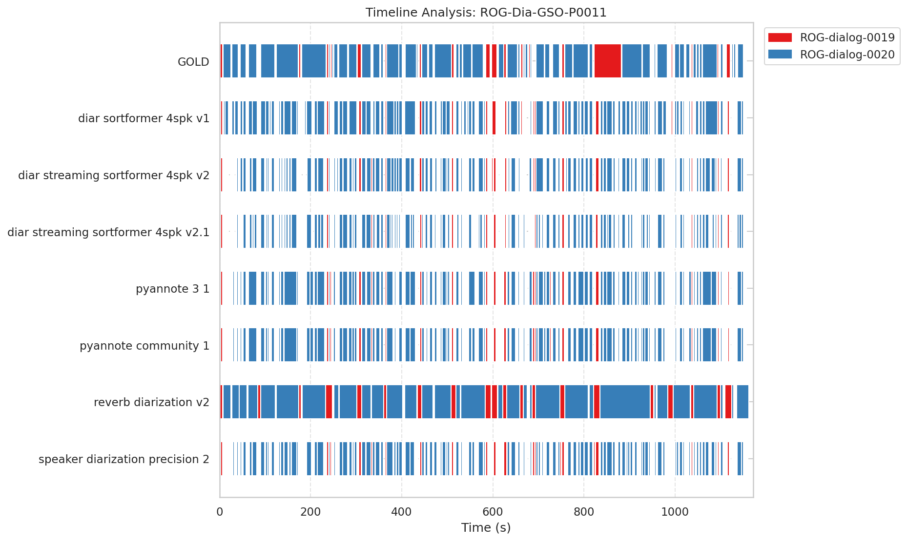

#### 60-Second Snippets (Zoom-in)
Below are 60-second zoomed-in windows showing where the models performed best and worst (based on average DER).

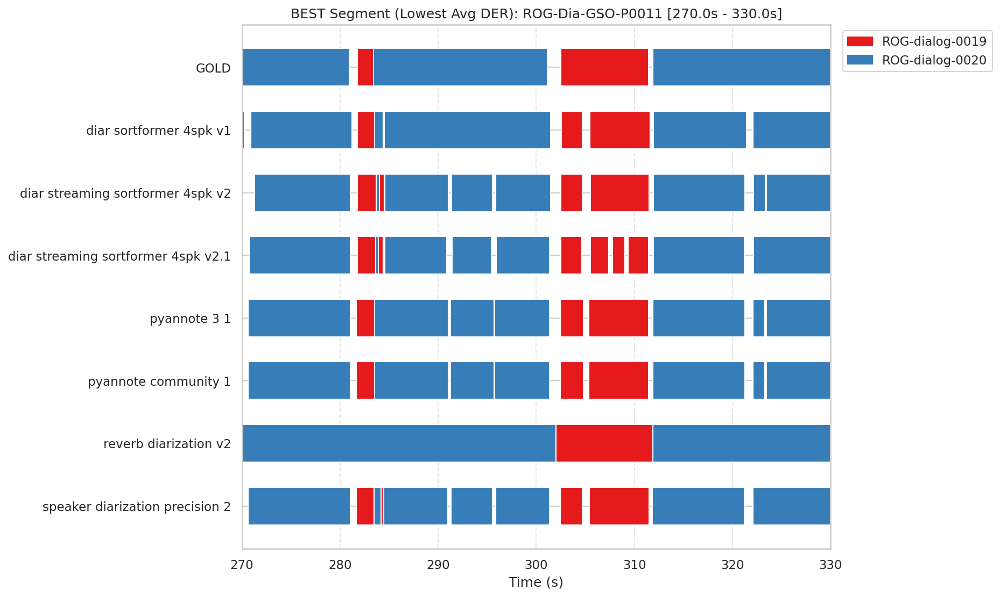

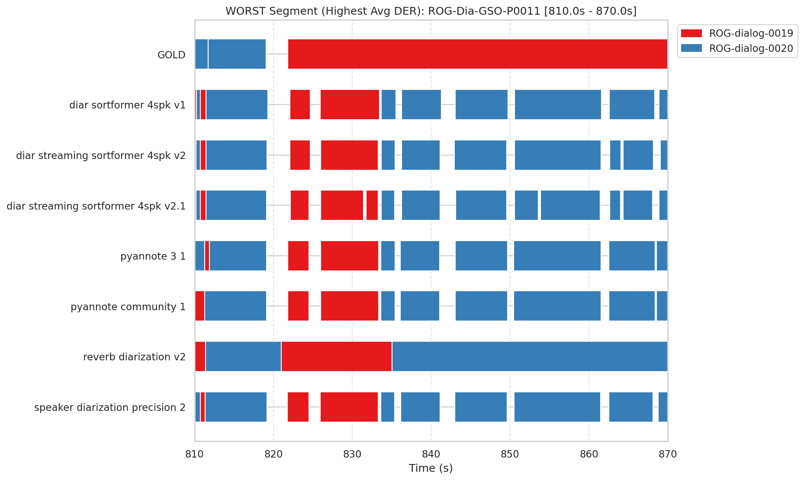

| Model                               | DER       | Miss     | FA       | Conf     | Pur       | Cov       | VRAM (GB)   |
|-------------------------------------|-----------|----------|----------|----------|-----------|-----------|-------------|
| reverb diarization v2               | **17.36** | **3.53** | 6.24     | 7.59     | 88.28     | 87.92     | 4.3         |
| diar sortformer 4spk v1             | 17.54     | 11.52    | 1.84     | 4.18     | **88.89** | **90.47** | 45.7        |
| pyannote 3 1                        | 19.43     | 13.34    | 1.70     | 4.38     | 88.20     | 89.35     | 1.6         |
| pyannote community 1                | 19.45     | 13.34    | 1.70     | 4.41     | 88.17     | 89.37     | 1.6         |
| speaker diarization precision 2     | 19.51     | 13.76    | 1.66     | 4.09     | 88.36     | 90.02     | **0.0**     |
| diar streaming sortformer 4spk v2   | 21.91     | 16.46    | 1.47     | 3.99     | 88.56     | 90.00     | 1.1         |
| diar streaming sortformer 4spk v2.1 | 23.59     | 18.20    | **1.42** | **3.96** | 88.23     | 90.01     | 1.1         |

---

### File: ROG-Dia-GSO-P0012

**Domain:** Intervju | **Quality:** 4 | **Device:** Pametni telefon Samsung Galaxy a53

> *Ena od sogovornic je prišla na obisk k drugi. Usedli sta se za mizo in pričeli s pogovorom.*

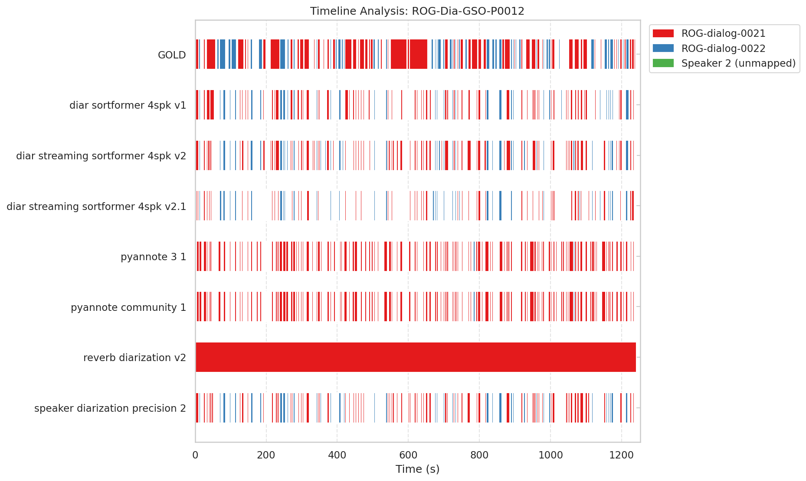

#### 60-Second Snippets (Zoom-in)
Below are 60-second zoomed-in windows showing where the models performed best and worst (based on average DER).

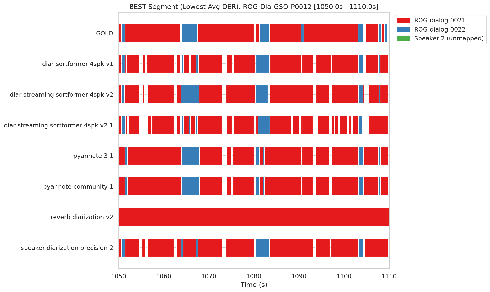

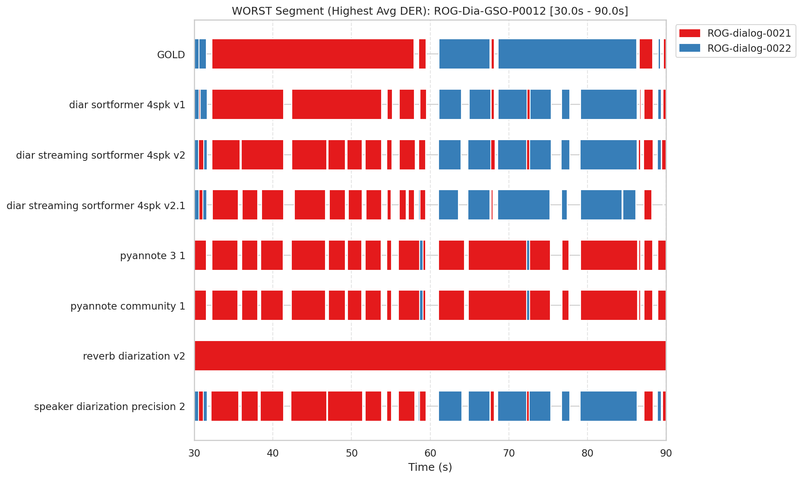

| Model                               | DER       | Miss      | FA       | Conf     | Pur       | Cov        | VRAM (GB)   |
|-------------------------------------|-----------|-----------|----------|----------|-----------|------------|-------------|
| diar streaming sortformer 4spk v2   | **15.19** | 13.26     | 1.40     | 0.53     | 83.08     | 85.54      | 1.2         |
| speaker diarization precision 2     | 15.84     | 14.30     | 1.12     | 0.43     | 83.65     | 86.73      | **0.0**     |
| diar sortformer 4spk v1             | 16.51     | 14.81     | 1.28     | **0.41** | 83.75     | 87.65      | 51.9        |
| diar streaming sortformer 4spk v2.1 | 22.60     | 21.26     | **0.71** | 0.63     | **84.20** | 87.94      | 1.2         |
| pyannote community 1                | 40.21     | 14.10     | 1.54     | 24.57    | 59.63     | 89.87      | 1.6         |
| pyannote 3 1                        | 40.21     | 14.10     | 1.54     | 24.57    | 59.63     | 89.87      | 1.6         |
| reverb diarization v2               | 42.15     | **10.48** | 3.78     | 27.89    | 61.62     | **100.00** | 4.3         |

---

### File: ROG-Dia-GSO-P0016

**Domain:** Diskusija | **Quality:** 3 | **Device:** pametni telefon Huawei P30 PRO

> *Starejši moški in ženska imata diskusijo o svojem otroštvu, odraščanju na kmetih. *

> ⚠️ **ERRATA APPLIED**: Evaluation bounded to 1172.092s.

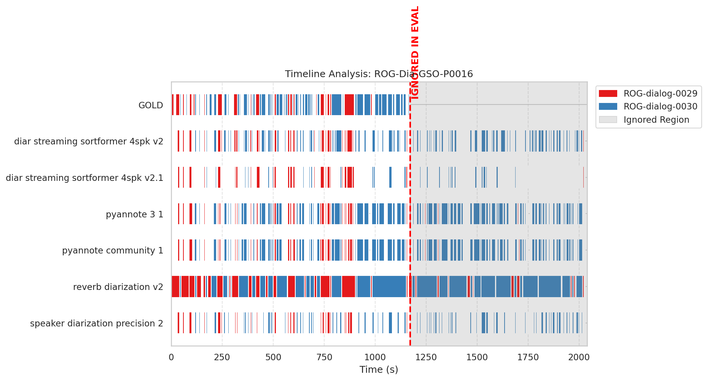

#### 60-Second Snippets (Zoom-in)
Below are 60-second zoomed-in windows showing where the models performed best and worst (based on average DER).

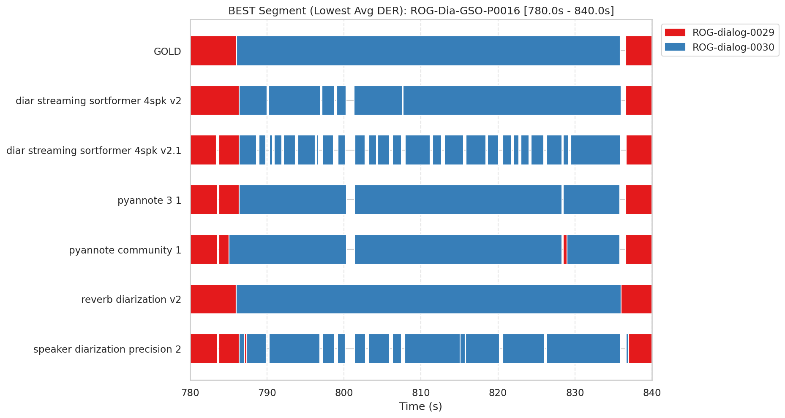

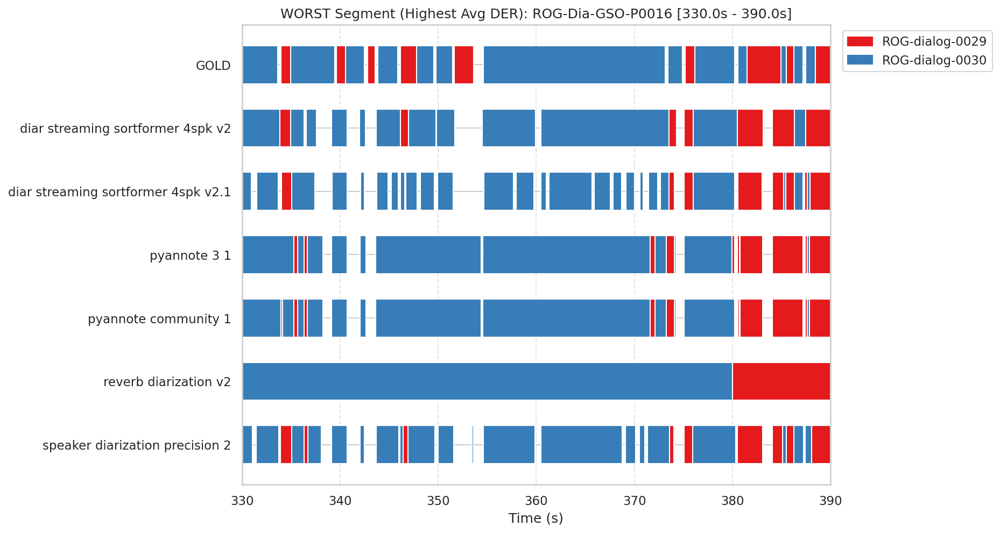

| Model                               | DER       | Miss      | FA       | Conf     | Pur       | Cov       | VRAM (GB)   | Status   |
|-------------------------------------|-----------|-----------|----------|----------|-----------|-----------|-------------|----------|
| diar streaming sortformer 4spk v2   | **13.78** | **11.33** | 1.70     | 0.74     | 80.75     | 83.01     | 1.6         | nan      |
| pyannote 3 1                        | 15.61     | 11.55     | 2.05     | 2.01     | 80.20     | 81.93     | 1.6         | nan      |
| speaker diarization precision 2     | 15.62     | 13.30     | 1.61     | **0.71** | 80.56     | 83.03     | **0.0**     | nan      |
| pyannote community 1                | 15.94     | 11.55     | 2.05     | 2.33     | 79.90     | 81.66     | 1.6         | nan      |
| reverb diarization v2               | 17.93     | 11.82     | 1.32     | 4.79     | **82.59** | 81.75     | 4.3         | nan      |
| diar streaming sortformer 4spk v2.1 | 19.43     | 17.19     | **1.29** | 0.95     | 80.57     | **83.34** | 1.6         | nan      |
| diar sortformer 4spk v1             | nan       | nan       | nan      | nan      | nan       | nan       | nan         | OOM/ERR  |

---

### File: ROG-Dia-GSO-P0018

**Domain:** Družabni pogovor | **Quality:** 5 | **Device:** telefon Samsung A52

> *Dobili smo se v župnišču, se pogovorili o prostoru snemanja, zahtevah posnetka. Govorki sta se odločili za spontan družabni pogovor brez vnaprej pripravljenih tem in vprašanj.*

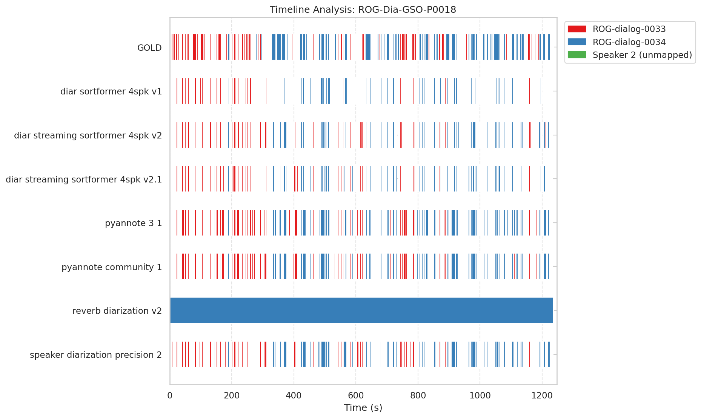

#### 60-Second Snippets (Zoom-in)
Below are 60-second zoomed-in windows showing where the models performed best and worst (based on average DER).

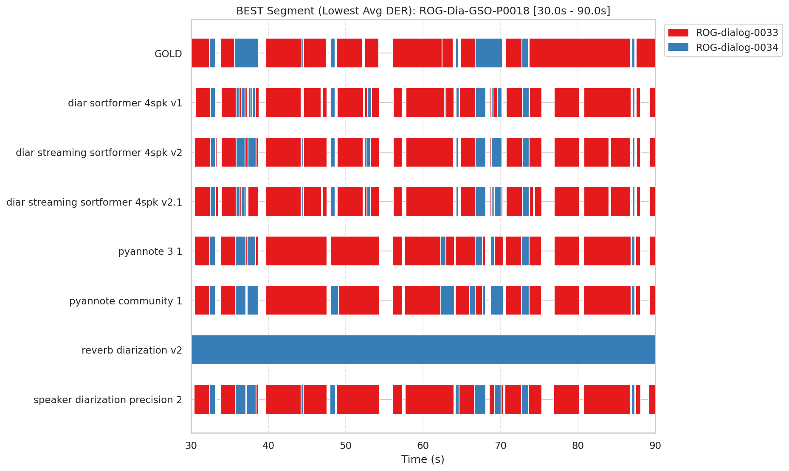

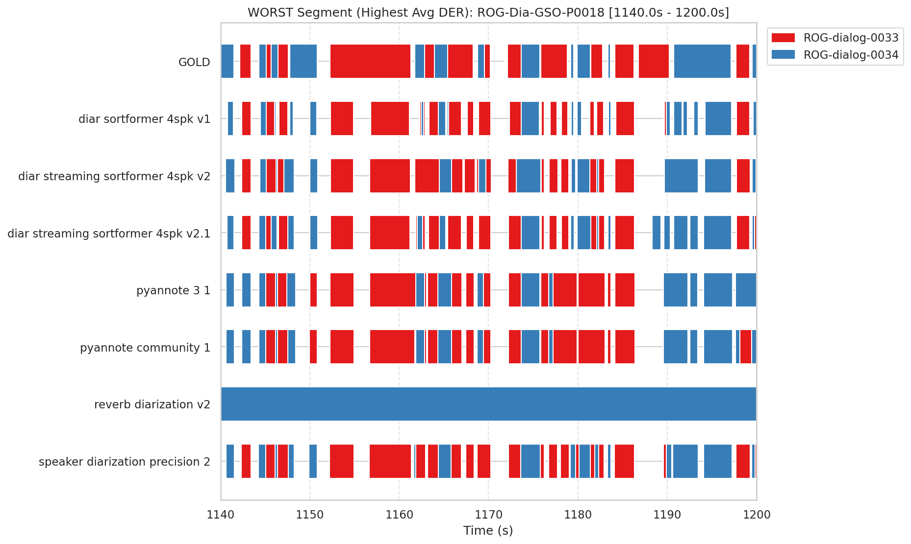

| Model                               | DER       | Miss      | FA       | Conf     | Pur       | Cov        | VRAM (GB)   |
|-------------------------------------|-----------|-----------|----------|----------|-----------|------------|-------------|
| speaker diarization precision 2     | **15.55** | 13.17     | **1.60** | **0.79** | **81.30** | 82.51      | **0.0**     |
| diar streaming sortformer 4spk v2   | 19.05     | 16.06     | 1.75     | 1.25     | 80.27     | 82.55      | 1.2         |
| pyannote 3 1                        | 19.62     | 13.25     | 1.86     | 4.51     | 77.71     | 78.30      | 1.6         |
| diar streaming sortformer 4spk v2.1 | 20.26     | 16.95     | 1.89     | 1.42     | 80.28     | 83.04      | 1.2         |
| pyannote community 1                | 21.66     | 13.25     | 1.86     | 6.55     | 75.78     | 76.69      | 1.6         |
| diar sortformer 4spk v1             | 25.22     | 21.59     | 1.88     | 1.76     | 79.03     | 81.63      | 51.6        |
| reverb diarization v2               | 51.66     | **11.33** | 3.50     | 36.83    | 51.84     | **100.00** | 4.3         |

---

### File: ROG-Dia-GSO-P0019

**Domain:** Pripoved | **Quality:** 4 | **Device:** Iphone 13 mini

> *Pogovor med sestro in bratom, ki sta se pogovarjala o potovanjih. Sestra je delila svojo izkušnjo potovanja v tujino, medtem ko jo je brat spraševal še o drugih vidikih potovanja – od priprav pred odhodom do krajev, ki jih je obiskala.*

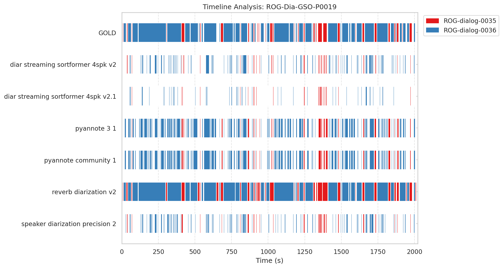

#### 60-Second Snippets (Zoom-in)
Below are 60-second zoomed-in windows showing where the models performed best and worst (based on average DER).

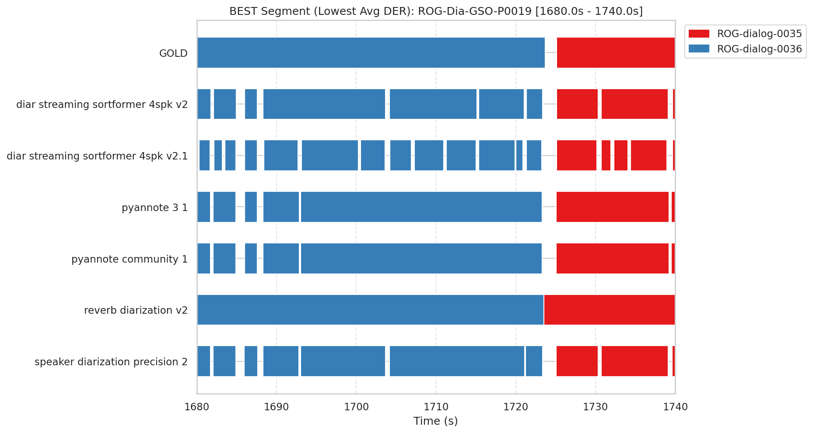

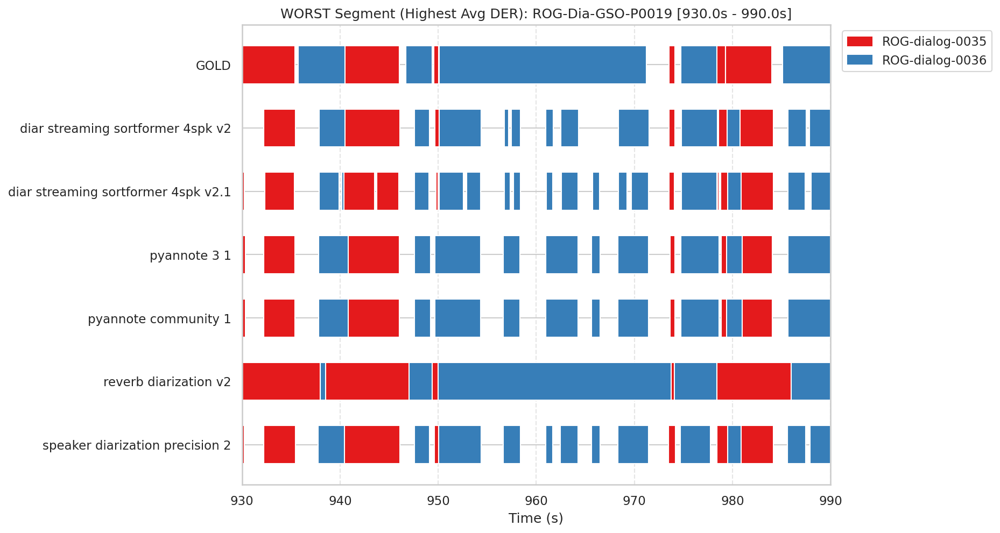

| Model                               | DER      | Miss     | FA       | Conf     | Pur       | Cov       | VRAM (GB)   | Status   |
|-------------------------------------|----------|----------|----------|----------|-----------|-----------|-------------|----------|
| reverb diarization v2               | **7.30** | **1.24** | 2.52     | 3.54     | 94.87     | 94.92     | 4.3         | nan      |
| pyannote 3 1                        | 12.68    | 12.31    | 0.34     | 0.04     | 98.36     | 98.52     | 1.6         | nan      |
| pyannote community 1                | 12.72    | 12.31    | 0.34     | 0.07     | 98.32     | 98.49     | 1.6         | nan      |
| speaker diarization precision 2     | 17.78    | 17.64    | 0.13     | 0.00     | **98.67** | 98.82     | **0.0**     | nan      |
| diar streaming sortformer 4spk v2   | 19.81    | 19.67    | 0.15     | **0.00** | 98.62     | **98.85** | 1.6         | nan      |
| diar streaming sortformer 4spk v2.1 | 23.50    | 23.41    | **0.08** | 0.01     | 98.64     | 98.85     | 1.6         | nan      |
| diar sortformer 4spk v1             | nan      | nan      | nan      | nan      | nan       | nan       | nan         | OOM/ERR  |

---

### File: ROG-Dia-GSO-P0021

**Domain:** Družabni pogovor | **Quality:** 4 | **Device:** Apple iPhone 15 Pro

> *Prijateljski pogovor med 2 osebama, ki se pogovarjata o splošnih temah; delo, prosti čas, hišni ljubljenčki, načrti za prihodnost, opis dela, itd*

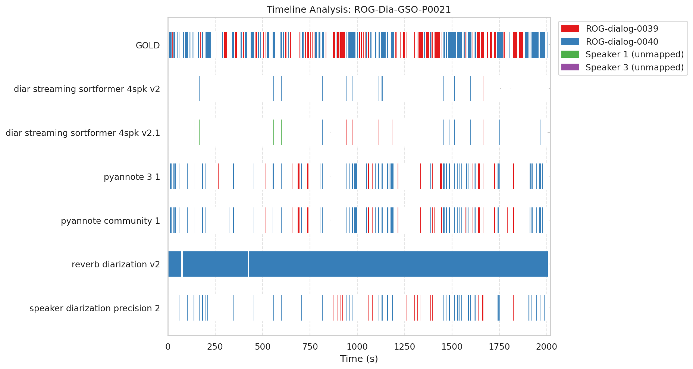

#### 60-Second Snippets (Zoom-in)
Below are 60-second zoomed-in windows showing where the models performed best and worst (based on average DER).

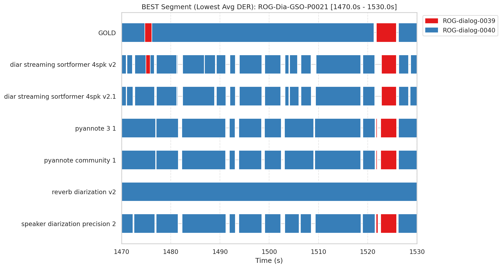

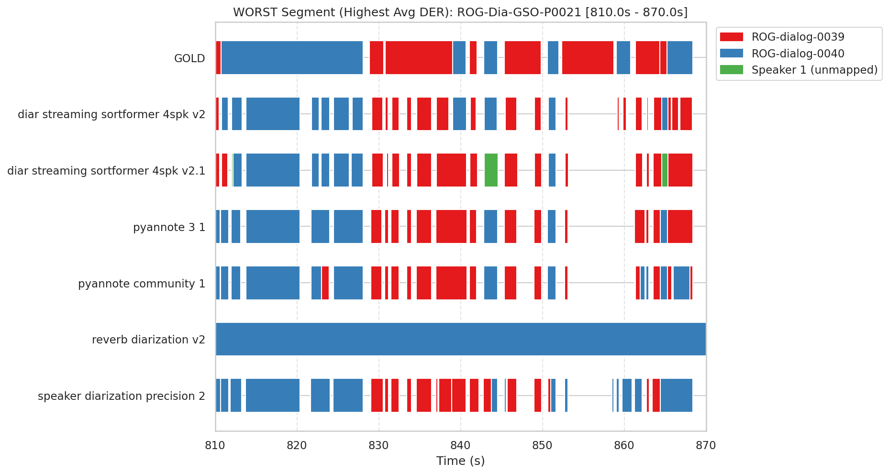

| Model                               | DER       | Miss     | FA       | Conf     | Pur       | Cov        | VRAM (GB)   | Status   |
|-------------------------------------|-----------|----------|----------|----------|-----------|------------|-------------|----------|
| speaker diarization precision 2     | **20.78** | 18.02    | 1.21     | **1.55** | **94.25** | 94.88      | **0.0**     | nan      |
| pyannote 3 1                        | 23.25     | 16.94    | 1.69     | 4.61     | 91.34     | 91.25      | 1.6         | nan      |
| pyannote community 1                | 24.17     | 16.95    | 1.69     | 5.53     | 90.27     | 90.66      | 1.6         | nan      |
| diar streaming sortformer 4spk v2   | 28.07     | 25.41    | **0.83** | 1.83     | 93.67     | 94.69      | 1.6         | nan      |
| reverb diarization v2               | 49.50     | **1.58** | 6.05     | 41.87    | 56.60     | **100.00** | 4.3         | nan      |
| diar streaming sortformer 4spk v2.1 | 58.60     | 24.47    | 1.47     | 32.66    | 82.47     | 54.52      | 1.6         | nan      |
| diar sortformer 4spk v1             | nan       | nan      | nan      | nan      | nan       | nan        | nan         | OOM/ERR  |

---

### File: ROG-Dia-GSO-P0022

**Domain:** Družabni pogovor | **Quality:** 5 | **Device:** Pametni telefon iphone 11 z aplikacijo Voice Record Pro z naročenimi nastavitvami. 

> *Pogovor med sorodnikoma o glasbenih skupinah in glasbenih izkušnjah.*

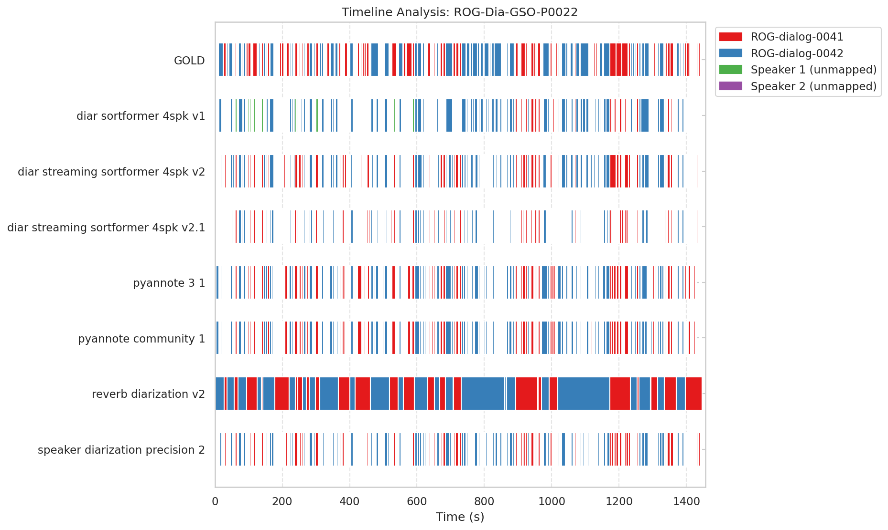

#### 60-Second Snippets (Zoom-in)
Below are 60-second zoomed-in windows showing where the models performed best and worst (based on average DER).

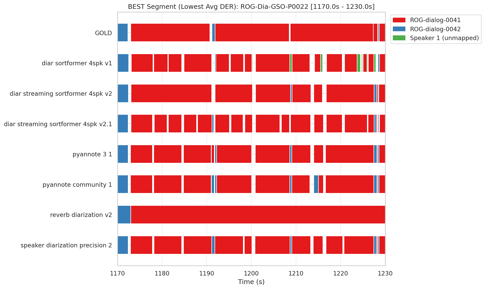

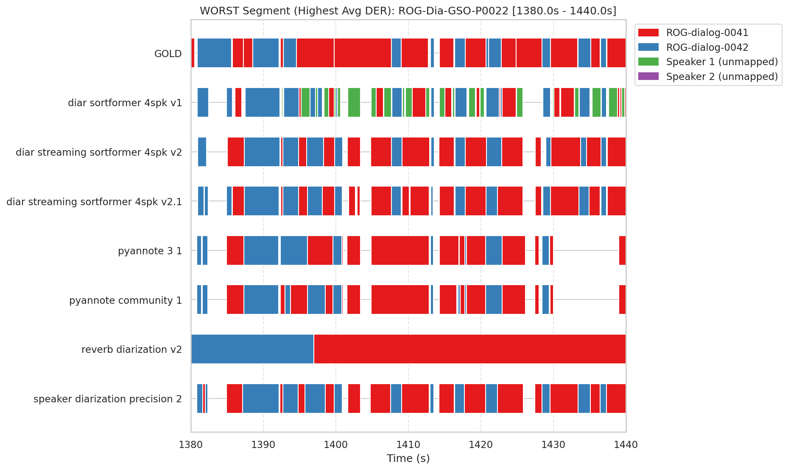

| Model                               | DER       | Miss     | FA       | Conf     | Pur       | Cov       | VRAM (GB)   |
|-------------------------------------|-----------|----------|----------|----------|-----------|-----------|-------------|
| speaker diarization precision 2     | **12.14** | 9.05     | 2.75     | **0.34** | 89.07     | 90.44     | **0.0**     |
| diar streaming sortformer 4spk v2   | 14.91     | 11.75    | **2.34** | 0.81     | 89.70     | 91.47     | 1.3         |
| pyannote 3 1                        | 15.76     | 10.08    | 3.00     | 2.68     | 87.41     | 87.47     | 1.6         |
| pyannote community 1                | 16.06     | 10.08    | 3.00     | 2.98     | 87.11     | 87.33     | 1.6         |
| reverb diarization v2               | 17.16     | **4.74** | 3.29     | 9.14     | 85.86     | 83.11     | 4.3         |
| diar streaming sortformer 4spk v2.1 | 17.53     | 14.65    | 2.43     | 0.44     | 89.20     | **91.95** | 1.3         |
| diar sortformer 4spk v1             | 34.29     | 12.95    | 2.62     | 18.72    | **90.29** | 73.86     | 69.9        |

---

### File: ROG-Dia-GSO-P0025

**Domain:** Navodila | **Quality:** 5 | **Device:** prenosni računalnik acer predator helios 300 z zunanjim mikrofonom RODE NT-USB

> *Pogovor o potovanju na Japonsko, iskanju novega stanovanja, službi in pripravi raznih Japonskih jedi*

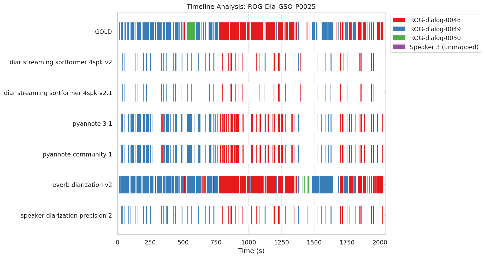

#### 60-Second Snippets (Zoom-in)
Below are 60-second zoomed-in windows showing where the models performed best and worst (based on average DER).

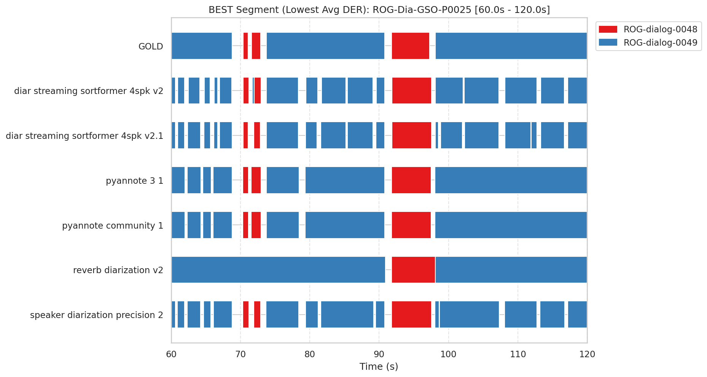

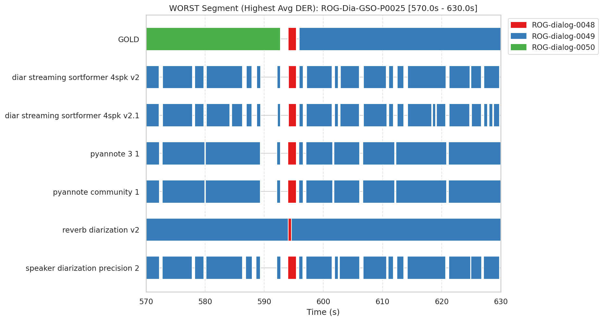

| Model                               | DER       | Miss     | FA       | Conf     | Pur       | Cov       | VRAM (GB)   | Status   |
|-------------------------------------|-----------|----------|----------|----------|-----------|-----------|-------------|----------|
| reverb diarization v2               | **14.29** | **1.70** | 5.37     | 7.22     | 90.35     | 91.87     | 4.3         | nan      |
| pyannote 3 1                        | 19.55     | 14.52    | 0.98     | 4.05     | 91.94     | 93.94     | 1.6         | nan      |
| pyannote community 1                | 19.61     | 14.52    | 0.98     | 4.11     | 91.87     | 94.08     | 1.6         | nan      |
| speaker diarization precision 2     | 23.50     | 19.38    | **0.84** | 3.28     | 92.28     | **94.37** | **0.0**     | nan      |
| diar streaming sortformer 4spk v2   | 25.19     | 20.92    | 1.02     | **3.25** | 91.89     | 94.35     | 1.6         | nan      |
| diar streaming sortformer 4spk v2.1 | 29.04     | 23.18    | 0.92     | 4.94     | **92.35** | 92.27     | 1.6         | nan      |
| diar sortformer 4spk v1             | nan       | nan      | nan      | nan      | nan       | nan       | nan         | OOM/ERR  |

---

