# ROG-Dia Benchmark Report

**Date:** 2026-04-03

## 1. Evaluated Models
* **diar sortformer 4spk v1** (`nvidia/diar_sortformer_4spk-v1`) - [HuggingFace](https://huggingface.co/nvidia/diar_sortformer_4spk-v1)
* **diar streaming sortformer 4spk v2** (`nvidia/diar_streaming_sortformer_4spk-v2`) - [HuggingFace](https://huggingface.co/nvidia/diar_streaming_sortformer_4spk-v2)
* **diar streaming sortformer 4spk v2.1** (`nvidia/diar_streaming_sortformer_4spk-v2.1`) - [HuggingFace](https://huggingface.co/nvidia/diar_streaming_sortformer_4spk-v2.1)
* **pyannote 3 1** (`pyannote/speaker-diarization-3.1`) - [HuggingFace](https://huggingface.co/pyannote/speaker-diarization-3.1)
* **pyannote community 1** (`pyannote/speaker-diarization-community-1`) - [HuggingFace](https://huggingface.co/pyannote/speaker-diarization-community-1)
* **reverb diarization v2** (`Revai/reverb-diarization-v2`) - [HuggingFace](https://huggingface.co/Revai/reverb-diarization-v2)
* **speaker diarization precision 2** (`pyannote/speaker-diarization-precision-2`) - [HuggingFace](https://huggingface.co/pyannote/speaker-diarization-precision-2)

## 2. Executive Summary

| Model                               |   Collar | DER      | Purity    | Cover     | Miss     | FA       | Conf     | RTF        | VRAM (GB)   | Completed   |
|-------------------------------------|----------|----------|-----------|-----------|----------|----------|----------|------------|-------------|-------------|
| speaker diarization precision 2     |     0.25 | **9.51** | **86.90** | 89.10     | **5.78** | 2.37     | **1.35** | 0.03       | **0.0**     | 12/12       |
| diar streaming sortformer 4spk v2   |     0.25 | 11.48    | 86.47     | 88.91     | 7.14     | 2.68     | 1.65     | **< 0.01** | 1.6         | 12/12       |
| diar streaming sortformer 4spk v2.1 |     0.25 | 17.33    | 85.75     | 84.95     | 9.70     | **1.94** | 5.29     | < 0.01     | 1.6         | 12/12       |
| pyannote community 1                |     0.25 | 19.01    | 80.95     | 86.32     | 5.84     | 5.05     | 8.91     | 0.06       | 1.6         | 12/12       |
| pyannote 3 1                        |     0.25 | 19.11    | 81.20     | 86.16     | 5.84     | 5.05     | 8.95     | 0.06       | 1.6         | 12/12       |
| reverb diarization v2               |     0.25 | 42.39    | 73.52     | **91.62** | 7.94     | 16.23    | 18.86    | 0.10       | 4.3         | 12/12       |
| diar sortformer 4spk v1             |     0.25 | 53.65    | 80.23     | 48.75     | 8.56     | 4.10     | 9.22     | 0.03       | 104.4       | 8/12        |

### Terminology & Methodology
* **DER (Diarization Error Rate):** Primary metric. Lower is better. Sum of Missed, False Alarm, and Confusion rates.
* **Miss (%):** Speech present in Gold Standard but missed by the model.
* **FA (False Alarm %):** Model predicted speech where Gold Standard is silent.
* **Conf (Confusion %):** Speech correctly detected but assigned to the wrong speaker.
* **Purity (%):** Evaluates cluster purity. High purity = when a model identifies a speaker, it is consistently the same person.
* **Cover (Coverage %):** Evaluates how much of the original speaker's speech was captured under a single hypothesis cluster.
* **RTF (Real Time Factor):** Processing time divided by audio length. e.g., `< 0.01` means exceptionally fast processing.
* **VRAM (GB):** Peak GPU memory utilized. `0.0 GB` indicates an API/Cloud-based model.

## 3. Dataset Errata (Corrections Applied)
Corrections automatically applied via Universal Evaluation Maps (UEM) to account for transcription errors. Models are not penalized for predictions outside these boundaries.

* **`ROG-Dia-GSO-P0016`**: Evaluated only up to 1172.092s. *Reason: Zlati standard se zaključi predčasno pri 19:32 (potrdila avtorica). Preostanek posnetka se ignorira pri izračunu metrik.*

## 4. Visual & Domain Analysis
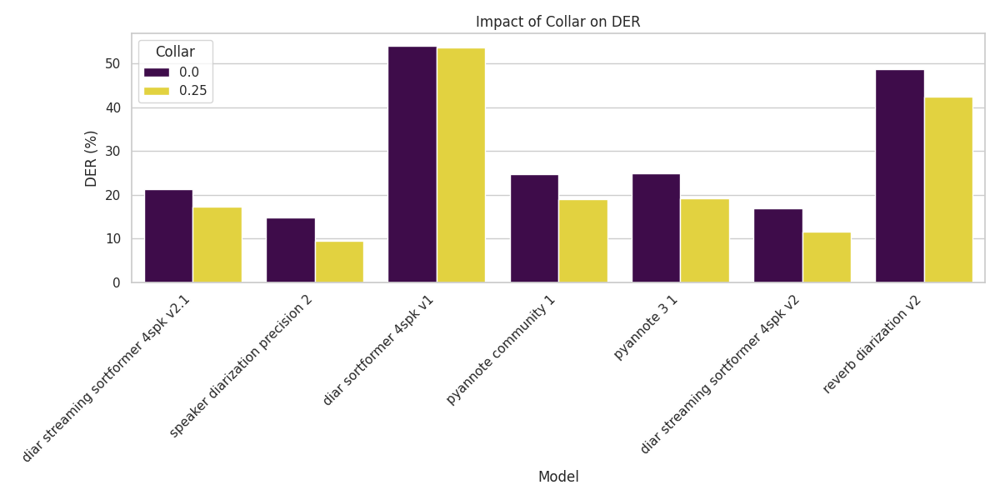

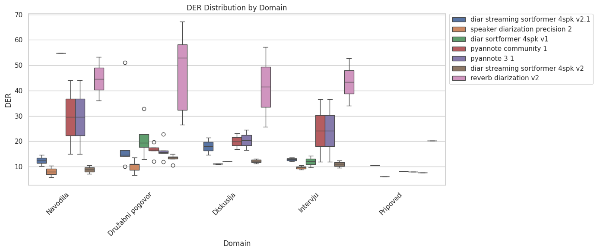

### Domain Comparison (DER %)
Average DER per domain. **Bold** highlights the best model for each domain.

| Domain           |      A |     B |     C |     D |     E |     F | G         |   AVG |
|------------------|--------|-------|-------|-------|-------|-------|-----------|-------|
| Diskusija        |  12.06 | 12.2  | 18.03 | 20.41 | 19.94 | 41.46 | **11.03** | 19.31 |
| Družabni pogovor |  21.09 | 13.18 | 21.24 | 16.38 | 16.47 | 47.44 | **10.08** | 20.84 |
| Intervju         |  11.97 | 10.96 | 12.82 | 24.17 | 24.18 | 43.38 | **9.65**  | 19.59 |
| Navodila         |  54.71 |  8.86 | 12.39 | 29.51 | 29.5  | 44.65 | **8.04**  | 26.81 |
| Pripoved         | nan    |  7.62 | 10.52 |  8.03 |  8.06 | 20.28 | **6.12**  | 10.1  |

* **A**: diar sortformer 4spk v1
* **B**: diar streaming sortformer 4spk v2
* **C**: diar streaming sortformer 4spk v2.1
* **D**: pyannote 3 1
* **E**: pyannote community 1
* **F**: reverb diarization v2
* **G**: speaker diarization precision 2

## 5. Deep Dive: File-by-File Analysis
Detailed breakdown for every file. *For metric definitions, see Executive Summary.*

### File: ROG-Dia-GSO-P0005

**Domain:** Navodila | **Quality:** 4 | **Device:** tablični računalnik Samsung Galaxy S6 Lite

> *Z govorkama smo se predhodno dogovorile za snemanje. Da je bil pogovor sproščen, smo govor snemale na domu ene izmed njiju. Pogovor je potekal o temah, ki govorki zanimajo, da sta si lahko izmenjevali navodila.*

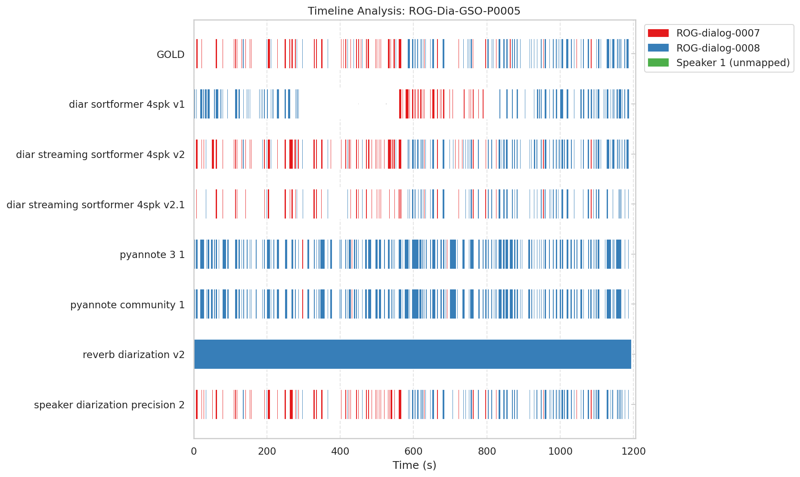

#### 60-Second Snippets (Zoom-in)
Below are 60-second zoomed-in windows showing where the models performed best and worst (based on average DER).

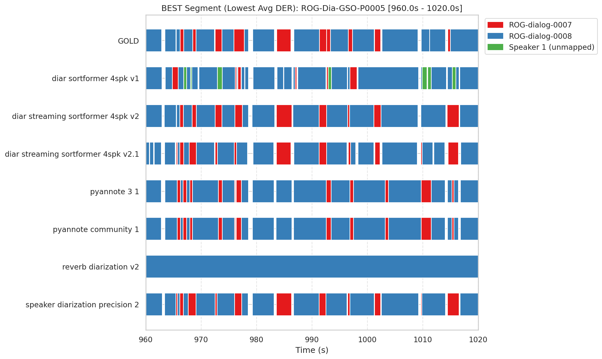

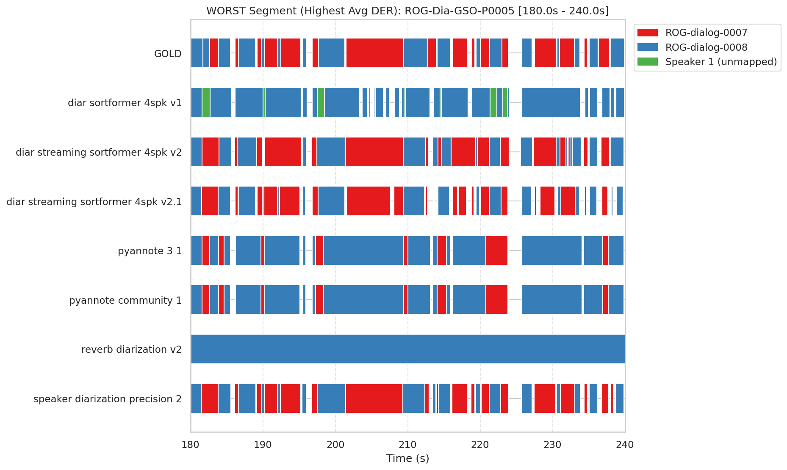

| Model                               | DER      | Miss     | FA       | Conf     | Pur       | Cov        | VRAM (GB)   |
|-------------------------------------|----------|----------|----------|----------|-----------|------------|-------------|
| speaker diarization precision 2     | **5.70** | 3.26     | 2.02     | **0.42** | 82.81     | 84.88      | **0.0**     |
| diar streaming sortformer 4spk v2   | 7.13     | **3.24** | 3.28     | 0.61     | 82.28     | 84.16      | 1.1         |
| diar streaming sortformer 4spk v2.1 | 10.26    | 8.27     | **1.39** | 0.59     | **83.36** | 87.13      | 1.1         |
| pyannote community 1                | 44.02    | 3.59     | 6.81     | 33.62    | 53.52     | 85.32      | 1.6         |
| pyannote 3 1                        | 44.02    | 3.59     | 6.81     | 33.62    | 53.52     | 85.32      | 1.6         |
| reverb diarization v2               | 53.19    | 10.08    | 7.24     | 35.87    | 54.05     | **100.00** | 4.3         |
| diar sortformer 4spk v1             | 54.71    | 13.24    | 3.42     | 38.05    | 57.16     | 62.93      | 47.9        |

---

### File: ROG-Dia-GSO-P0007

**Domain:** Družabni pogovor | **Quality:** 5 | **Device:** Apple iPhone 13

> *Ena sogovornica je obiskala drugo in v kuhinji za mizo sta opravile pogovor, ki se je snemal.*

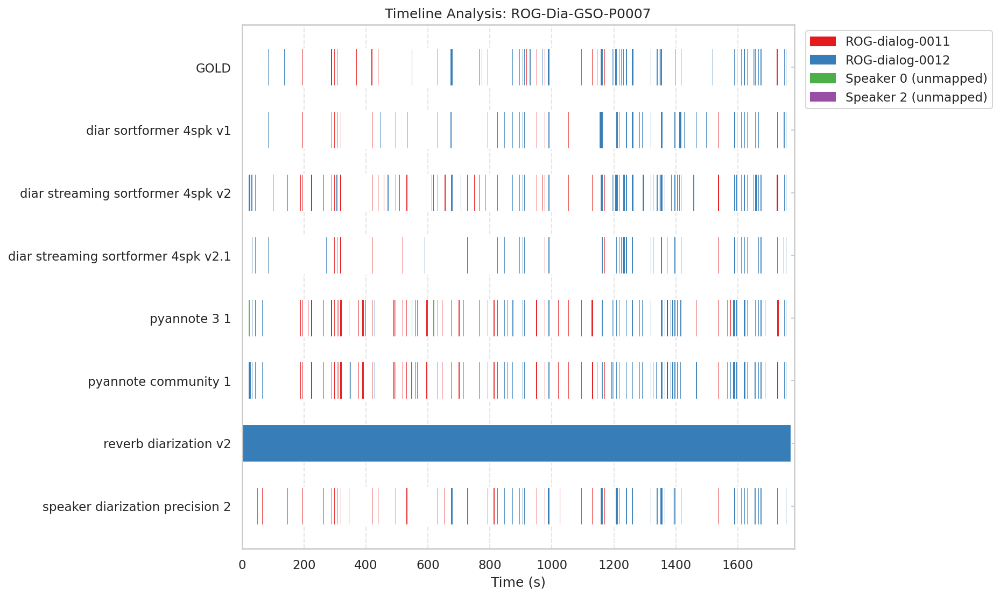

#### 60-Second Snippets (Zoom-in)
Below are 60-second zoomed-in windows showing where the models performed best and worst (based on average DER).

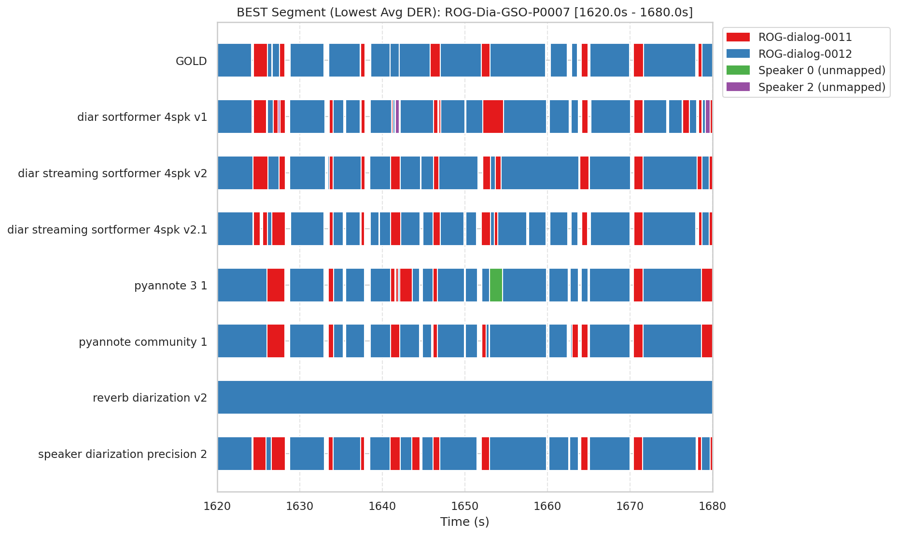

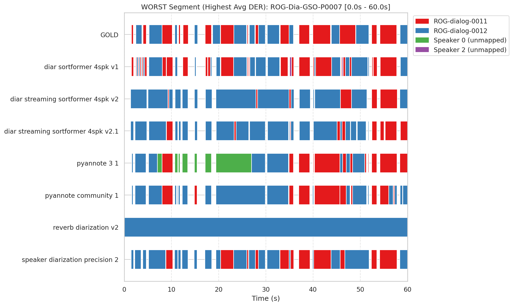

| Model                               | DER       | Miss     | FA       | Conf     | Pur       | Cov        | VRAM (GB)   |
|-------------------------------------|-----------|----------|----------|----------|-----------|------------|-------------|
| speaker diarization precision 2     | **13.52** | 9.64     | 2.14     | **1.74** | **77.20** | 80.23      | **0.0**     |
| diar streaming sortformer 4spk v2   | 14.98     | 9.29     | 3.14     | 2.54     | 75.93     | 78.86      | 1.5         |
| diar streaming sortformer 4spk v2.1 | 16.43     | 11.64    | **2.03** | 2.76     | 76.02     | 79.58      | 1.5         |
| diar sortformer 4spk v1             | 19.29     | **7.53** | 6.11     | 5.65     | 74.34     | 78.11      | 104.4       |
| pyannote community 1                | 19.78     | 9.53     | 3.52     | 6.74     | 72.15     | 73.48      | 1.6         |
| pyannote 3 1                        | 22.85     | 9.53     | 3.52     | 9.81     | 71.82     | 71.02      | 1.6         |
| reverb diarization v2               | 52.94     | 15.52    | 6.54     | 30.89    | 53.60     | **100.00** | 4.3         |

---

### File: ROG-Dia-GSO-P0008

**Domain:** Diskusija | **Quality:** 4 | **Device:** Iphone 13 mini

> *Pogovor med bratoma o kosilu ter o tehnologiji ter argumentiranje prednosti in slabosti.*

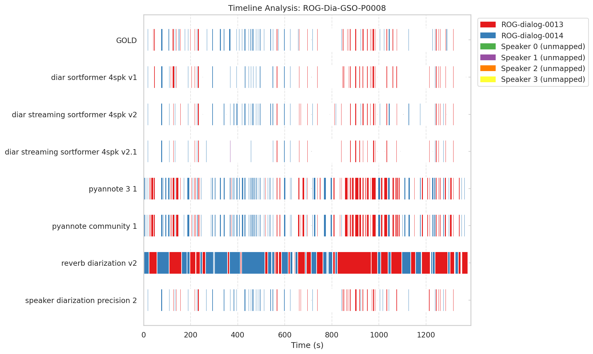

#### 60-Second Snippets (Zoom-in)
Below are 60-second zoomed-in windows showing where the models performed best and worst (based on average DER).

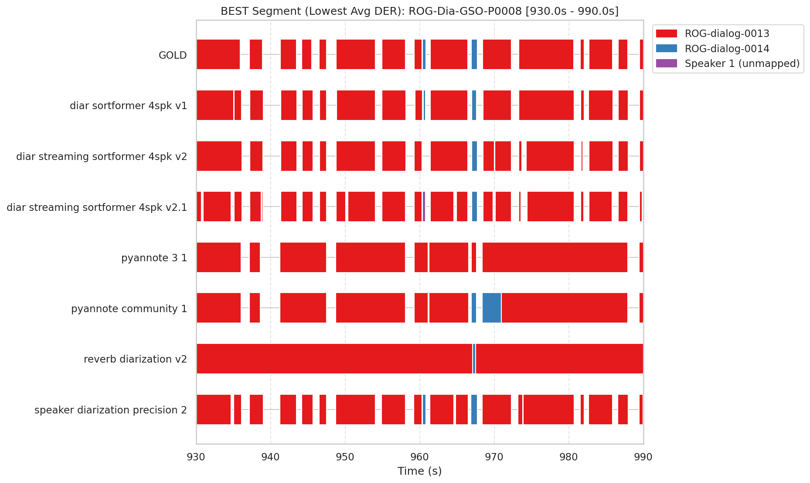

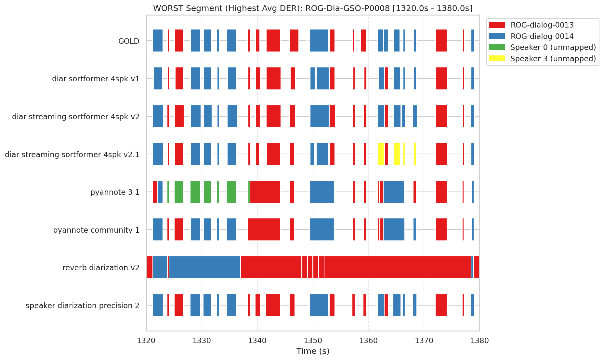

| Model                               | DER       | Miss     | FA       | Conf     | Pur       | Cov       | VRAM (GB)   |
|-------------------------------------|-----------|----------|----------|----------|-----------|-----------|-------------|
| speaker diarization precision 2     | **10.87** | 9.07     | **1.16** | **0.64** | 93.23     | **94.74** | **0.0**     |
| diar sortformer 4spk v1             | 12.06     | 8.21     | 2.38     | 1.47     | 90.97     | 93.21     | 63.9        |
| diar streaming sortformer 4spk v2   | 13.14     | 10.24    | 1.55     | 1.35     | 92.61     | 93.84     | 1.3         |
| diar streaming sortformer 4spk v2.1 | 21.44     | 14.07    | 1.61     | 5.76     | **93.79** | 89.15     | 1.3         |
| pyannote community 1                | 23.14     | 6.22     | 9.87     | 7.04     | 85.50     | 86.08     | 1.6         |
| pyannote 3 1                        | 24.40     | 6.22     | 9.87     | 8.31     | 85.42     | 84.88     | 1.6         |
| reverb diarization v2               | 57.25     | **4.96** | 36.75    | 15.54    | 78.91     | 78.11     | 4.3         |

---

### File: ROG-Dia-GSO-P0009

**Domain:** Družabni pogovor | **Quality:** 5 | **Device:** Mobilni telefon Iphone SE 2020

> *Posnetek je nastal v domačem okolju enega izmed govorcev med njim in njegovim dolgoletnim sosedom in prijateljem na pobudo snemalke. *

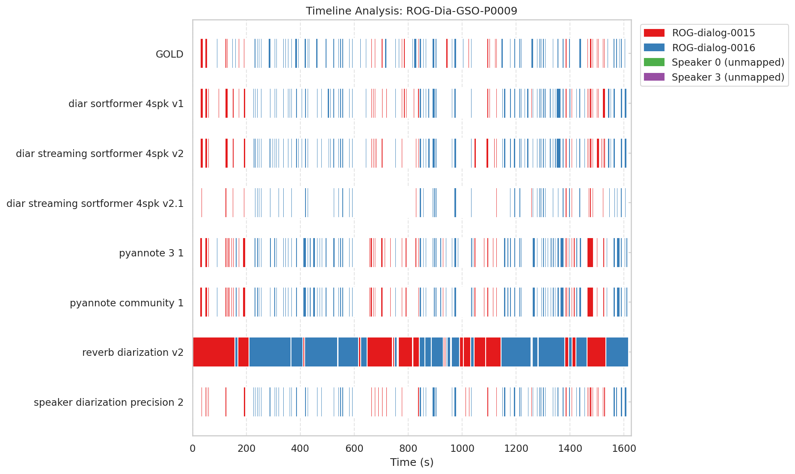

#### 60-Second Snippets (Zoom-in)
Below are 60-second zoomed-in windows showing where the models performed best and worst (based on average DER).

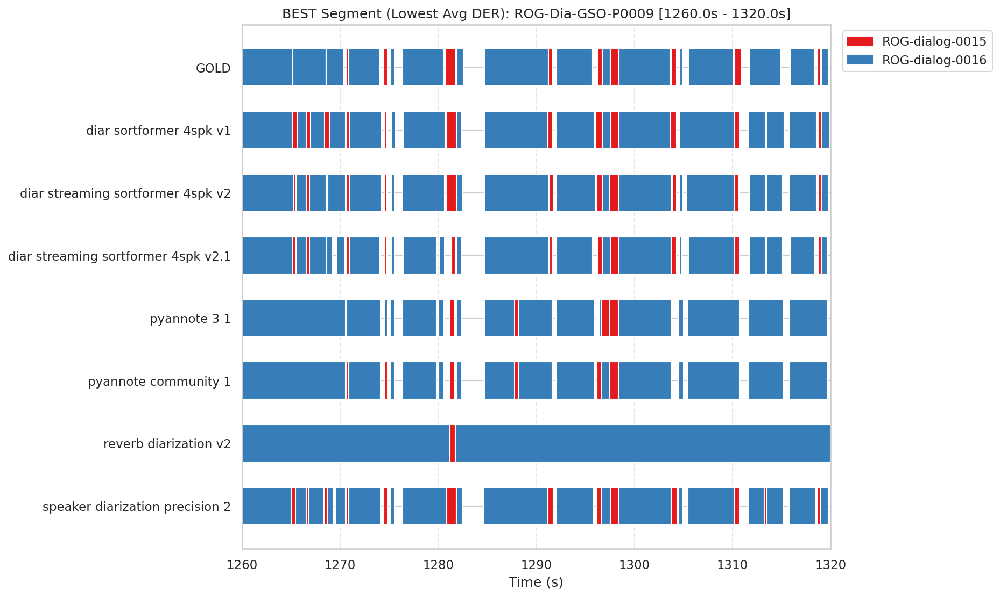

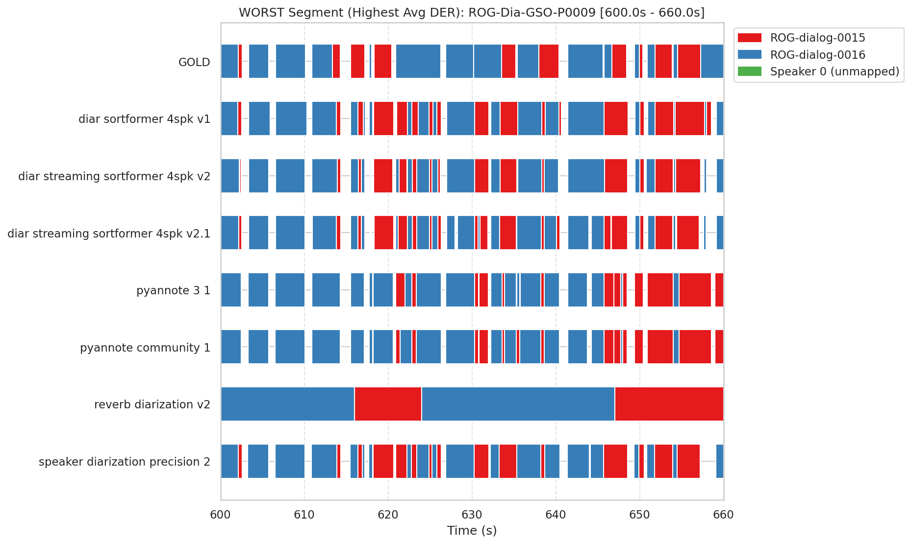

| Model                               | DER       | Miss     | FA       | Conf     | Pur       | Cov       | VRAM (GB)   |
|-------------------------------------|-----------|----------|----------|----------|-----------|-----------|-------------|
| speaker diarization precision 2     | **10.96** | **7.24** | 3.13     | **0.59** | 80.75     | 84.55     | **0.0**     |
| diar sortformer 4spk v1             | 12.89     | 7.61     | 4.54     | 0.75     | 80.68     | 84.69     | 87.1        |
| diar streaming sortformer 4spk v2   | 13.05     | 8.91     | 3.39     | 0.76     | **81.55** | 85.70     | 1.4         |
| diar streaming sortformer 4spk v2.1 | 14.09     | 11.37    | **1.98** | 0.73     | 81.47     | **86.09** | 1.4         |
| pyannote 3 1                        | 16.32     | 9.48     | 3.33     | 3.50     | 79.12     | 80.54     | 1.6         |
| pyannote community 1                | 16.38     | 9.48     | 3.33     | 3.56     | 79.07     | 80.64     | 1.6         |
| reverb diarization v2               | 32.29     | 12.65    | 13.74    | 5.89     | 80.74     | 79.45     | 4.3         |

---

### File: ROG-Dia-GSO-P0011

**Domain:** Intervju | **Quality:** 4 | **Device:** Mobilna naprava Iphone 13, aplikacija Voice Record.

> *Govorca sta ženska in moški, oba stara okrog 50 let. Je večer, sedita za kuhinjsko mizo. Ženska postavlja moškemu vprašanja o domačem kraju, običajih in spominih iz otroštva ter mladosti. Moški odgovarja na njena vprašanja, ona pa ga med tem tudi spomni na pomembne točke, ki bi jih lahko vključil v svoje odgovore.*

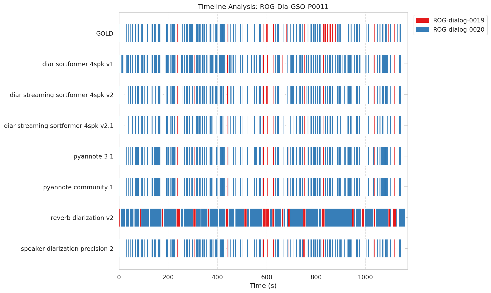

#### 60-Second Snippets (Zoom-in)
Below are 60-second zoomed-in windows showing where the models performed best and worst (based on average DER).

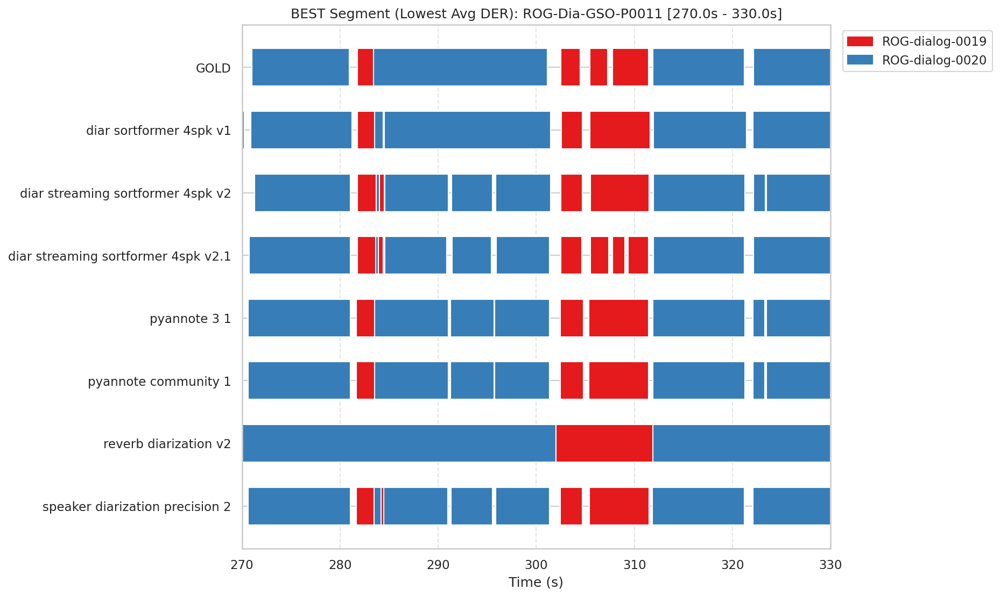

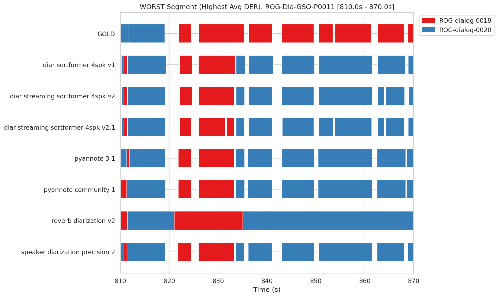

| Model                               | DER       | Miss     | FA       | Conf     | Pur       | Cov       | VRAM (GB)   |
|-------------------------------------|-----------|----------|----------|----------|-----------|-----------|-------------|
| speaker diarization precision 2     | **10.48** | **2.14** | 3.74     | 4.60     | 87.95     | 89.95     | **0.0**     |
| pyannote 3 1                        | 11.81     | 2.39     | 4.50     | 4.93     | 87.73     | 89.18     | 1.6         |
| pyannote community 1                | 11.85     | 2.39     | 4.50     | 4.96     | 87.70     | 89.21     | 1.6         |
| diar streaming sortformer 4spk v2.1 | 11.97     | 4.60     | **2.79** | **4.57** | 88.01     | 90.01     | 1.1         |
| diar streaming sortformer 4spk v2   | 12.36     | 4.21     | 3.50     | 4.65     | 88.09     | 89.83     | 1.1         |
| diar sortformer 4spk v1             | 14.21     | 2.79     | 6.82     | 4.59     | **88.28** | **90.18** | 45.7        |
| reverb diarization v2               | 34.02     | 4.16     | 22.24    | 7.63     | 87.49     | 87.19     | 4.3         |

---

### File: ROG-Dia-GSO-P0012

**Domain:** Intervju | **Quality:** 4 | **Device:** Pametni telefon Samsung Galaxy a53

> *Ena od sogovornic je prišla na obisk k drugi. Usedli sta se za mizo in pričeli s pogovorom.*

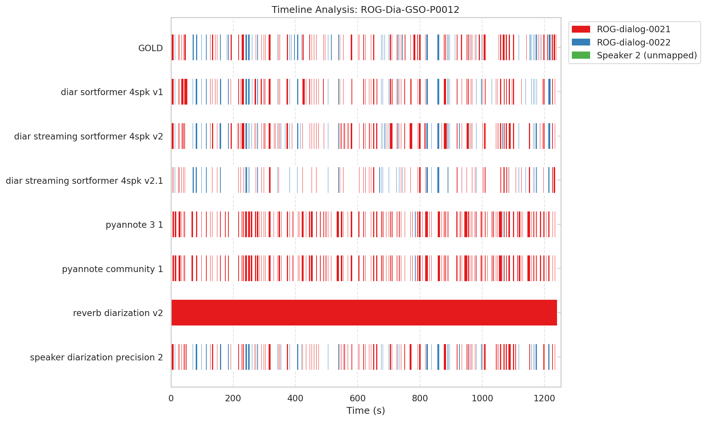

#### 60-Second Snippets (Zoom-in)
Below are 60-second zoomed-in windows showing where the models performed best and worst (based on average DER).

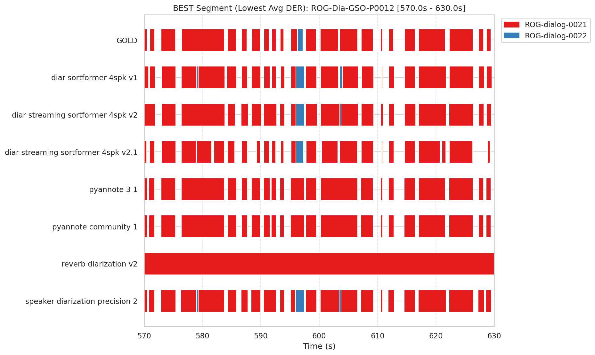

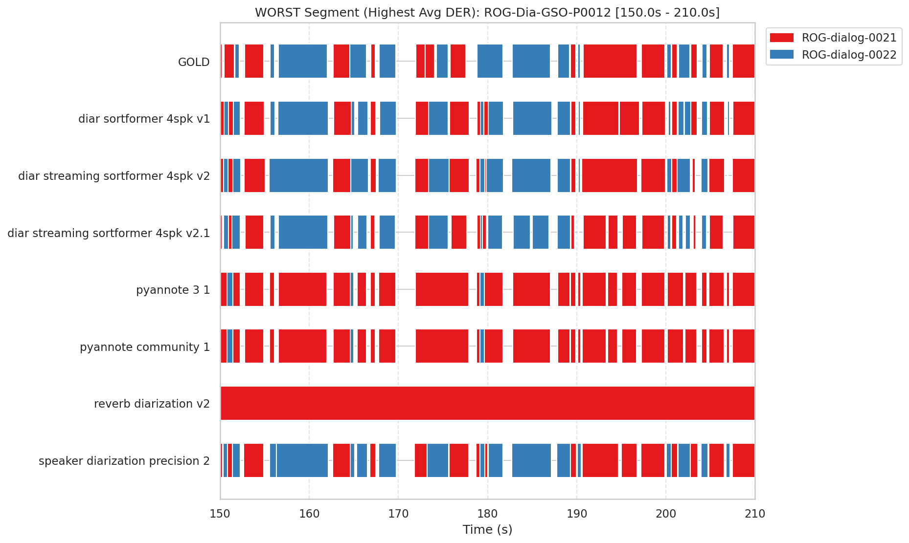

| Model                               | DER      | Miss     | FA       | Conf     | Pur       | Cov        | VRAM (GB)   |
|-------------------------------------|----------|----------|----------|----------|-----------|------------|-------------|
| speaker diarization precision 2     | **8.82** | 6.62     | 1.71     | 0.49     | 82.91     | 86.66      | **0.0**     |
| diar streaming sortformer 4spk v2   | 9.55     | **6.17** | 2.78     | 0.61     | 82.21     | 85.33      | 1.2         |
| diar sortformer 4spk v1             | 9.73     | 6.92     | 2.34     | **0.48** | 83.00     | 87.51      | 51.9        |
| diar streaming sortformer 4spk v2.1 | 13.66    | 11.99    | **0.93** | 0.74     | **83.75** | 87.94      | 1.2         |
| pyannote community 1                | 36.52    | 6.33     | 3.01     | 27.18    | 58.80     | 89.79      | 1.6         |
| pyannote 3 1                        | 36.52    | 6.33     | 3.01     | 27.18    | 58.80     | 89.79      | 1.6         |
| reverb diarization v2               | 52.73    | 11.76    | 12.87    | 28.11    | 60.14     | **100.00** | 4.3         |

---

### File: ROG-Dia-GSO-P0016

**Domain:** Diskusija | **Quality:** 3 | **Device:** pametni telefon Huawei P30 PRO

> *Starejši moški in ženska imata diskusijo o svojem otroštvu, odraščanju na kmetih. *

> ⚠️ **ERRATA APPLIED**: Evaluation bounded to 1172.092s.

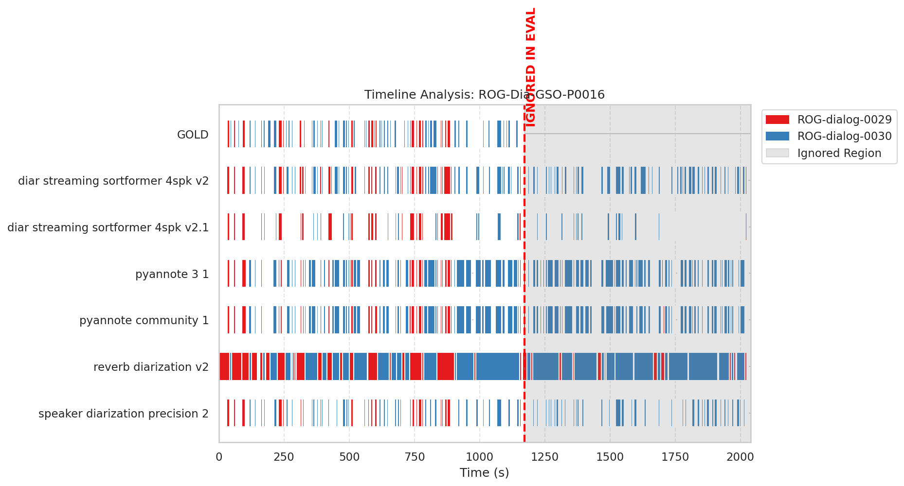

#### 60-Second Snippets (Zoom-in)
Below are 60-second zoomed-in windows showing where the models performed best and worst (based on average DER).

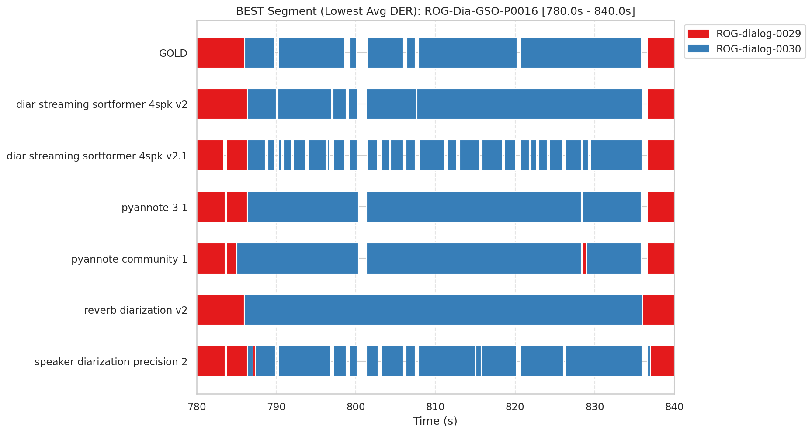

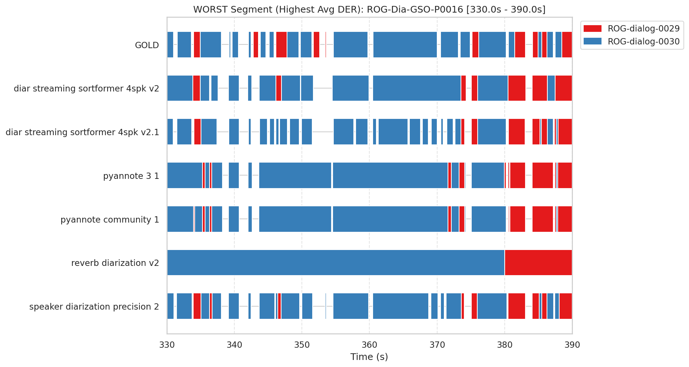

| Model                               | DER       | Miss     | FA       | Conf     | Pur       | Cov       | VRAM (GB)   | Status   |
|-------------------------------------|-----------|----------|----------|----------|-----------|-----------|-------------|----------|
| speaker diarization precision 2     | **11.19** | 7.93     | 2.51     | **0.76** | 79.90     | 82.90     | **0.0**     | nan      |
| diar streaming sortformer 4spk v2   | 11.26     | **7.06** | 3.39     | 0.81     | 79.88     | 82.73     | 1.6         | nan      |
| diar streaming sortformer 4spk v2.1 | 14.62     | 11.41    | **2.16** | 1.05     | 79.97     | **83.19** | 1.6         | nan      |
| pyannote 3 1                        | 16.42     | 8.93     | 5.32     | 2.16     | 79.10     | 81.30     | 1.6         | nan      |
| pyannote community 1                | 16.74     | 8.93     | 5.32     | 2.49     | 78.81     | 81.02     | 1.6         | nan      |
| reverb diarization v2               | 25.67     | 13.01    | 7.52     | 5.14     | **81.04** | 80.53     | 4.3         | nan      |
| diar sortformer 4spk v1             | nan       | nan      | nan      | nan      | nan       | nan       | nan         | OOM/ERR  |

---

### File: ROG-Dia-GSO-P0018

**Domain:** Družabni pogovor | **Quality:** 5 | **Device:** telefon Samsung A52

> *Dobili smo se v župnišču, se pogovorili o prostoru snemanja, zahtevah posnetka. Govorki sta se odločili za spontan družabni pogovor brez vnaprej pripravljenih tem in vprašanj.*

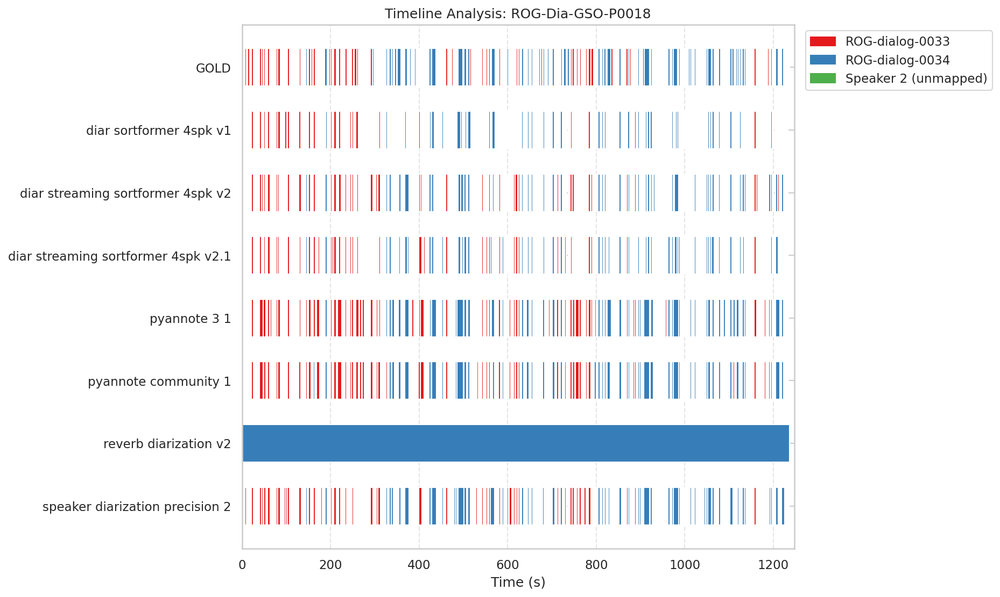

#### 60-Second Snippets (Zoom-in)
Below are 60-second zoomed-in windows showing where the models performed best and worst (based on average DER).

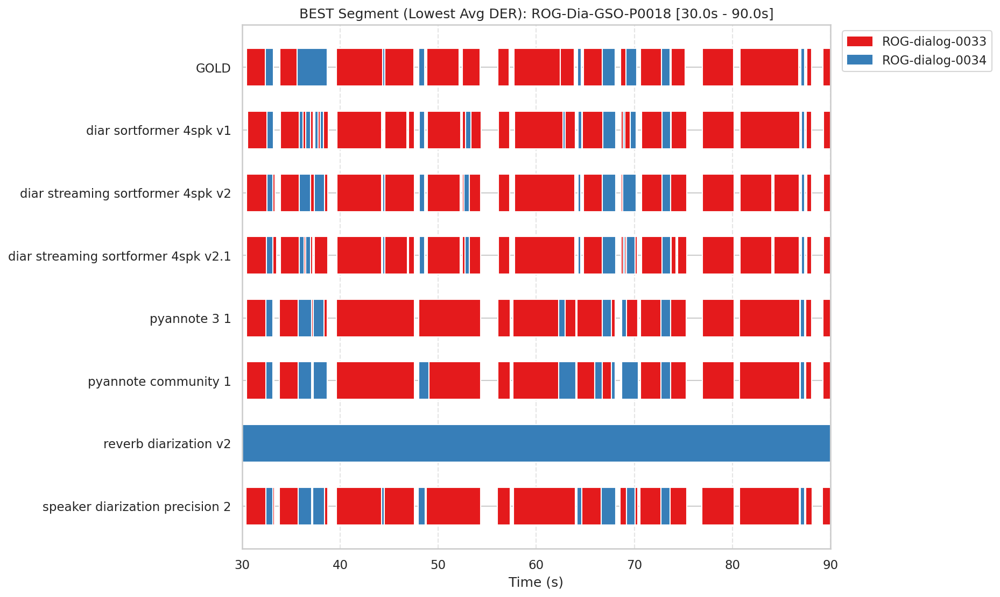

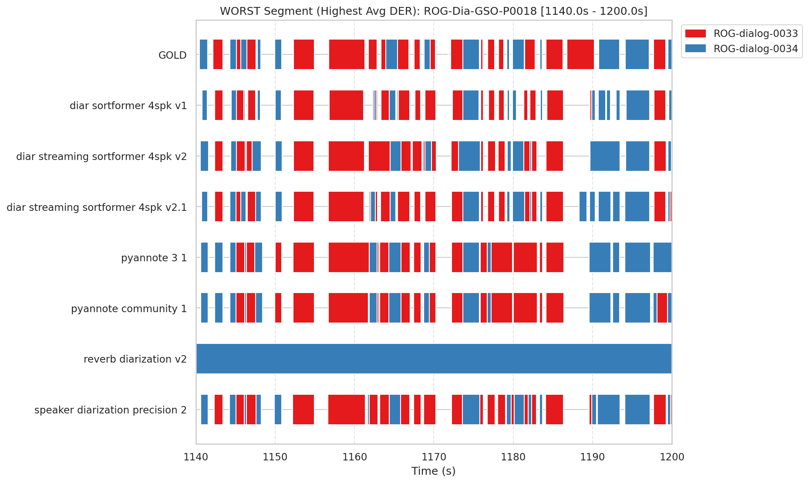

| Model                               | DER       | Miss     | FA       | Conf     | Pur       | Cov        | VRAM (GB)   |
|-------------------------------------|-----------|----------|----------|----------|-----------|------------|-------------|
| speaker diarization precision 2     | **10.78** | **7.65** | **2.28** | **0.84** | **80.76** | 82.43      | **0.0**     |
| diar streaming sortformer 4spk v2   | 13.56     | 9.83     | 2.34     | 1.39     | 79.79     | 82.49      | 1.2         |
| diar streaming sortformer 4spk v2.1 | 14.58     | 10.61    | 2.38     | 1.59     | 79.84     | 83.02      | 1.2         |
| pyannote 3 1                        | 15.37     | 7.80     | 2.73     | 4.83     | 77.17     | 78.18      | 1.6         |
| pyannote community 1                | 17.44     | 7.80     | 2.74     | 6.90     | 75.34     | 76.57      | 1.6         |
| diar sortformer 4spk v1             | 19.43     | 15.25    | 2.29     | 1.88     | 78.70     | 81.59      | 51.6        |
| reverb diarization v2               | 58.25     | 12.33    | 9.85     | 36.06    | 51.60     | **100.00** | 4.3         |

---

### File: ROG-Dia-GSO-P0019

**Domain:** Pripoved | **Quality:** 4 | **Device:** Iphone 13 mini

> *Pogovor med sestro in bratom, ki sta se pogovarjala o potovanjih. Sestra je delila svojo izkušnjo potovanja v tujino, medtem ko jo je brat spraševal še o drugih vidikih potovanja – od priprav pred odhodom do krajev, ki jih je obiskala.*

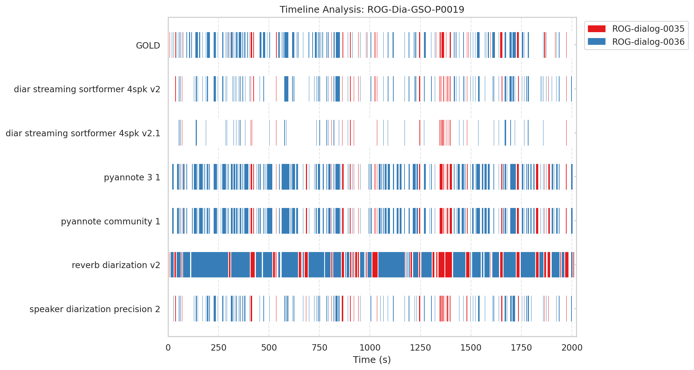

#### 60-Second Snippets (Zoom-in)
Below are 60-second zoomed-in windows showing where the models performed best and worst (based on average DER).

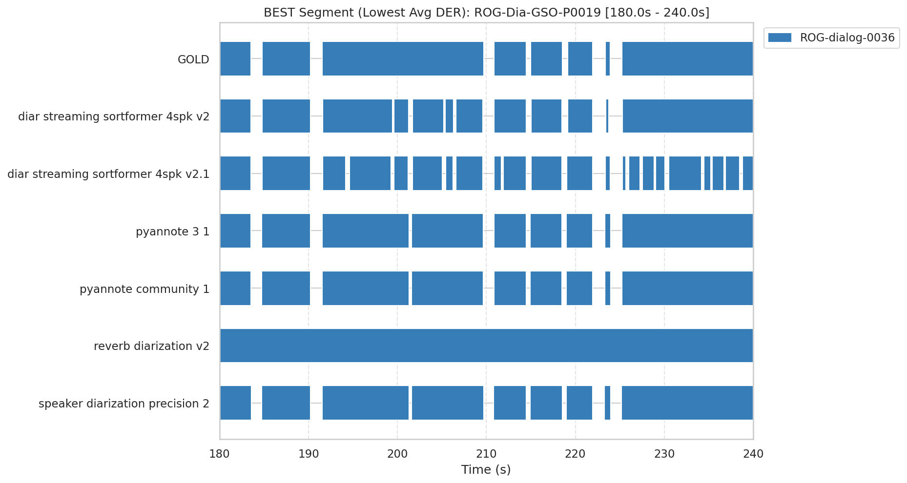

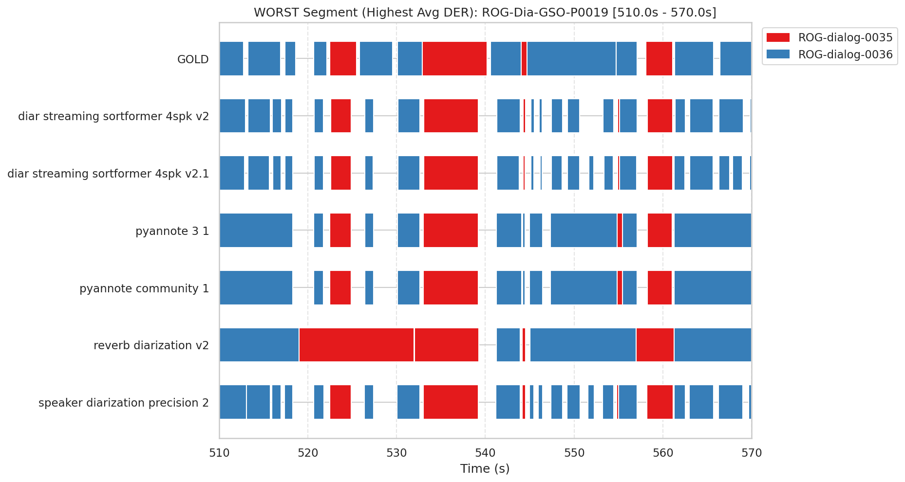

| Model                               | DER      | Miss     | FA       | Conf     | Pur       | Cov       | VRAM (GB)   | Status   |
|-------------------------------------|----------|----------|----------|----------|-----------|-----------|-------------|----------|
| speaker diarization precision 2     | **6.12** | 5.69     | 0.42     | 0.00     | **98.60** | 98.82     | **0.0**     | nan      |
| diar streaming sortformer 4spk v2   | 7.62     | 7.12     | 0.50     | **0.00** | 98.55     | 98.84     | 1.6         | nan      |
| pyannote 3 1                        | 8.03     | 4.04     | 3.94     | 0.04     | 98.19     | 98.43     | 1.6         | nan      |
| pyannote community 1                | 8.06     | 4.04     | 3.94     | 0.08     | 98.16     | 98.41     | 1.6         | nan      |
| diar streaming sortformer 4spk v2.1 | 10.52    | 10.36    | **0.15** | 0.01     | 98.59     | **98.85** | 1.6         | nan      |
| reverb diarization v2               | 20.28    | **1.42** | 15.04    | 3.82     | 94.37     | 94.51     | 4.3         | nan      |
| diar sortformer 4spk v1             | nan      | nan      | nan      | nan      | nan       | nan       | nan         | OOM/ERR  |

---

### File: ROG-Dia-GSO-P0021

**Domain:** Družabni pogovor | **Quality:** 4 | **Device:** Apple iPhone 15 Pro

> *Prijateljski pogovor med 2 osebama, ki se pogovarjata o splošnih temah; delo, prosti čas, hišni ljubljenčki, načrti za prihodnost, opis dela, itd*

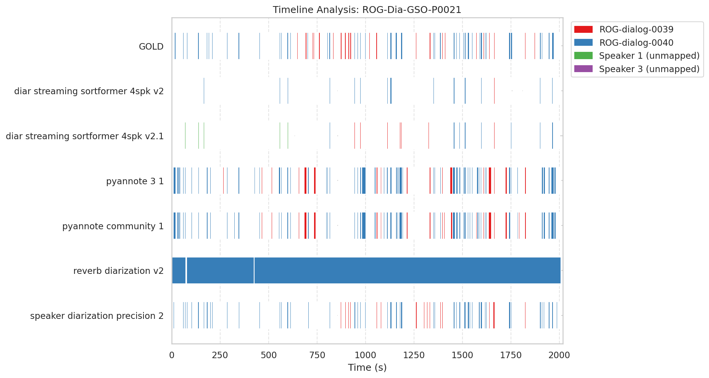

#### 60-Second Snippets (Zoom-in)
Below are 60-second zoomed-in windows showing where the models performed best and worst (based on average DER).

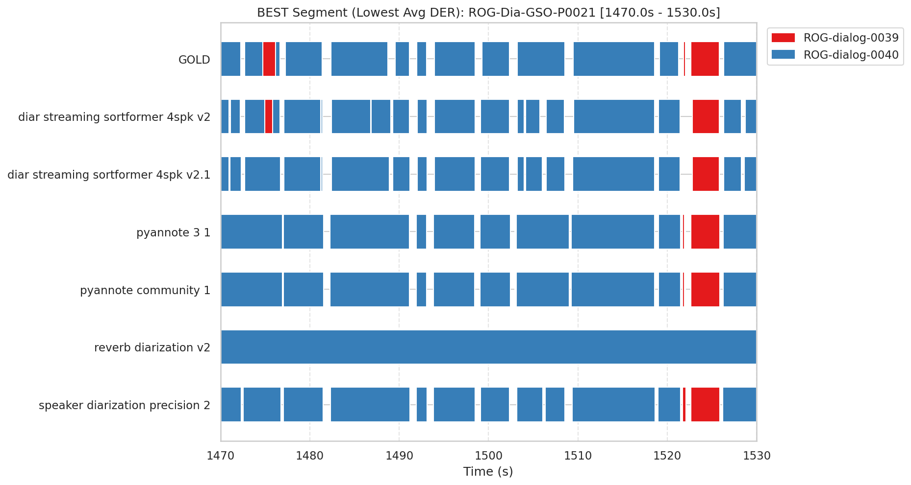

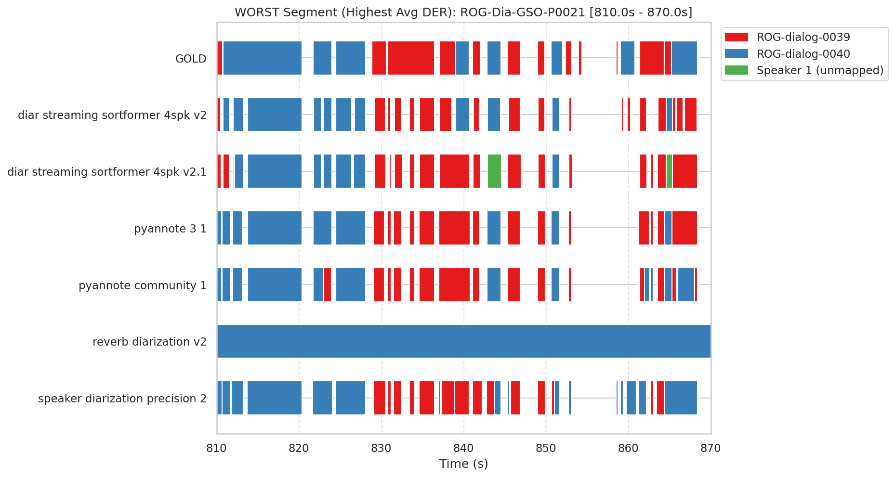

| Model                               | DER      | Miss     | FA       | Conf     | Pur       | Cov        | VRAM (GB)   | Status   |
|-------------------------------------|----------|----------|----------|----------|-----------|------------|-------------|----------|
| speaker diarization precision 2     | **8.62** | 4.09     | 2.66     | **1.87** | **93.88** | 94.82      | **0.0**     | nan      |
| diar streaming sortformer 4spk v2   | 13.85    | 10.13    | **1.53** | 2.19     | 93.48     | 94.67      | 1.6         | nan      |
| pyannote 3 1                        | 15.58    | 4.62     | 5.32     | 5.63     | 90.68     | 90.99      | 1.6         | nan      |
| pyannote community 1                | 16.63    | 4.62     | 5.33     | 6.68     | 89.62     | 90.37      | 1.6         | nan      |
| diar streaming sortformer 4spk v2.1 | 51.09    | 9.48     | 2.48     | 39.13    | 82.37     | 54.62      | 1.6         | nan      |
| reverb diarization v2               | 67.16    | **1.95** | 24.64    | 40.56    | 57.52     | **100.00** | 4.3         | nan      |
| diar sortformer 4spk v1             | nan      | nan      | nan      | nan      | nan       | nan        | nan         | OOM/ERR  |

---

### File: ROG-Dia-GSO-P0022

**Domain:** Družabni pogovor | **Quality:** 5 | **Device:** Pametni telefon iphone 11 z aplikacijo Voice Record Pro z naročenimi nastavitvami. 

> *Pogovor med sorodnikoma o glasbenih skupinah in glasbenih izkušnjah.*

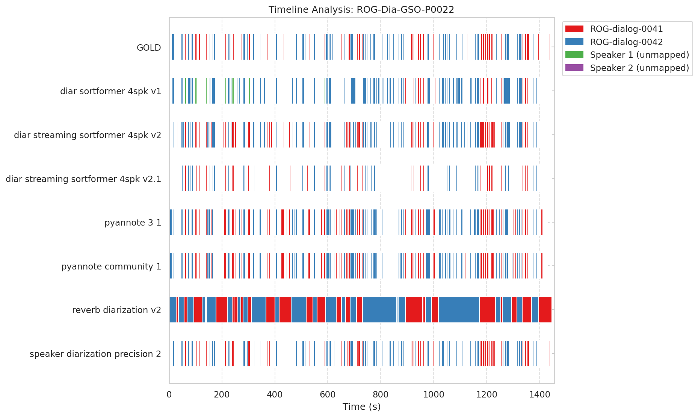

#### 60-Second Snippets (Zoom-in)
Below are 60-second zoomed-in windows showing where the models performed best and worst (based on average DER).

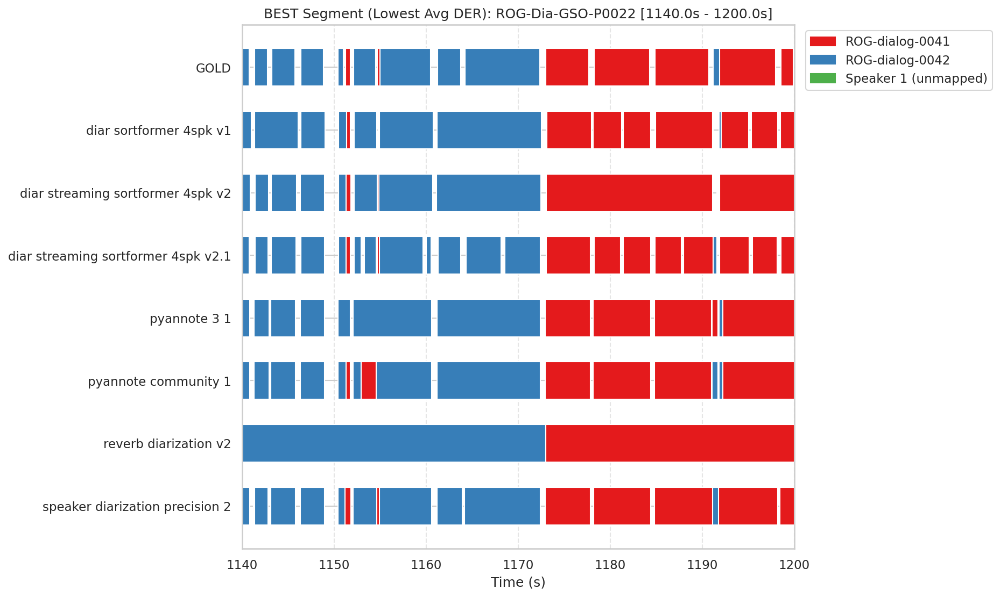

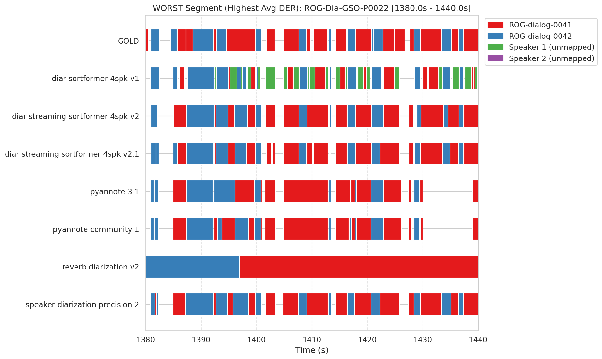

| Model                               | DER      | Miss     | FA       | Conf     | Pur       | Cov       | VRAM (GB)   |
|-------------------------------------|----------|----------|----------|----------|-----------|-----------|-------------|
| speaker diarization precision 2     | **6.51** | **1.96** | 4.16     | **0.39** | 88.51     | 90.31     | **0.0**     |
| diar streaming sortformer 4spk v2.1 | 10.04    | 6.19     | **3.34** | 0.51     | 88.84     | **91.90** | 1.3         |
| diar streaming sortformer 4spk v2   | 10.44    | 5.24     | 4.27     | 0.93     | 89.13     | 91.25     | 1.3         |
| pyannote 3 1                        | 11.81    | 3.81     | 5.15     | 2.85     | 86.86     | 87.31     | 1.6         |
| pyannote community 1                | 12.10    | 3.81     | 5.15     | 3.15     | 86.59     | 87.18     | 1.6         |
| reverb diarization v2               | 26.56    | 5.37     | 11.74    | 9.45     | 84.89     | 82.20     | 4.3         |
| diar sortformer 4spk v1             | 32.75    | 6.92     | 4.93     | 20.90    | **89.71** | 73.29     | 69.9        |

---

### File: ROG-Dia-GSO-P0025

**Domain:** Navodila | **Quality:** 5 | **Device:** prenosni računalnik acer predator helios 300 z zunanjim mikrofonom RODE NT-USB

> *Pogovor o potovanju na Japonsko, iskanju novega stanovanja, službi in pripravi raznih Japonskih jedi*

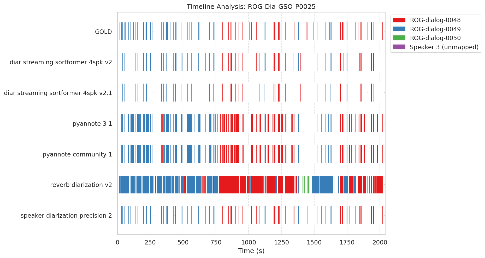

#### 60-Second Snippets (Zoom-in)
Below are 60-second zoomed-in windows showing where the models performed best and worst (based on average DER).

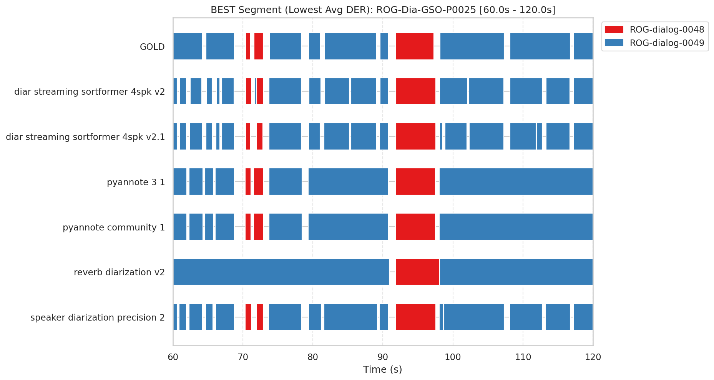

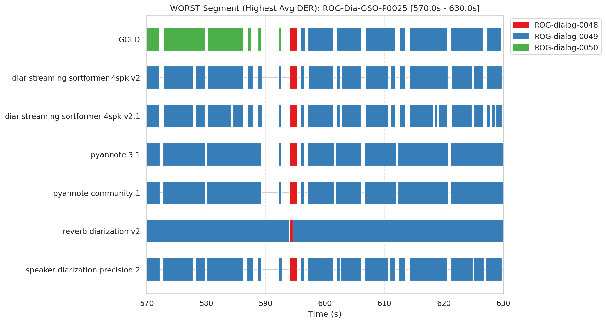

| Model                               | DER       | Miss     | FA       | Conf     | Pur       | Cov       | VRAM (GB)   | Status   |
|-------------------------------------|-----------|----------|----------|----------|-----------|-----------|-------------|----------|
| speaker diarization precision 2     | **10.38** | 4.07     | 2.45     | **3.86** | 91.98     | **94.30** | **0.0**     | nan      |
| diar streaming sortformer 4spk v2   | 10.60     | 4.24     | 2.44     | 3.92     | 91.59     | 94.26     | 1.6         | nan      |
| diar streaming sortformer 4spk v2.1 | 14.53     | 6.42     | **2.01** | 6.10     | **92.05** | 92.20     | 1.6         | nan      |
| pyannote community 1                | 14.99     | 3.37     | 7.13     | 4.48     | 91.54     | 93.66     | 1.6         | nan      |
| pyannote 3 1                        | 14.99     | 3.37     | 7.13     | 4.49     | 91.53     | 93.46     | 1.6         | nan      |
| reverb diarization v2               | 36.11     | **2.12** | 26.58    | 7.41     | 89.56     | 90.97     | 4.3         | nan      |
| diar sortformer 4spk v1             | nan       | nan      | nan      | nan      | nan       | nan       | nan         | OOM/ERR  |

---

