# ROG-Dia Benchmark Report

**Date:** 2026-02-20

## 1. Evaluated Models
* **diar sortformer 4spk v1** (`nvidia/diar_sortformer_4spk-v1`) - [HuggingFace](https://huggingface.co/nvidia/diar_sortformer_4spk-v1)
* **diar streaming sortformer 4spk v2** (`nvidia/diar_streaming_sortformer_4spk-v2`) - [HuggingFace](https://huggingface.co/nvidia/diar_streaming_sortformer_4spk-v2)
* **diar streaming sortformer 4spk v2.1** (`nvidia/diar_streaming_sortformer_4spk-v2.1`) - [HuggingFace](https://huggingface.co/nvidia/diar_streaming_sortformer_4spk-v2.1)
* **pyannote 3 1** (`pyannote/speaker-diarization-3.1`) - [HuggingFace](https://huggingface.co/pyannote/speaker-diarization-3.1)
* **pyannote community 1** (`pyannote/speaker-diarization-community-1`) - [HuggingFace](https://huggingface.co/pyannote/speaker-diarization-community-1)
* **reverb diarization v2** (`Revai/reverb-diarization-v2`) - [HuggingFace](https://huggingface.co/Revai/reverb-diarization-v2)
* **speaker diarization precision 2** (`pyannote/speaker-diarization-precision-2`) - [HuggingFace](https://huggingface.co/pyannote/speaker-diarization-precision-2)

## 2. Executive Summary

| Model                               |   Collar | DER       | Purity    | Cover     | Miss     | FA       | Conf     | RTF        | VRAM (GB)   | Completed   |
|-------------------------------------|----------|-----------|-----------|-----------|----------|----------|----------|------------|-------------|-------------|
| speaker diarization precision 2     |     0.25 | **20.25** | **86.91** | 89.32     | 17.40    | 1.26     | **1.22** | 0.03       | **0.0**     | 12/12       |
| diar streaming sortformer 4spk v2   |     0.25 | 22.45     | 86.56     | 89.13     | 19.20    | 1.25     | 1.44     | **< 0.01** | 1.6         | 12/12       |
| pyannote community 1                |     0.25 | 25.18     | 80.78     | 86.49     | 15.95    | 1.59     | 8.34     | 0.06       | 1.6         | 12/12       |
| pyannote 3 1                        |     0.25 | 25.28     | 81.00     | 86.35     | 15.95    | 1.59     | 8.39     | 0.06       | 1.6         | 12/12       |
| reverb diarization v2               |     0.25 | 27.62     | 73.01     | **91.14** | **7.92** | **0.95** | 19.38    | 0.10       | 4.3         | 12/12       |
| diar streaming sortformer 4spk v2.1 |     0.25 | 29.55     | 85.75     | 84.74     | 23.06    | 1.16     | 4.29     | < 0.01     | 1.6         | 12/12       |
| diar sortformer 4spk v1             |     0.25 | 57.78     | 80.36     | 48.28     | 19.38    | 2.12     | 8.32     | 0.03       | 104.4       | 8/12        |

### Terminology & Methodology
* **DER (Diarization Error Rate):** Primary metric. Lower is better. Sum of Missed, False Alarm, and Confusion rates.
* **Miss (%):** Speech present in Gold Standard but missed by the model.
* **FA (False Alarm %):** Model predicted speech where Gold Standard is silent.
* **Conf (Confusion %):** Speech correctly detected but assigned to the wrong speaker.
* **Purity (%):** Evaluates cluster purity. High purity = when a model identifies a speaker, it is consistently the same person.
* **Cover (Coverage %):** Evaluates how much of the original speaker's speech was captured under a single hypothesis cluster.
* **RTF (Real Time Factor):** Processing time divided by audio length. e.g., `< 0.01` means exceptionally fast processing.
* **VRAM (GB):** Peak GPU memory utilized. `0.0 GB` indicates an API/Cloud-based model.

## 3. Dataset Errata (Corrections Applied)
Corrections automatically applied via Universal Evaluation Maps (UEM) to account for transcription errors. Models are not penalized for predictions outside these boundaries.

* **`ROG-Dia-GSO-P0016`**: Evaluated only up to 1172.092s. *Reason: Zlati standard se zaključi predčasno pri 19:32 (potrdila avtorica). Preostanek posnetka se ignorira pri izračunu metrik.*

## 4. Visual & Domain Analysis
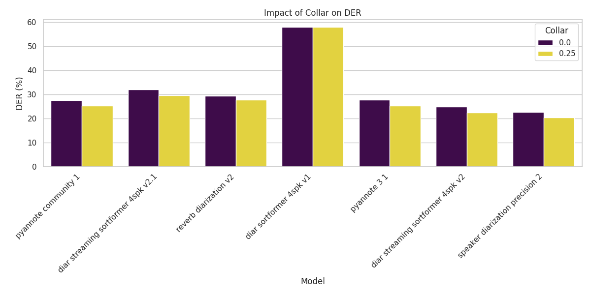

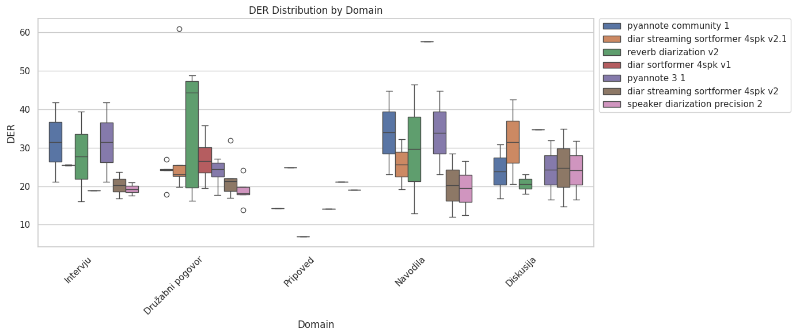

### Domain Comparison (DER %)
Average DER per domain. **Bold** highlights the best model for each domain.

| Domain           | A         |     B |     C |     D |     E | F         | G         |   AVG |
|------------------|-----------|-------|-------|-------|-------|-----------|-----------|-------|
| Diskusija        | 34.78     | 24.8  | 31.52 | 24.21 | 23.86 | **20.58** | 24.16     | 26.27 |
| Družabni pogovor | 27.11     | 22.22 | 30.37 | 23.56 | 23.56 | 35.22     | **18.75** | 25.83 |
| Intervju         | **18.85** | 20.24 | 25.48 | 31.45 | 31.46 | 27.77     | 19.24     | 24.93 |
| Navodila         | 57.63     | 20.23 | 25.67 | 33.92 | 33.93 | 29.68     | **19.44** | 31.5  |
| Pripoved         | nan       | 21.12 | 24.92 | 14.18 | 14.21 | **6.88**  | 19.03     | 16.72 |

* **A**: diar sortformer 4spk v1
* **B**: diar streaming sortformer 4spk v2
* **C**: diar streaming sortformer 4spk v2.1
* **D**: pyannote 3 1
* **E**: pyannote community 1
* **F**: reverb diarization v2
* **G**: speaker diarization precision 2

## 5. Deep Dive: File-by-File Analysis
Detailed breakdown for every file. *For metric definitions, see Executive Summary.*

### File: ROG-Dia-GSO-P0005

**Domain:** Navodila | **Quality:** 4 | **Device:** tablični računalnik Samsung Galaxy S6 Lite

> *Z govorkama smo se predhodno dogovorile za snemanje. Da je bil pogovor sproščen, smo govor snemale na domu ene izmed njiju. Pogovor je potekal o temah, ki govorki zanimajo, da sta si lahko izmenjevali navodila.*

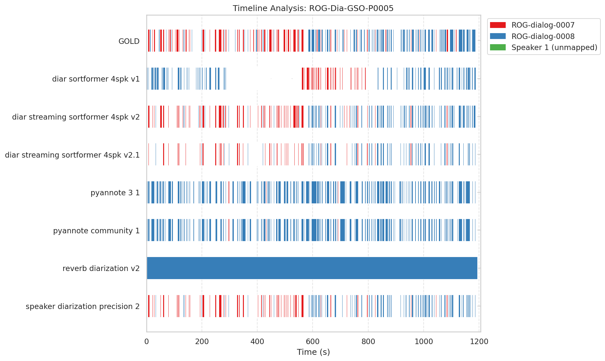

#### 60-Second Snippets (Zoom-in)
Below are 60-second zoomed-in windows showing where the models performed best and worst (based on average DER).

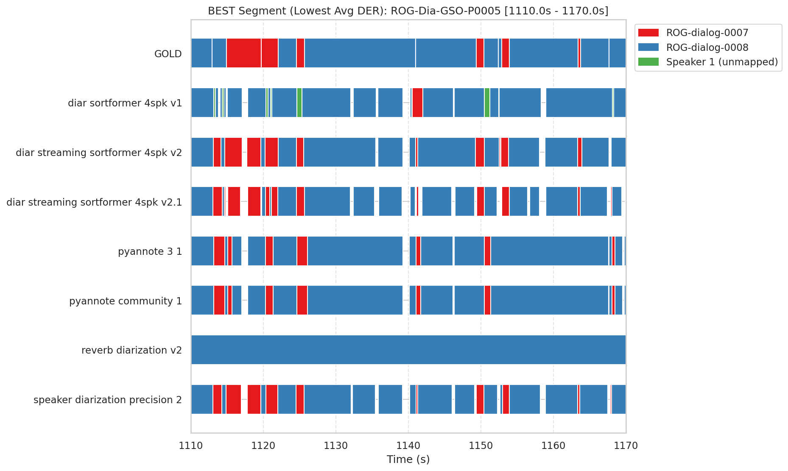

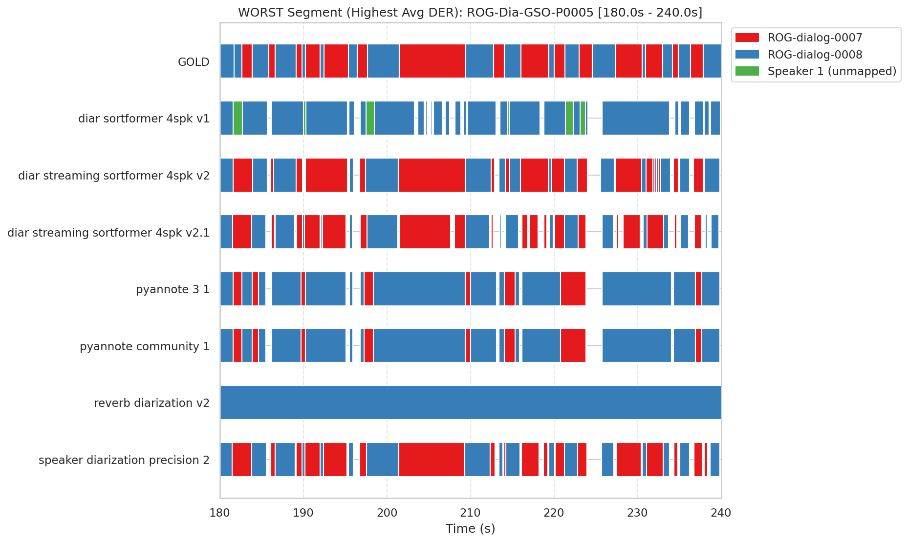

| Model                               | DER       | Miss     | FA       | Conf     | Pur       | Cov        | VRAM (GB)   |
|-------------------------------------|-----------|----------|----------|----------|-----------|------------|-------------|
| diar streaming sortformer 4spk v2   | **12.04** | 9.06     | 2.30     | 0.68     | 82.21     | 84.07      | 1.1         |
| speaker diarization precision 2     | 12.43     | 10.26    | 1.72     | **0.45** | 82.76     | 84.80      | **0.0**     |
| diar streaming sortformer 4spk v2.1 | 19.20     | 17.40    | 1.20     | 0.59     | **83.31** | 87.08      | 1.1         |
| pyannote community 1                | 44.77     | **8.62** | 3.97     | 32.18    | 53.29     | 85.90      | 1.6         |
| pyannote 3 1                        | 44.77     | **8.62** | 3.97     | 32.18    | 53.29     | 85.90      | 1.6         |
| reverb diarization v2               | 46.42     | 10.34    | **0.39** | 35.69    | 53.97     | **100.00** | 4.3         |
| diar sortformer 4spk v1             | 57.63     | 20.01    | 2.65     | 34.96    | 56.91     | 63.09      | 47.9        |

---

### File: ROG-Dia-GSO-P0007

**Domain:** Družabni pogovor | **Quality:** 5 | **Device:** Apple iPhone 13

> *Ena sogovornica je obiskala drugo in v kuhinji za mizo sta opravile pogovor, ki se je snemal.*

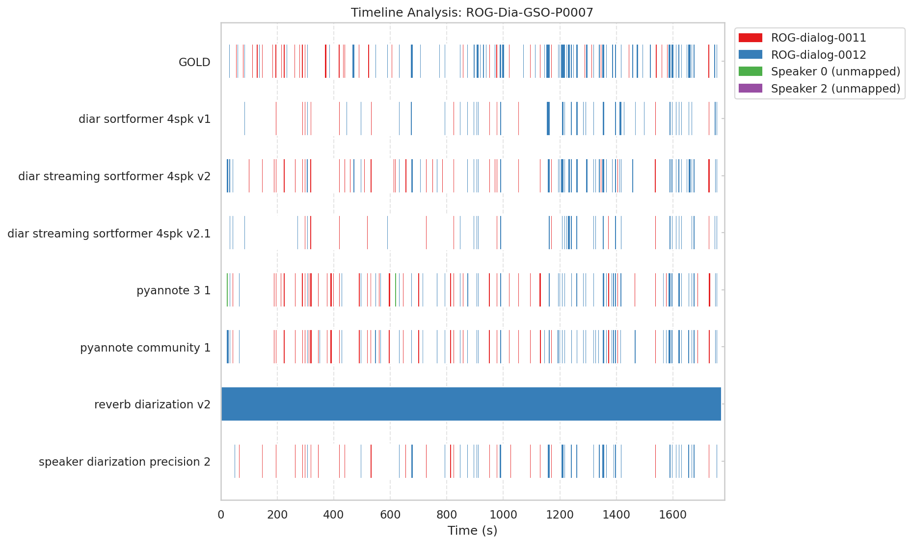

#### 60-Second Snippets (Zoom-in)
Below are 60-second zoomed-in windows showing where the models performed best and worst (based on average DER).

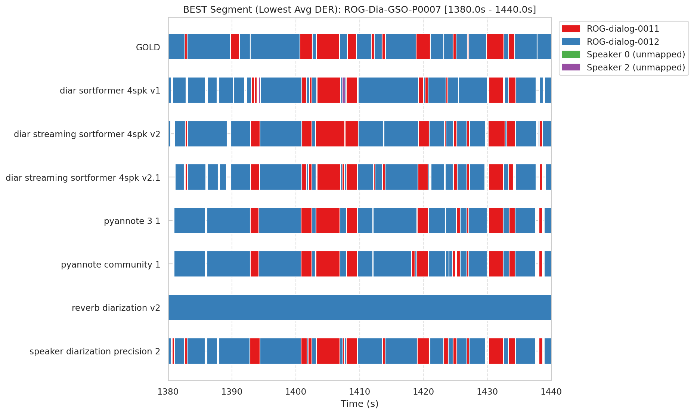

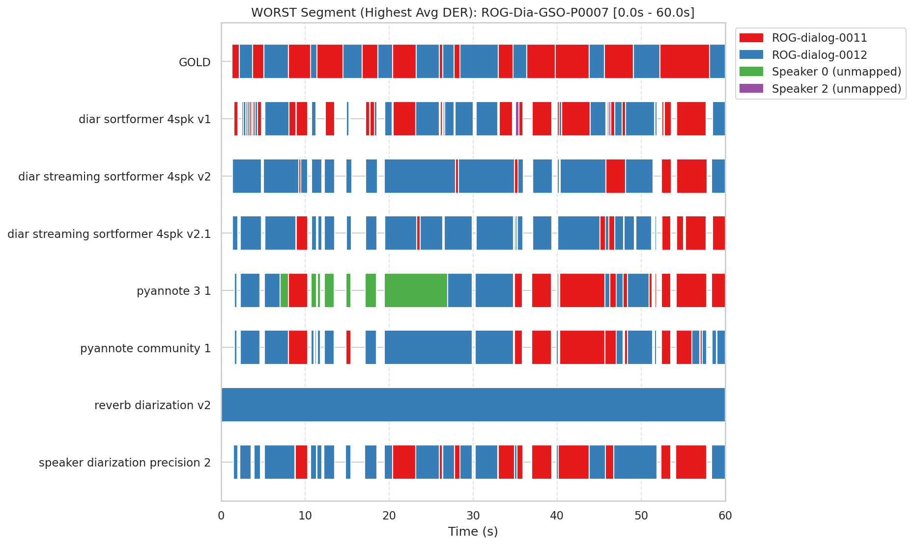

| Model                               | DER       | Miss      | FA       | Conf     | Pur       | Cov        | VRAM (GB)   |
|-------------------------------------|-----------|-----------|----------|----------|-----------|------------|-------------|
| speaker diarization precision 2     | **18.15** | 14.81     | 1.60     | **1.74** | **77.21** | 80.13      | **0.0**     |
| diar streaming sortformer 4spk v2   | 18.75     | **14.26** | 1.93     | 2.56     | 75.98     | 78.67      | 1.5         |
| diar streaming sortformer 4spk v2.1 | 22.66     | 18.49     | 1.51     | 2.66     | 76.01     | 79.48      | 1.5         |
| pyannote community 1                | 24.20     | 15.03     | 2.34     | 6.83     | 71.73     | 73.33      | 1.6         |
| diar sortformer 4spk v1             | 24.80     | 14.42     | 5.11     | 5.27     | 74.43     | 77.93      | 104.4       |
| pyannote 3 1                        | 27.17     | 15.03     | 2.34     | 9.80     | 71.37     | 70.89      | 1.6         |
| reverb diarization v2               | 47.30     | 15.32     | **0.06** | 31.92    | 52.76     | **100.00** | 4.3         |

---

### File: ROG-Dia-GSO-P0008

**Domain:** Diskusija | **Quality:** 4 | **Device:** Iphone 13 mini

> *Pogovor med bratoma o kosilu ter o tehnologiji ter argumentiranje prednosti in slabosti.*

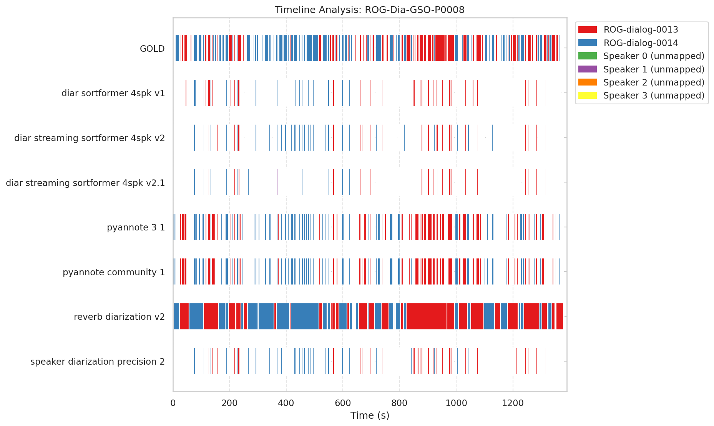

#### 60-Second Snippets (Zoom-in)
Below are 60-second zoomed-in windows showing where the models performed best and worst (based on average DER).

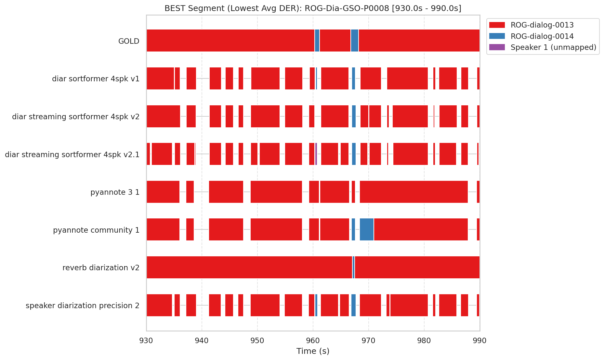

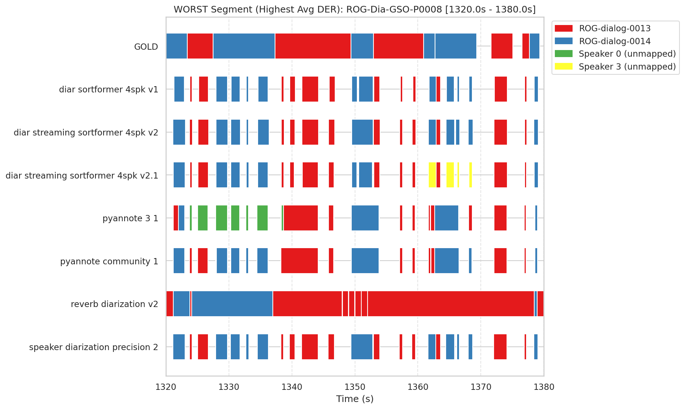

| Model                               | DER       | Miss     | FA       | Conf     | Pur       | Cov       | VRAM (GB)   |
|-------------------------------------|-----------|----------|----------|----------|-----------|-----------|-------------|
| reverb diarization v2               | **23.14** | **4.86** | 1.87     | 16.41    | 78.41     | 77.39     | 4.3         |
| pyannote community 1                | 30.93     | 23.40    | 1.10     | 6.43     | 85.06     | 85.51     | 1.6         |
| speaker diarization precision 2     | 31.78     | 30.82    | **0.43** | **0.53** | 93.30     | **94.68** | **0.0**     |
| pyannote 3 1                        | 31.93     | 23.40    | 1.09     | 7.44     | 84.90     | 84.40     | 1.6         |
| diar sortformer 4spk v1             | 34.78     | 32.48    | 1.19     | 1.10     | 91.31     | 93.11     | 63.9        |
| diar streaming sortformer 4spk v2   | 34.86     | 33.17    | 0.63     | 1.06     | 92.87     | 93.78     | 1.3         |
| diar streaming sortformer 4spk v2.1 | 42.47     | 37.29    | 0.95     | 4.23     | **93.84** | 89.13     | 1.3         |

---

### File: ROG-Dia-GSO-P0009

**Domain:** Družabni pogovor | **Quality:** 5 | **Device:** Mobilni telefon Iphone SE 2020

> *Posnetek je nastal v domačem okolju enega izmed govorcev med njim in njegovim dolgoletnim sosedom in prijateljem na pobudo snemalke. *

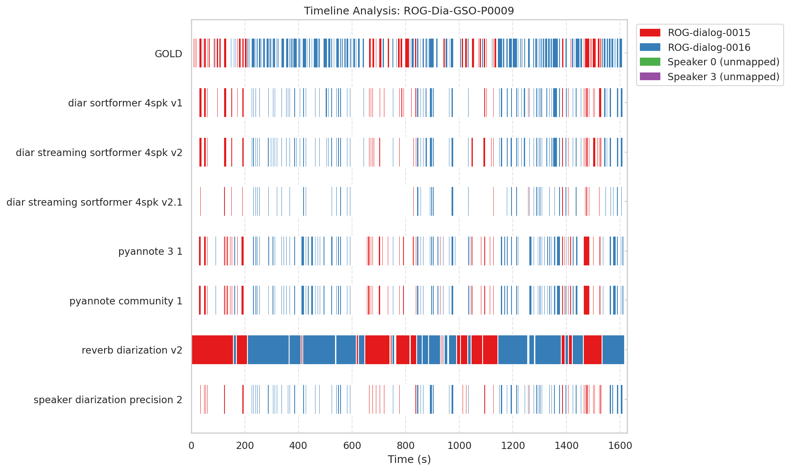

#### 60-Second Snippets (Zoom-in)
Below are 60-second zoomed-in windows showing where the models performed best and worst (based on average DER).

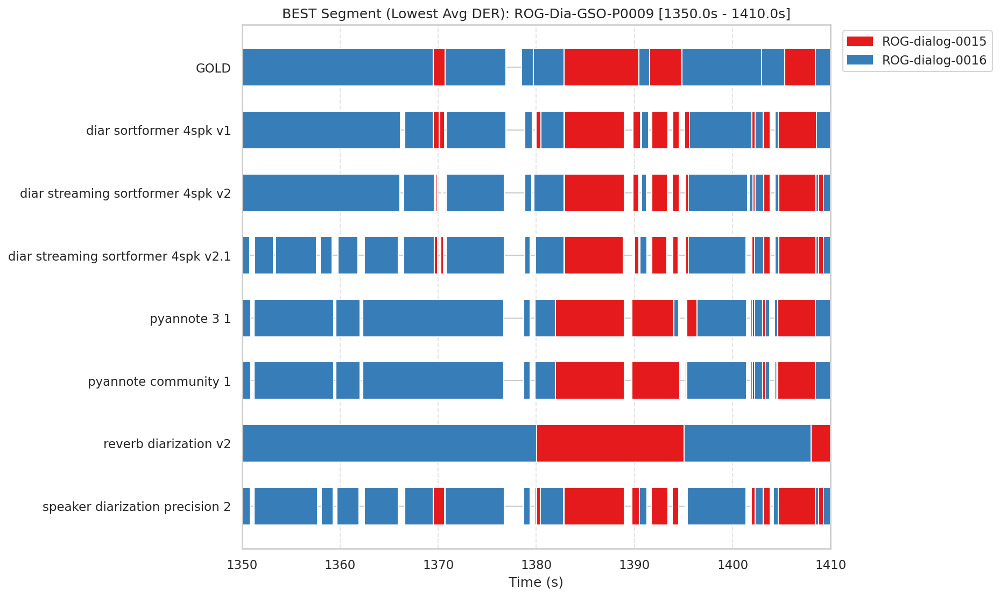

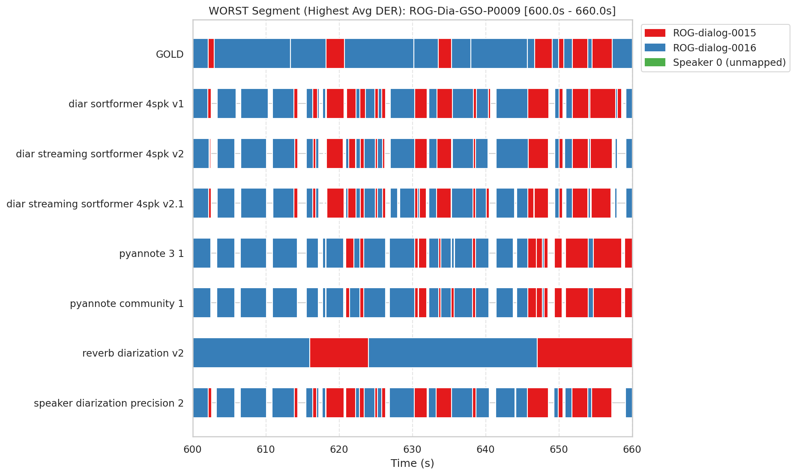

| Model                               | DER       | Miss      | FA       | Conf     | Pur       | Cov       | VRAM (GB)   |
|-------------------------------------|-----------|-----------|----------|----------|-----------|-----------|-------------|
| diar sortformer 4spk v1             | **19.56** | 16.97     | 1.77     | 0.82     | 80.71     | 84.54     | 87.1        |
| reverb diarization v2               | 19.57     | **12.53** | **0.83** | 6.21     | 80.58     | 79.31     | 4.3         |
| speaker diarization precision 2     | 19.80     | 17.45     | 1.69     | **0.65** | 80.65     | 84.33     | **0.0**     |
| diar streaming sortformer 4spk v2   | 21.36     | 19.42     | 1.25     | 0.69     | **81.62** | 85.50     | 1.4         |
| pyannote 3 1                        | 24.40     | 19.58     | 1.48     | 3.34     | 78.90     | 80.28     | 1.6         |
| pyannote community 1                | 24.50     | 19.58     | 1.48     | 3.43     | 78.80     | 80.34     | 1.6         |
| diar streaming sortformer 4spk v2.1 | 25.45     | 23.57     | 1.20     | 0.68     | 81.31     | **85.86** | 1.4         |

---

### File: ROG-Dia-GSO-P0011

**Domain:** Intervju | **Quality:** 4 | **Device:** Mobilna naprava Iphone 13, aplikacija Voice Record.

> *Govorca sta ženska in moški, oba stara okrog 50 let. Je večer, sedita za kuhinjsko mizo. Ženska postavlja moškemu vprašanja o domačem kraju, običajih in spominih iz otroštva ter mladosti. Moški odgovarja na njena vprašanja, ona pa ga med tem tudi spomni na pomembne točke, ki bi jih lahko vključil v svoje odgovore.*

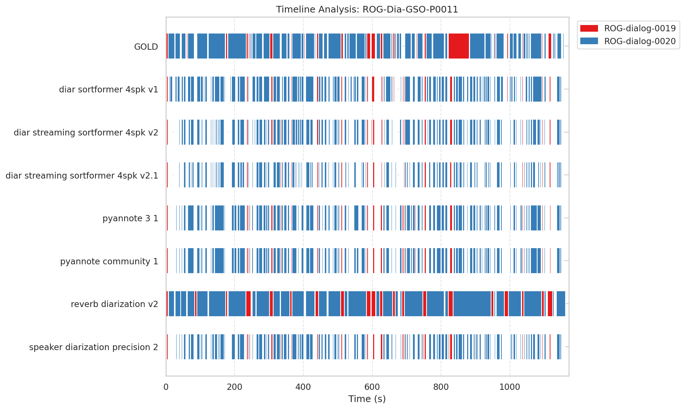

#### 60-Second Snippets (Zoom-in)
Below are 60-second zoomed-in windows showing where the models performed best and worst (based on average DER).

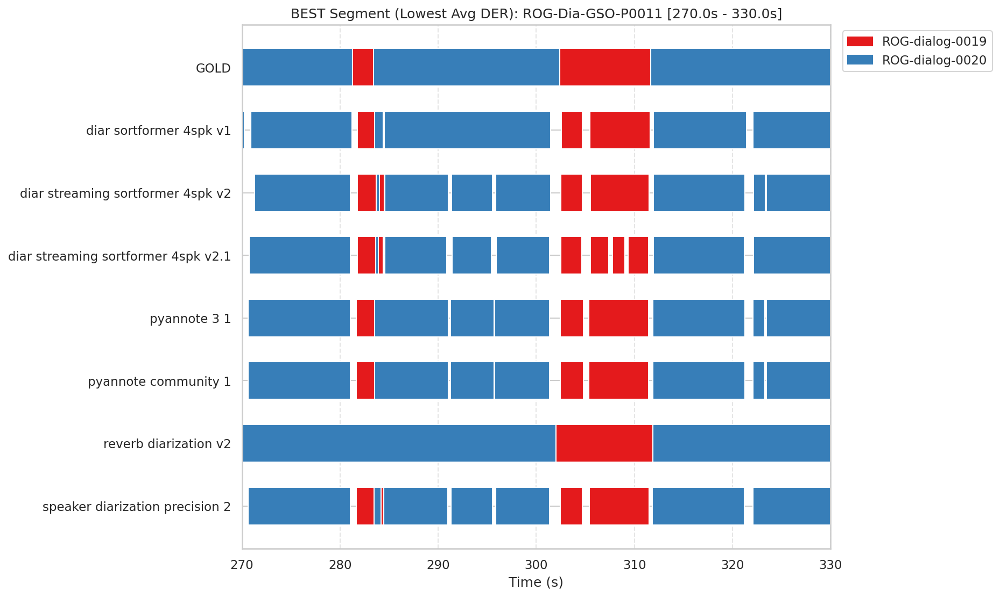

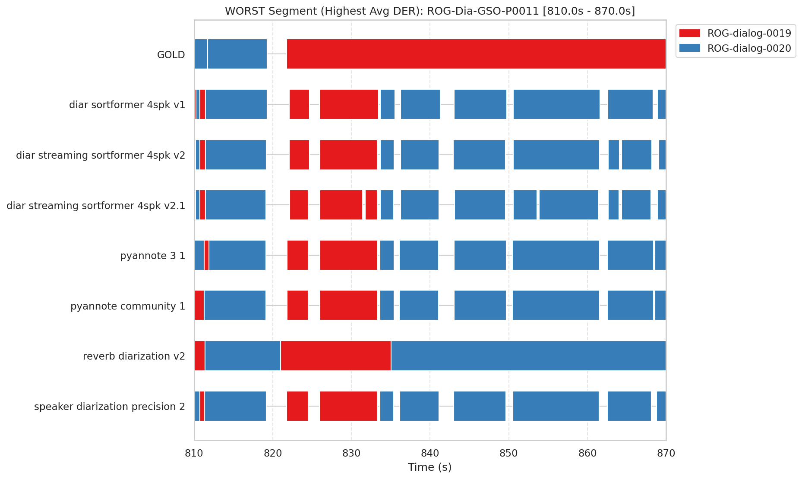

| Model                               | DER       | Miss     | FA       | Conf     | Pur       | Cov       | VRAM (GB)   |
|-------------------------------------|-----------|----------|----------|----------|-----------|-----------|-------------|
| reverb diarization v2               | **16.11** | **4.31** | 3.59     | 8.21     | 86.99     | 86.81     | 4.3         |
| diar sortformer 4spk v1             | 18.82     | 13.48    | 1.32     | 4.02     | **88.62** | **90.26** | 45.7        |
| speaker diarization precision 2     | 20.97     | 15.61    | 1.42     | 3.94     | 88.09     | 89.90     | **0.0**     |
| pyannote 3 1                        | 21.12     | 15.37    | 1.44     | 4.31     | 87.90     | 89.21     | 1.6         |
| pyannote community 1                | 21.14     | 15.37    | 1.44     | 4.33     | 87.87     | 89.23     | 1.6         |
| diar streaming sortformer 4spk v2   | 23.62     | 18.58    | **1.18** | 3.86     | 88.28     | 89.86     | 1.1         |
| diar streaming sortformer 4spk v2.1 | 25.38     | 20.33    | 1.24     | **3.81** | 87.99     | 89.95     | 1.1         |

---

### File: ROG-Dia-GSO-P0012

**Domain:** Intervju | **Quality:** 4 | **Device:** Pametni telefon Samsung Galaxy a53

> *Ena od sogovornic je prišla na obisk k drugi. Usedli sta se za mizo in pričeli s pogovorom.*

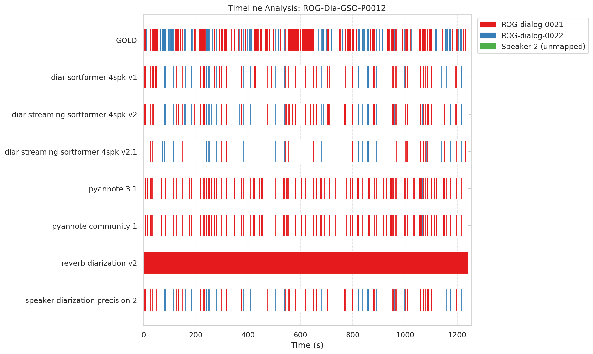

#### 60-Second Snippets (Zoom-in)
Below are 60-second zoomed-in windows showing where the models performed best and worst (based on average DER).

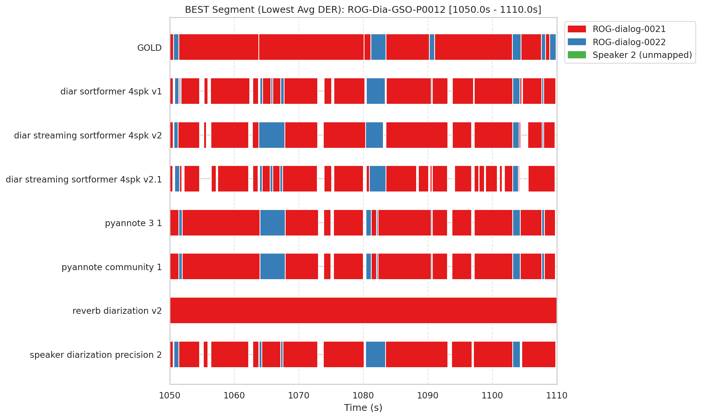

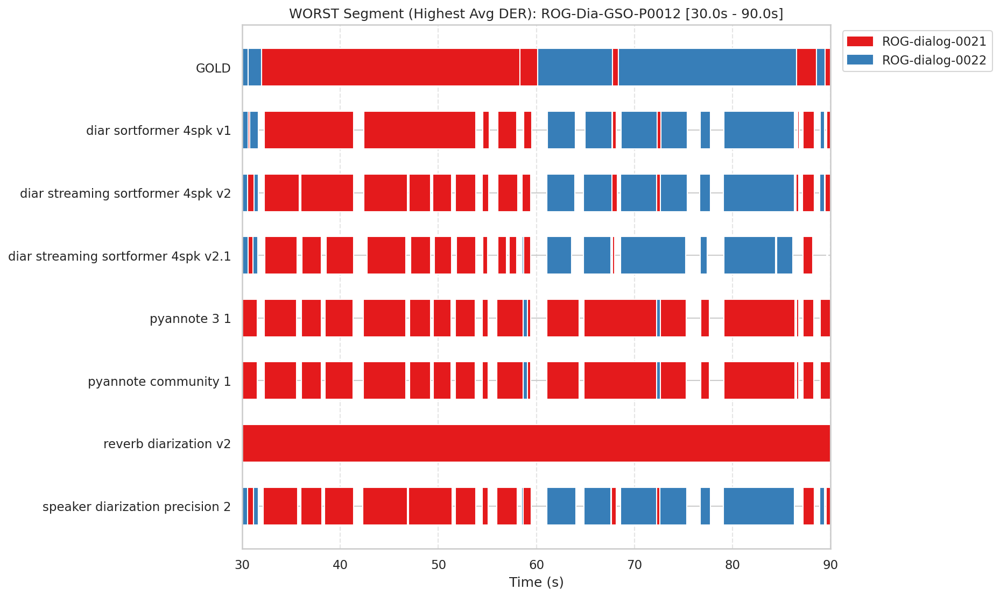

| Model                               | DER       | Miss      | FA       | Conf     | Pur       | Cov        | VRAM (GB)   |
|-------------------------------------|-----------|-----------|----------|----------|-----------|------------|-------------|
| diar streaming sortformer 4spk v2   | **16.86** | 15.19     | 1.07     | 0.60     | 82.82     | 85.34      | 1.2         |
| speaker diarization precision 2     | 17.51     | 16.05     | 0.98     | 0.48     | 83.42     | 86.57      | **0.0**     |
| diar sortformer 4spk v1             | 18.87     | 17.38     | 1.06     | **0.44** | 83.56     | 87.42      | 51.9        |
| diar streaming sortformer 4spk v2.1 | 25.58     | 24.24     | 0.64     | 0.70     | **83.99** | 87.80      | 1.2         |
| reverb diarization v2               | 39.44     | **10.87** | **0.34** | 28.23    | 60.91     | **100.00** | 4.3         |
| pyannote community 1                | 41.78     | 16.43     | 1.17     | 24.18    | 59.23     | 90.06      | 1.6         |
| pyannote 3 1                        | 41.78     | 16.43     | 1.17     | 24.18    | 59.23     | 90.06      | 1.6         |

---

### File: ROG-Dia-GSO-P0016

**Domain:** Diskusija | **Quality:** 3 | **Device:** pametni telefon Huawei P30 PRO

> *Starejši moški in ženska imata diskusijo o svojem otroštvu, odraščanju na kmetih. *

> ⚠️ **ERRATA APPLIED**: Evaluation bounded to 1172.092s.

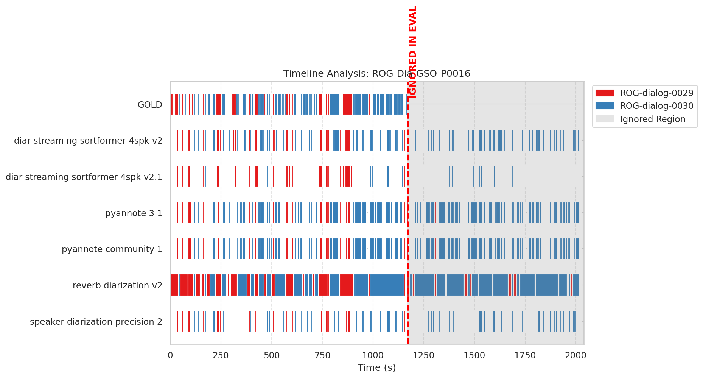

#### 60-Second Snippets (Zoom-in)
Below are 60-second zoomed-in windows showing where the models performed best and worst (based on average DER).

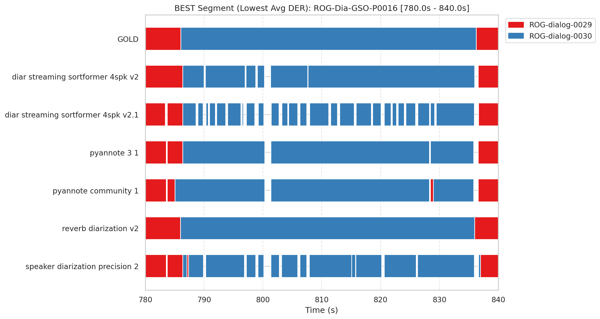

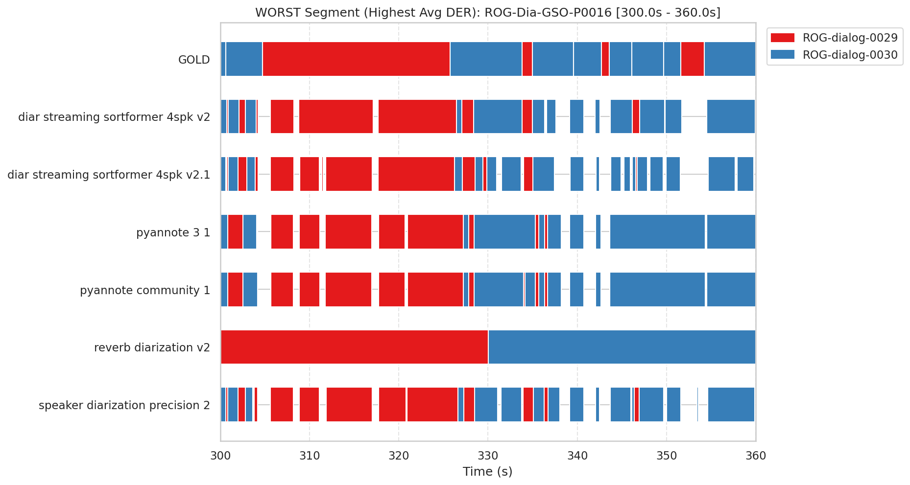

| Model                               | DER       | Miss      | FA       | Conf     | Pur       | Cov       | VRAM (GB)   | Status   |
|-------------------------------------|-----------|-----------|----------|----------|-----------|-----------|-------------|----------|
| diar streaming sortformer 4spk v2   | **14.74** | **12.43** | 1.48     | 0.83     | 80.23     | 82.67     | 1.6         | nan      |
| pyannote 3 1                        | 16.50     | 12.59     | 1.69     | 2.22     | 79.54     | 81.47     | 1.6         | nan      |
| speaker diarization precision 2     | 16.53     | 14.26     | 1.50     | **0.77** | 80.12     | 82.78     | **0.0**     | nan      |
| pyannote community 1                | 16.79     | 12.59     | 1.69     | 2.51     | 79.26     | 81.21     | 1.6         | nan      |
| reverb diarization v2               | 18.03     | 12.49     | **0.40** | 5.13     | **81.55** | 80.83     | 4.3         | nan      |
| diar streaming sortformer 4spk v2.1 | 20.57     | 18.36     | 1.21     | 1.00     | 80.18     | **83.12** | 1.6         | nan      |
| diar sortformer 4spk v1             | nan       | nan       | nan      | nan      | nan       | nan       | nan         | OOM/ERR  |

---

### File: ROG-Dia-GSO-P0018

**Domain:** Družabni pogovor | **Quality:** 5 | **Device:** telefon Samsung A52

> *Dobili smo se v župnišču, se pogovorili o prostoru snemanja, zahtevah posnetka. Govorki sta se odločili za spontan družabni pogovor brez vnaprej pripravljenih tem in vprašanj.*

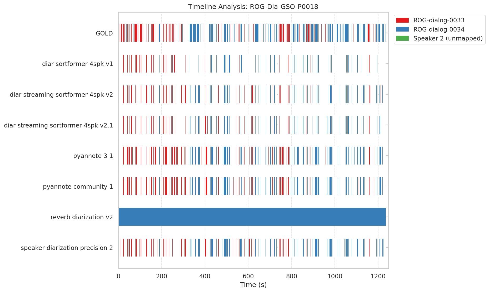

#### 60-Second Snippets (Zoom-in)
Below are 60-second zoomed-in windows showing where the models performed best and worst (based on average DER).

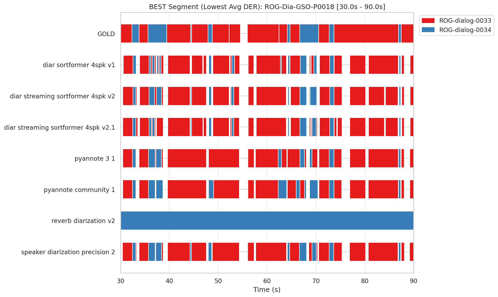

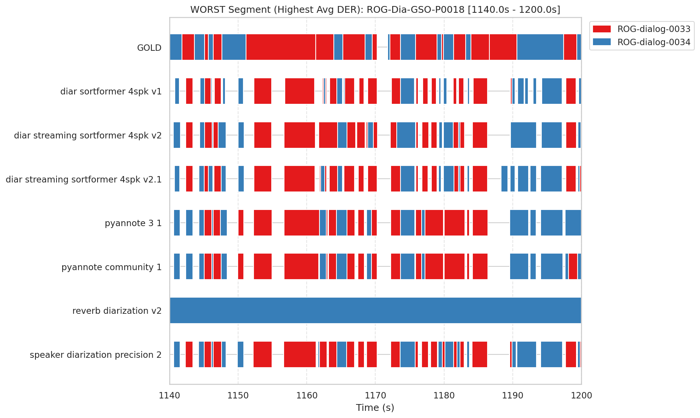

| Model                               | DER       | Miss      | FA       | Conf     | Pur       | Cov        | VRAM (GB)   |
|-------------------------------------|-----------|-----------|----------|----------|-----------|------------|-------------|
| speaker diarization precision 2     | **17.90** | 15.58     | 1.44     | **0.87** | **80.59** | 82.25      | **0.0**     |
| diar streaming sortformer 4spk v2   | 22.07     | 19.19     | 1.57     | 1.31     | 79.67     | 82.31      | 1.2         |
| pyannote 3 1                        | 22.46     | 15.81     | 1.59     | 5.06     | 76.47     | 77.78      | 1.6         |
| diar streaming sortformer 4spk v2.1 | 23.02     | 19.85     | 1.70     | 1.46     | 79.73     | 82.87      | 1.2         |
| pyannote community 1                | 24.29     | 15.81     | 1.59     | 6.89     | 74.70     | 76.22      | 1.6         |
| diar sortformer 4spk v1             | 28.25     | 24.70     | 1.70     | 1.85     | 78.50     | 81.45      | 51.6        |
| reverb diarization v2               | 48.77     | **12.39** | **0.56** | 35.82    | 51.79     | **100.00** | 4.3         |

---

### File: ROG-Dia-GSO-P0019

**Domain:** Pripoved | **Quality:** 4 | **Device:** Iphone 13 mini

> *Pogovor med sestro in bratom, ki sta se pogovarjala o potovanjih. Sestra je delila svojo izkušnjo potovanja v tujino, medtem ko jo je brat spraševal še o drugih vidikih potovanja – od priprav pred odhodom do krajev, ki jih je obiskala.*

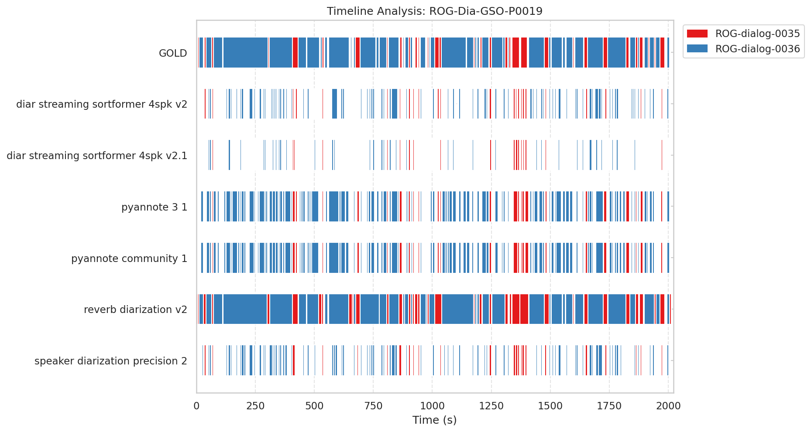

#### 60-Second Snippets (Zoom-in)
Below are 60-second zoomed-in windows showing where the models performed best and worst (based on average DER).

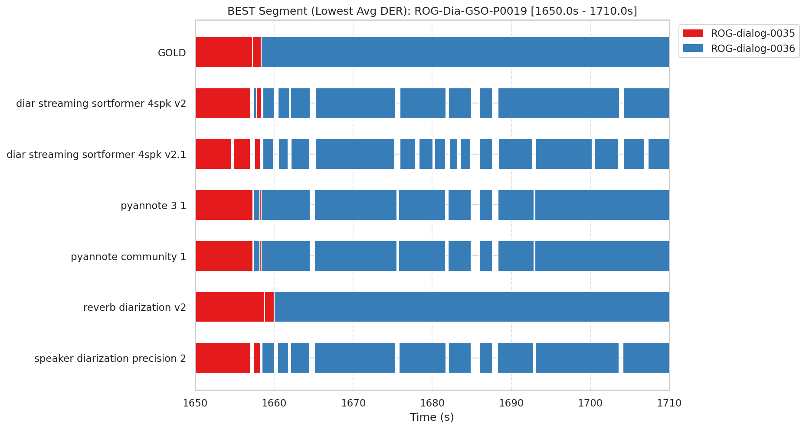

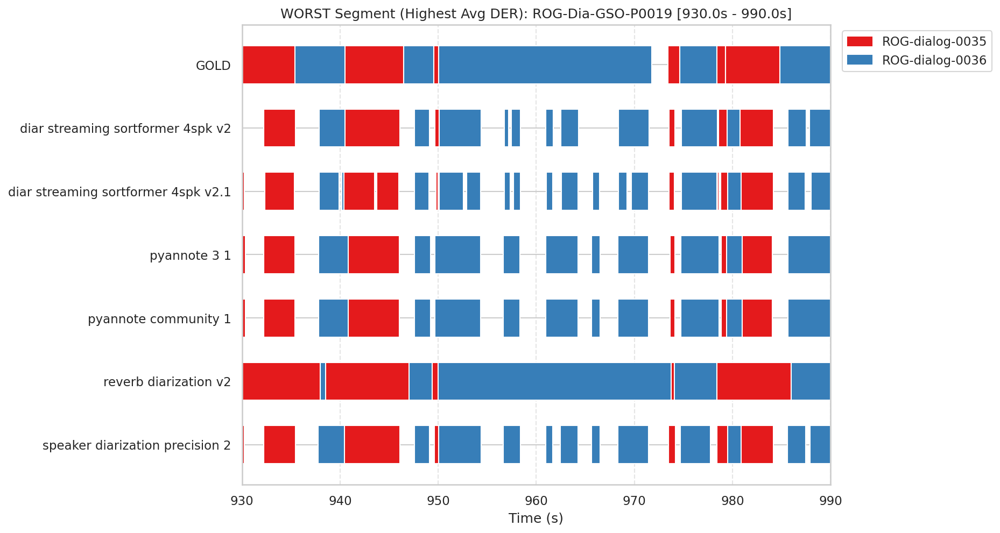

| Model                               | DER      | Miss     | FA       | Conf     | Pur       | Cov       | VRAM (GB)   | Status   |
|-------------------------------------|----------|----------|----------|----------|-----------|-----------|-------------|----------|
| reverb diarization v2               | **6.88** | **1.59** | 1.20     | 4.09     | 94.02     | 94.15     | 4.3         | nan      |
| pyannote 3 1                        | 14.18    | 13.84    | 0.31     | 0.03     | 98.25     | 98.46     | 1.6         | nan      |
| pyannote community 1                | 14.21    | 13.84    | 0.31     | 0.07     | 98.21     | 98.44     | 1.6         | nan      |
| speaker diarization precision 2     | 19.03    | 18.93    | 0.10     | 0.00     | **98.59** | 98.81     | **0.0**     | nan      |
| diar streaming sortformer 4spk v2   | 21.12    | 21.02    | 0.09     | **0.00** | 98.58     | **98.84** | 1.6         | nan      |
| diar streaming sortformer 4spk v2.1 | 24.92    | 24.85    | **0.07** | 0.01     | 98.59     | 98.84     | 1.6         | nan      |
| diar sortformer 4spk v1             | nan      | nan      | nan      | nan      | nan       | nan       | nan         | OOM/ERR  |

---

### File: ROG-Dia-GSO-P0021

**Domain:** Družabni pogovor | **Quality:** 4 | **Device:** Apple iPhone 15 Pro

> *Prijateljski pogovor med 2 osebama, ki se pogovarjata o splošnih temah; delo, prosti čas, hišni ljubljenčki, načrti za prihodnost, opis dela, itd*

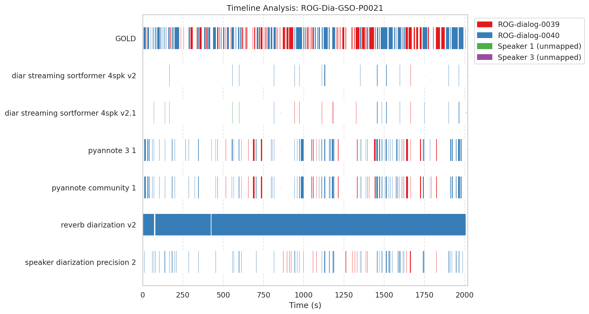

#### 60-Second Snippets (Zoom-in)
Below are 60-second zoomed-in windows showing where the models performed best and worst (based on average DER).

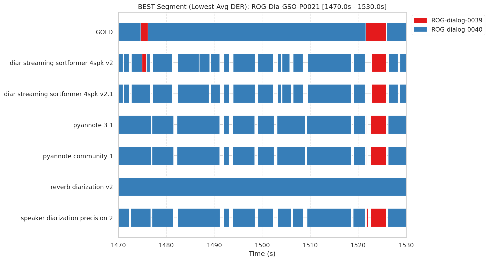

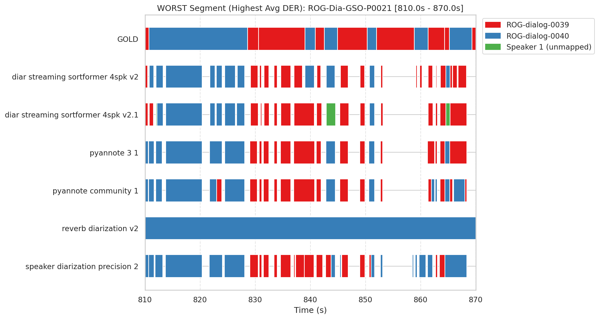

| Model                               | DER       | Miss     | FA       | Conf     | Pur       | Cov        | VRAM (GB)   | Status   |
|-------------------------------------|-----------|----------|----------|----------|-----------|------------|-------------|----------|
| speaker diarization precision 2     | **24.08** | 21.34    | 1.04     | **1.70** | **93.64** | 94.79      | **0.0**     | nan      |
| pyannote 3 1                        | 26.14     | 20.17    | 0.73     | 5.23     | 89.98     | 90.56      | 1.6         | nan      |
| pyannote community 1                | 26.93     | 20.17    | 0.73     | 6.02     | 89.03     | 90.01      | 1.6         | nan      |
| diar streaming sortformer 4spk v2   | 31.98     | 29.41    | 0.76     | 1.80     | 93.37     | 94.64      | 1.6         | nan      |
| reverb diarization v2               | 44.27     | **2.04** | **0.47** | 41.77    | 56.26     | **100.00** | 4.3         | nan      |
| diar streaming sortformer 4spk v2.1 | 60.87     | 28.41    | 1.31     | 31.15    | 82.25     | 54.49      | 1.6         | nan      |
| diar sortformer 4spk v1             | nan       | nan      | nan      | nan      | nan       | nan        | nan         | OOM/ERR  |

---

### File: ROG-Dia-GSO-P0022

**Domain:** Družabni pogovor | **Quality:** 5 | **Device:** Pametni telefon iphone 11 z aplikacijo Voice Record Pro z naročenimi nastavitvami. 

> *Pogovor med sorodnikoma o glasbenih skupinah in glasbenih izkušnjah.*

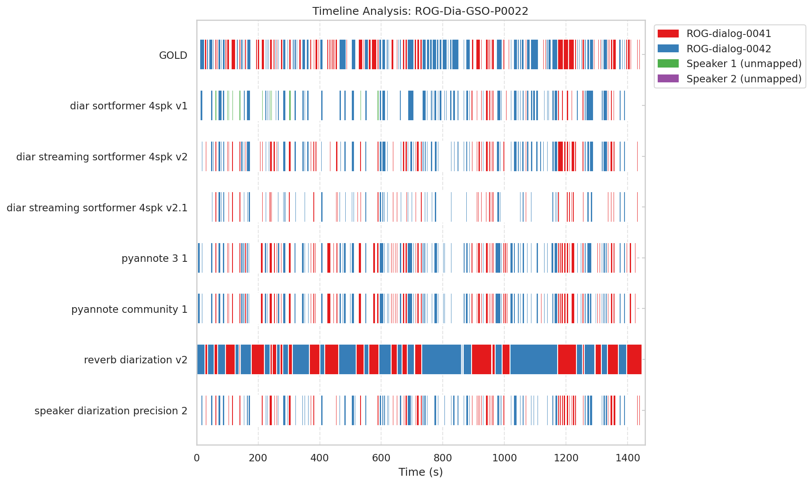

#### 60-Second Snippets (Zoom-in)
Below are 60-second zoomed-in windows showing where the models performed best and worst (based on average DER).

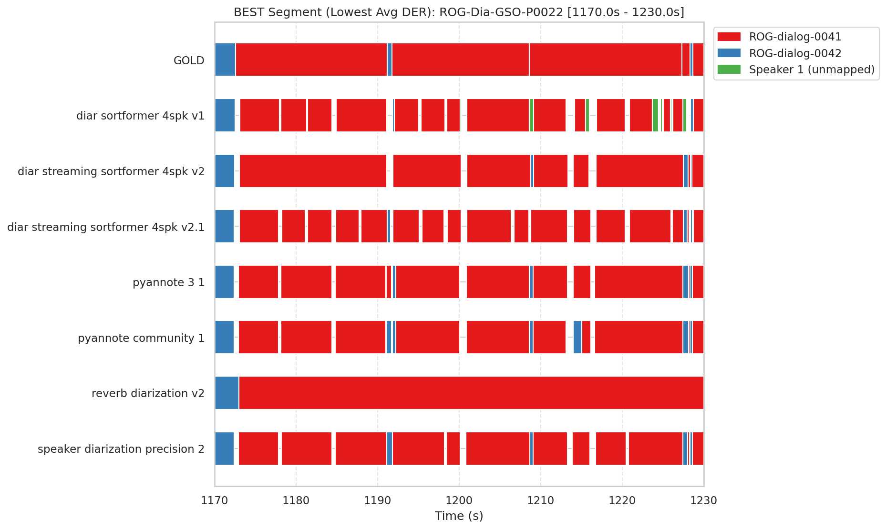

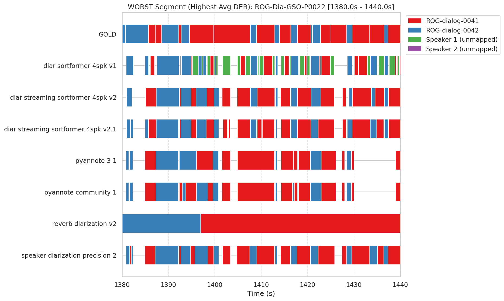

| Model                               | DER       | Miss     | FA       | Conf     | Pur       | Cov       | VRAM (GB)   |
|-------------------------------------|-----------|----------|----------|----------|-----------|-----------|-------------|
| speaker diarization precision 2     | **13.84** | 11.05    | 2.45     | **0.34** | 88.56     | 90.34     | **0.0**     |
| reverb diarization v2               | 16.19     | **5.42** | **0.45** | 10.32    | 83.96     | 81.57     | 4.3         |
| diar streaming sortformer 4spk v2   | 16.93     | 14.20    | 1.90     | 0.83     | 89.30     | 91.22     | 1.3         |
| pyannote 3 1                        | 17.66     | 12.22    | 2.49     | 2.94     | 86.53     | 87.02     | 1.6         |
| pyannote community 1                | 17.90     | 12.22    | 2.49     | 3.18     | 86.28     | 86.89     | 1.6         |
| diar streaming sortformer 4spk v2.1 | 19.85     | 17.26    | 2.15     | 0.44     | 88.89     | **91.89** | 1.3         |
| diar sortformer 4spk v1             | 35.84     | 15.58    | 2.15     | 18.11    | **89.89** | 73.67     | 69.9        |

---

### File: ROG-Dia-GSO-P0025

**Domain:** Navodila | **Quality:** 5 | **Device:** prenosni računalnik acer predator helios 300 z zunanjim mikrofonom RODE NT-USB

> *Pogovor o potovanju na Japonsko, iskanju novega stanovanja, službi in pripravi raznih Japonskih jedi*

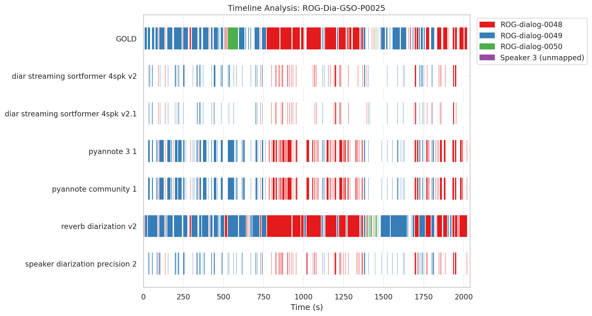

#### 60-Second Snippets (Zoom-in)
Below are 60-second zoomed-in windows showing where the models performed best and worst (based on average DER).

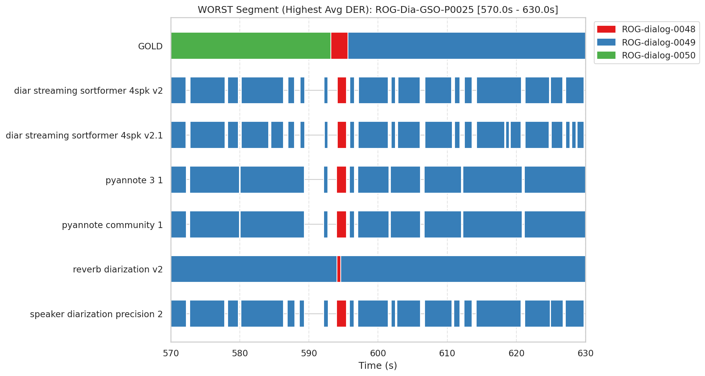

| Model                               | DER       | Miss     | FA       | Conf     | Pur       | Cov       | VRAM (GB)   | Status   |
|-------------------------------------|-----------|----------|----------|----------|-----------|-----------|-------------|----------|
| reverb diarization v2               | **12.94** | **2.86** | 1.27     | 8.81     | 87.89     | 89.43     | 4.3         | nan      |
| pyannote 3 1                        | 23.08     | 18.34    | 0.78     | 3.96     | 91.44     | 93.77     | 1.6         | nan      |
| pyannote community 1                | 23.10     | 18.34    | 0.78     | 3.98     | 91.42     | 93.93     | 1.6         | nan      |
| speaker diarization precision 2     | 26.46     | 22.65    | **0.70** | 3.11     | 91.89     | **94.31** | **0.0**     | nan      |
| diar streaming sortformer 4spk v2   | 28.42     | 24.49    | 0.85     | **3.08** | 91.52     | 94.23     | 1.6         | nan      |
| diar streaming sortformer 4spk v2.1 | 32.15     | 26.69    | 0.75     | 4.72     | **92.05** | 92.23     | 1.6         | nan      |
| diar sortformer 4spk v1             | nan       | nan      | nan      | nan      | nan       | nan       | nan         | OOM/ERR  |

---

