# ROG-Dia Benchmark Report

**Date:** 2026-03-01

## 1. Evaluated Models
* **diar sortformer 4spk v1** (`nvidia/diar_sortformer_4spk-v1`) - [HuggingFace](https://huggingface.co/nvidia/diar_sortformer_4spk-v1)
* **diar streaming sortformer 4spk v2** (`nvidia/diar_streaming_sortformer_4spk-v2`) - [HuggingFace](https://huggingface.co/nvidia/diar_streaming_sortformer_4spk-v2)
* **diar streaming sortformer 4spk v2.1** (`nvidia/diar_streaming_sortformer_4spk-v2.1`) - [HuggingFace](https://huggingface.co/nvidia/diar_streaming_sortformer_4spk-v2.1)
* **pyannote 3 1** (`pyannote/speaker-diarization-3.1`) - [HuggingFace](https://huggingface.co/pyannote/speaker-diarization-3.1)
* **pyannote community 1** (`pyannote/speaker-diarization-community-1`) - [HuggingFace](https://huggingface.co/pyannote/speaker-diarization-community-1)
* **reverb diarization v2** (`Revai/reverb-diarization-v2`) - [HuggingFace](https://huggingface.co/Revai/reverb-diarization-v2)
* **speaker diarization precision 2** (`pyannote/speaker-diarization-precision-2`) - [HuggingFace](https://huggingface.co/pyannote/speaker-diarization-precision-2)

## 2. Executive Summary

| Model                               |   Collar | DER       | Purity    | Cover     | Miss     | FA       | Conf     | RTF        | VRAM (GB)   | Completed   |
|-------------------------------------|----------|-----------|-----------|-----------|----------|----------|----------|------------|-------------|-------------|
| speaker diarization precision 2     |     0.25 | **18.68** | **87.29** | 89.32     | 16.53    | 1.25     | **0.56** | 0.03       | **0.0**     | 12/12       |
| diar streaming sortformer 4spk v2   |     0.25 | 21.18     | 86.97     | 89.09     | 18.54    | 1.37     | 0.77     | **< 0.01** | 1.6         | 12/12       |
| pyannote community 1                |     0.25 | 23.81     | 81.28     | 86.74     | 15.14    | 1.73     | 7.64     | 0.06       | 1.6         | 12/12       |
| pyannote 3 1                        |     0.25 | 23.89     | 81.51     | 86.60     | 15.14    | 1.73     | 7.66     | 0.06       | 1.6         | 12/12       |
| diar streaming sortformer 4spk v2.1 |     0.25 | 28.24     | 86.11     | 84.68     | 22.31    | **1.22** | 3.71     | < 0.01     | 1.6         | 12/12       |
| reverb diarization v2               |     0.25 | 28.25     | 73.84     | **91.79** | **8.13** | 2.20     | 18.33    | 0.10       | 4.3         | 12/12       |
| diar sortformer 4spk v1             |     0.25 | 57.51     | 80.69     | 48.43     | 19.41    | 2.47     | 7.60     | 0.03       | 104.4       | 8/12        |

### Terminology & Methodology
* **DER (Diarization Error Rate):** Primary metric. Lower is better. Sum of Missed, False Alarm, and Confusion rates.
* **Miss (%):** Speech present in Gold Standard but missed by the model.
* **FA (False Alarm %):** Model predicted speech where Gold Standard is silent.
* **Conf (Confusion %):** Speech correctly detected but assigned to the wrong speaker.
* **Purity (%):** Evaluates cluster purity. High purity = when a model identifies a speaker, it is consistently the same person.
* **Cover (Coverage %):** Evaluates how much of the original speaker's speech was captured under a single hypothesis cluster.
* **RTF (Real Time Factor):** Processing time divided by audio length. e.g., `< 0.01` means exceptionally fast processing.
* **VRAM (GB):** Peak GPU memory utilized. `0.0 GB` indicates an API/Cloud-based model.

## 3. Dataset Errata (Corrections Applied)
Corrections automatically applied via Universal Evaluation Maps (UEM) to account for transcription errors. Models are not penalized for predictions outside these boundaries.

* **`ROG-Dia-GSO-P0016`**: Evaluated only up to 1172.092s. *Reason: Zlati standard se zaključi predčasno pri 19:32 (potrdila avtorica). Preostanek posnetka se ignorira pri izračunu metrik.*

## 4. Visual & Domain Analysis
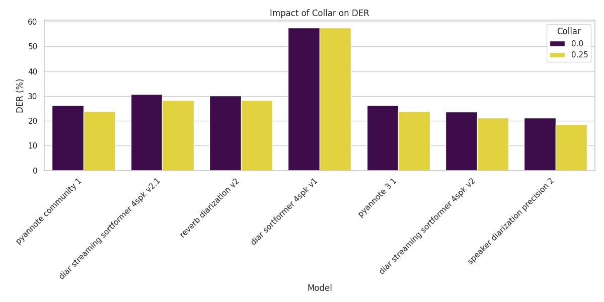

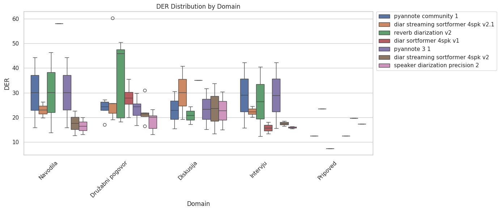

### Domain Comparison (DER %)
Average DER per domain. **Bold** highlights the best model for each domain.

| Domain           | A         |     B |     C |     D |     E | F         | G         |   AVG |
|------------------|-----------|-------|-------|-------|-------|-----------|-----------|-------|
| Diskusija        | 35.09     | 23.59 | 30.05 | 23.36 | 22.95 | **20.78** | 22.74     | 25.51 |
| Družabni pogovor | 27.81     | 22.23 | 30.5  | 23.45 | 23.54 | 36.40     | **18.48** | 26.06 |
| Intervju         | **15.70** | 17.47 | 22.34 | 28.96 | 29.02 | 26.42     | 15.89     | 22.26 |
| Navodila         | 58.11     | 17.62 | 23.05 | 30.06 | 30.04 | 30.12     | **16.47** | 29.35 |
| Pripoved         | nan       | 19.63 | 23.43 | 12.42 | 12.45 | **7.31**  | 17.37     | 15.44 |

* **A**: diar sortformer 4spk v1
* **B**: diar streaming sortformer 4spk v2
* **C**: diar streaming sortformer 4spk v2.1
* **D**: pyannote 3 1
* **E**: pyannote community 1
* **F**: reverb diarization v2
* **G**: speaker diarization precision 2

## 5. Deep Dive: File-by-File Analysis
Detailed breakdown for every file. *For metric definitions, see Executive Summary.*

### File: ROG-Dia-GSO-P0005

**Domain:** Navodila | **Quality:** 4 | **Device:** tablični računalnik Samsung Galaxy S6 Lite

> *Z govorkama smo se predhodno dogovorile za snemanje. Da je bil pogovor sproščen, smo govor snemale na domu ene izmed njiju. Pogovor je potekal o temah, ki govorki zanimajo, da sta si lahko izmenjevali navodila.*

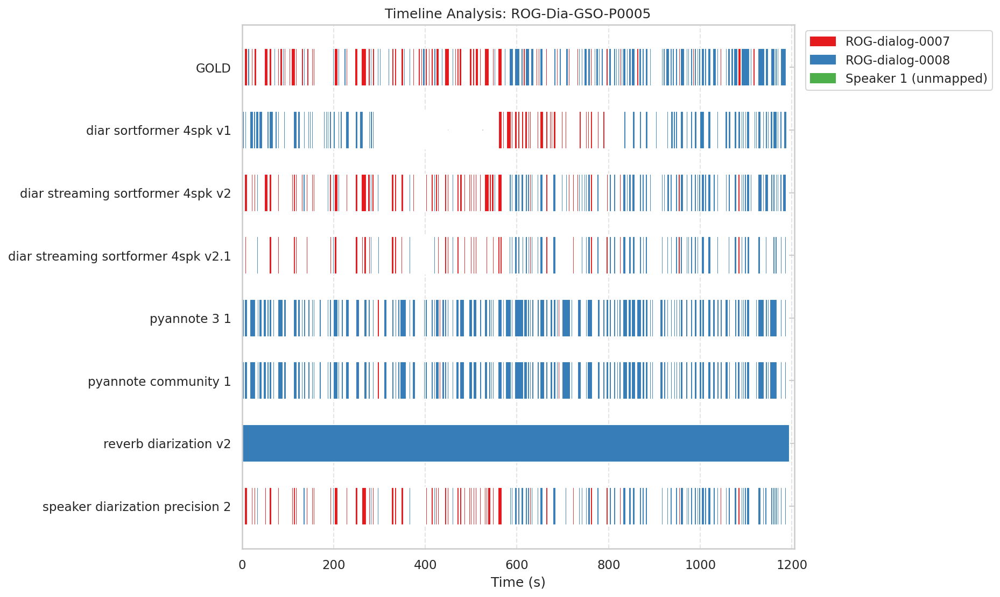

#### 60-Second Snippets (Zoom-in)
Below are 60-second zoomed-in windows showing where the models performed best and worst (based on average DER).

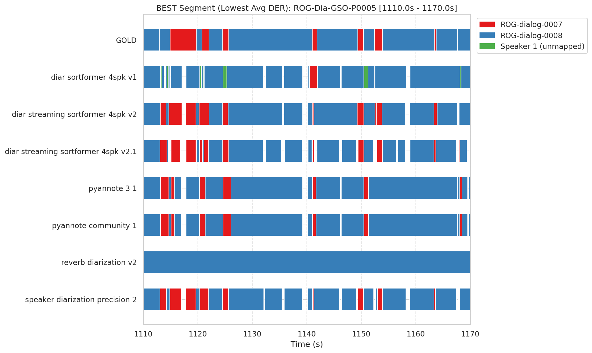

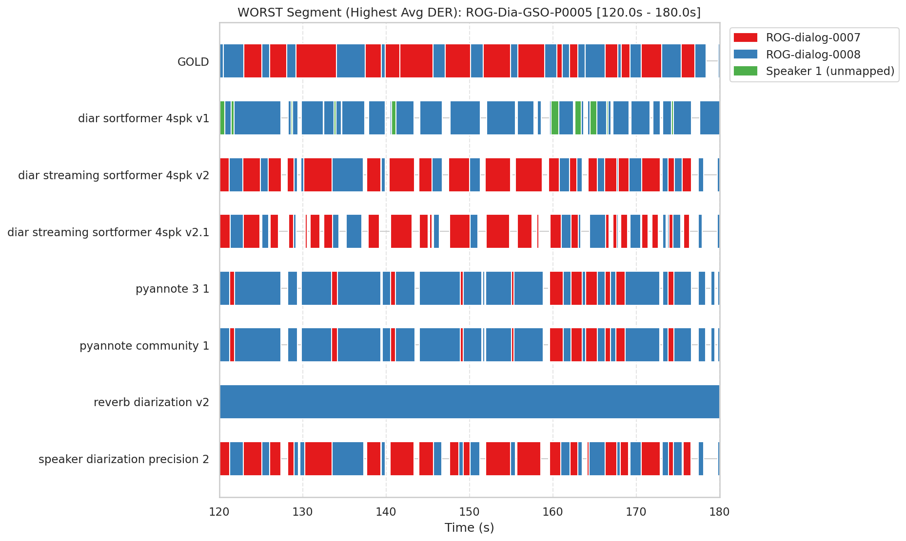

| Model                               | DER       | Miss     | FA       | Conf     | Pur       | Cov        | VRAM (GB)   |
|-------------------------------------|-----------|----------|----------|----------|-----------|------------|-------------|
| diar streaming sortformer 4spk v2   | **12.66** | 9.77     | 2.16     | 0.73     | 81.54     | 83.05      | 1.1         |
| speaker diarization precision 2     | 13.00     | 10.95    | 1.65     | **0.40** | 82.12     | 83.87      | **0.0**     |
| diar streaming sortformer 4spk v2.1 | 19.80     | 18.07    | 1.15     | 0.58     | **82.60** | 85.81      | 1.1         |
| pyannote community 1                | 44.24     | **9.05** | 3.73     | 31.45    | 53.49     | 85.79      | 1.6         |
| pyannote 3 1                        | 44.24     | **9.05** | 3.73     | 31.45    | 53.49     | 85.79      | 1.6         |
| reverb diarization v2               | 46.39     | 11.11    | **0.56** | 34.72    | 54.17     | **100.00** | 4.3         |
| diar sortformer 4spk v1             | 58.11     | 20.93    | 2.83     | 34.36    | 57.24     | 62.31      | 47.9        |

---

### File: ROG-Dia-GSO-P0007

**Domain:** Družabni pogovor | **Quality:** 5 | **Device:** Apple iPhone 13

> *Ena sogovornica je obiskala drugo in v kuhinji za mizo sta opravile pogovor, ki se je snemal.*

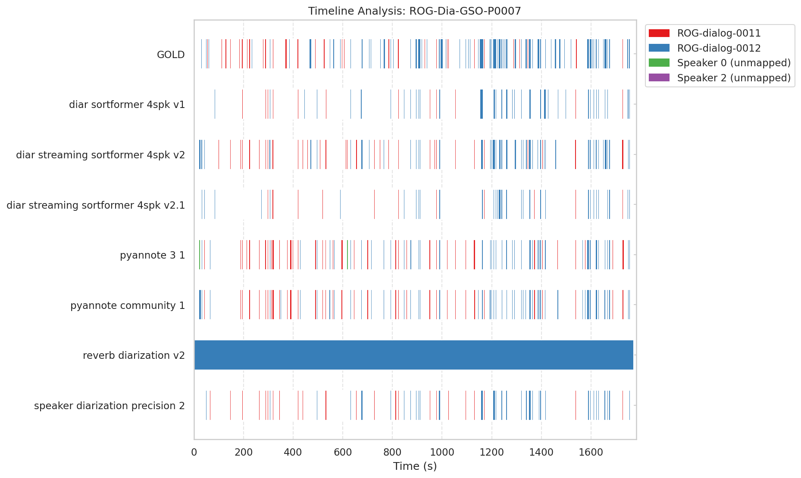

#### 60-Second Snippets (Zoom-in)
Below are 60-second zoomed-in windows showing where the models performed best and worst (based on average DER).

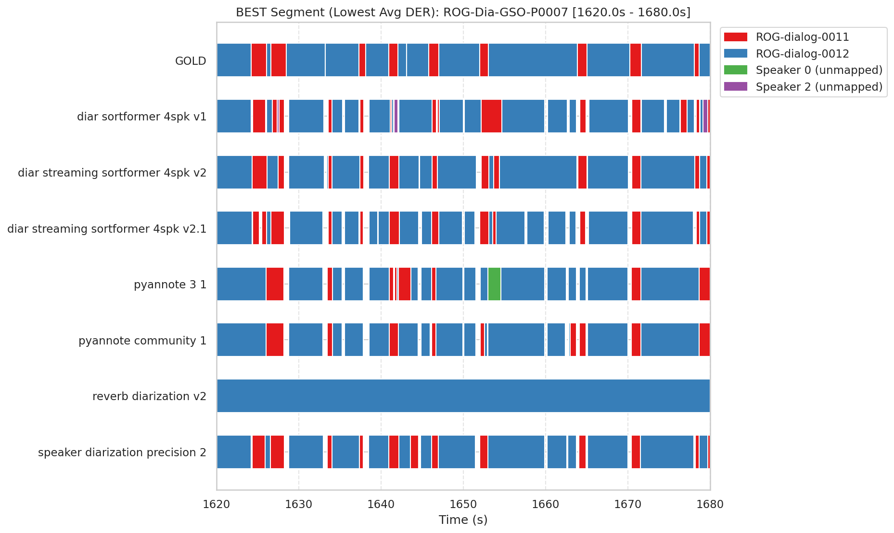

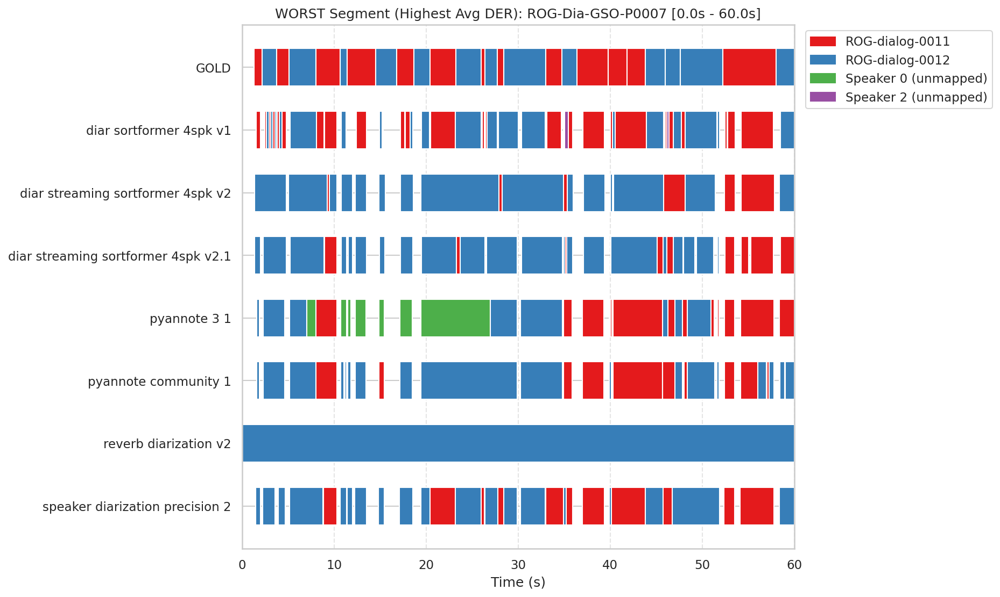

| Model                               | DER       | Miss      | FA       | Conf     | Pur       | Cov        | VRAM (GB)   |
|-------------------------------------|-----------|-----------|----------|----------|-----------|------------|-------------|
| speaker diarization precision 2     | **20.64** | 17.89     | 1.35     | **1.41** | **74.68** | 77.02      | **0.0**     |
| diar streaming sortformer 4spk v2   | 21.86     | **17.64** | 1.89     | 2.34     | 73.42     | 75.38      | 1.5         |
| diar streaming sortformer 4spk v2.1 | 25.74     | 21.65     | 1.57     | 2.52     | 73.27     | 75.85      | 1.5         |
| pyannote community 1                | 27.16     | 18.19     | 2.26     | 6.71     | 68.98     | 70.33      | 1.6         |
| diar sortformer 4spk v1             | 28.54     | 18.15     | 5.47     | 4.91     | 72.34     | 74.54      | 104.4       |
| pyannote 3 1                        | 29.76     | 18.18     | 2.26     | 9.31     | 68.83     | 68.17      | 1.6         |
| reverb diarization v2               | 47.51     | 18.71     | **0.26** | 28.54    | 52.75     | **100.00** | 4.3         |

---

### File: ROG-Dia-GSO-P0008

**Domain:** Diskusija | **Quality:** 4 | **Device:** Iphone 13 mini

> *Pogovor med bratoma o kosilu ter o tehnologiji ter argumentiranje prednosti in slabosti.*

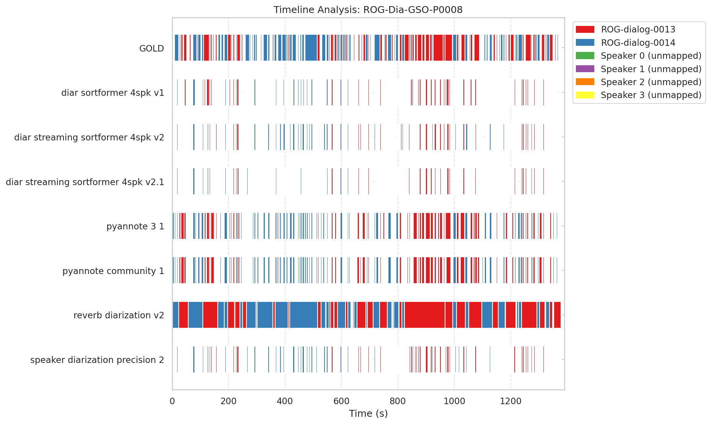

#### 60-Second Snippets (Zoom-in)
Below are 60-second zoomed-in windows showing where the models performed best and worst (based on average DER).

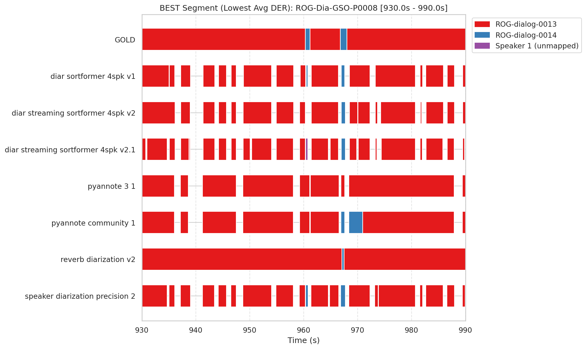

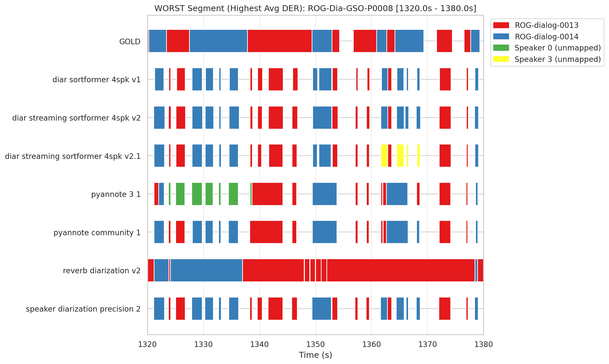

| Model                               | DER       | Miss     | FA       | Conf     | Pur       | Cov       | VRAM (GB)   |
|-------------------------------------|-----------|----------|----------|----------|-----------|-----------|-------------|
| reverb diarization v2               | **24.36** | **2.61** | 4.14     | 17.61    | 79.48     | 78.63     | 4.3         |
| speaker diarization precision 2     | 30.43     | 28.39    | **1.26** | **0.78** | 94.63     | **95.81** | **0.0**     |
| pyannote community 1                | 30.51     | 21.35    | 2.79     | 6.37     | 87.16     | 87.72     | 1.6         |
| pyannote 3 1                        | 31.66     | 21.35    | 2.78     | 7.52     | 86.64     | 86.46     | 1.6         |
| diar streaming sortformer 4spk v2   | 33.74     | 31.03    | 1.61     | 1.10     | 94.52     | 95.12     | 1.3         |
| diar sortformer 4spk v1             | 35.09     | 31.03    | 2.98     | 1.08     | 93.61     | 94.96     | 63.9        |
| diar streaming sortformer 4spk v2.1 | 40.82     | 34.89    | 1.53     | 4.40     | **95.17** | 90.34     | 1.3         |

---

### File: ROG-Dia-GSO-P0009

**Domain:** Družabni pogovor | **Quality:** 5 | **Device:** Mobilni telefon Iphone SE 2020

> *Posnetek je nastal v domačem okolju enega izmed govorcev med njim in njegovim dolgoletnim sosedom in prijateljem na pobudo snemalke. *

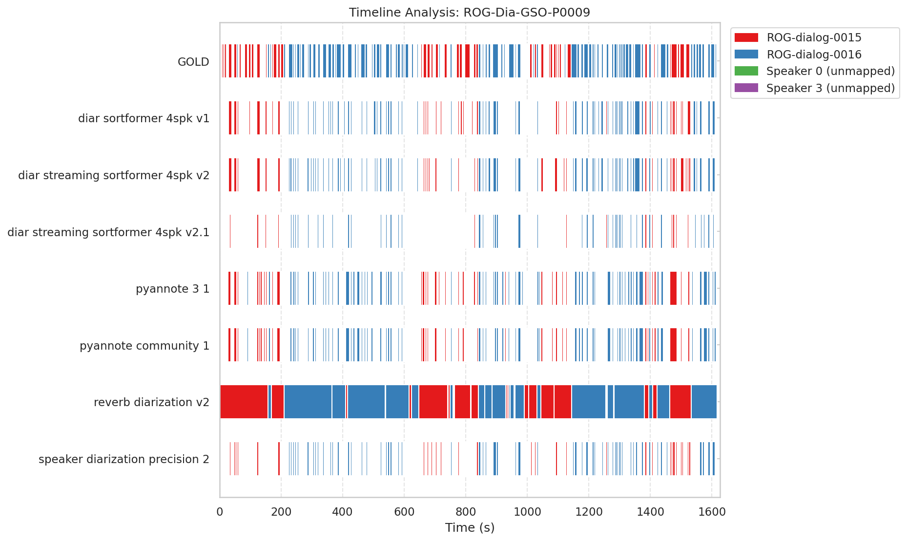

#### 60-Second Snippets (Zoom-in)
Below are 60-second zoomed-in windows showing where the models performed best and worst (based on average DER).

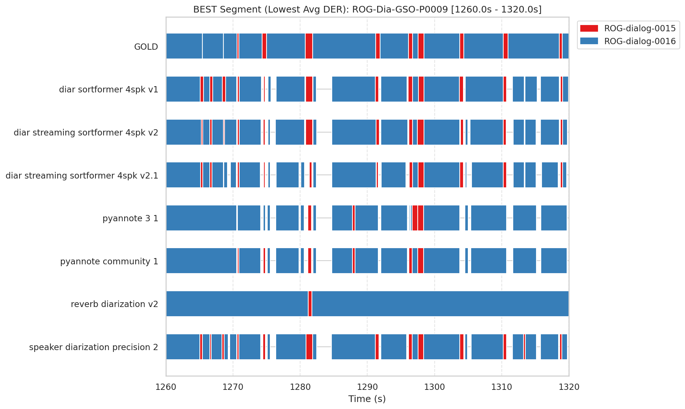

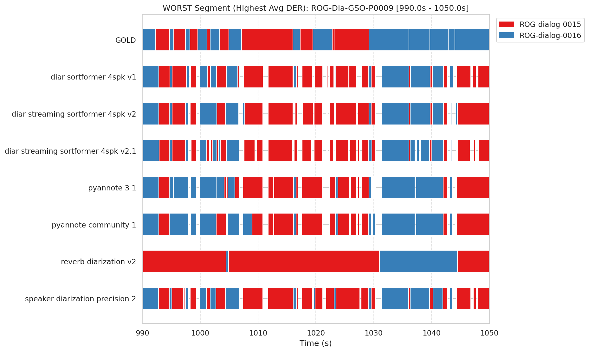

| Model                               | DER       | Miss      | FA       | Conf     | Pur       | Cov       | VRAM (GB)   |
|-------------------------------------|-----------|-----------|----------|----------|-----------|-----------|-------------|
| reverb diarization v2               | **19.85** | **12.45** | **1.51** | 5.89     | 81.11     | 79.43     | 4.3         |
| diar sortformer 4spk v1             | 19.95     | 17.05     | 2.36     | 0.54     | 81.33     | 84.33     | 87.1        |
| speaker diarization precision 2     | 20.13     | 17.51     | 2.21     | **0.41** | 81.04     | 83.87     | **0.0**     |
| diar streaming sortformer 4spk v2   | 21.49     | 19.35     | 1.64     | 0.50     | **82.00** | 85.00     | 1.4         |
| pyannote 3 1                        | 24.34     | 19.46     | 1.81     | 3.06     | 79.43     | 80.25     | 1.6         |
| pyannote community 1                | 24.40     | 19.46     | 1.81     | 3.13     | 79.36     | 80.35     | 1.6         |
| diar streaming sortformer 4spk v2.1 | 25.68     | 23.51     | 1.59     | 0.59     | 81.58     | **85.24** | 1.4         |

---

### File: ROG-Dia-GSO-P0011

**Domain:** Intervju | **Quality:** 4 | **Device:** Mobilna naprava Iphone 13, aplikacija Voice Record.

> *Govorca sta ženska in moški, oba stara okrog 50 let. Je večer, sedita za kuhinjsko mizo. Ženska postavlja moškemu vprašanja o domačem kraju, običajih in spominih iz otroštva ter mladosti. Moški odgovarja na njena vprašanja, ona pa ga med tem tudi spomni na pomembne točke, ki bi jih lahko vključil v svoje odgovore.*

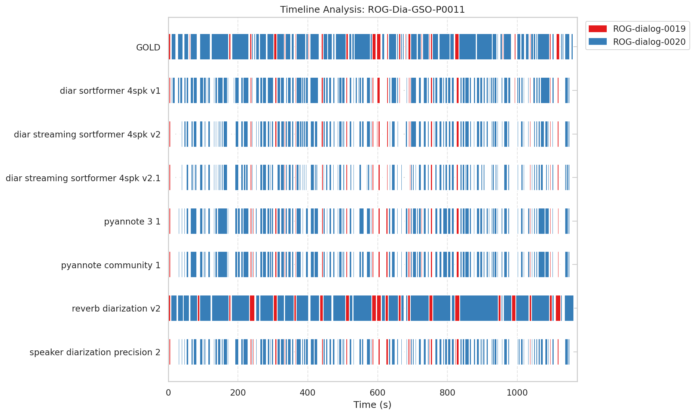

#### 60-Second Snippets (Zoom-in)
Below are 60-second zoomed-in windows showing where the models performed best and worst (based on average DER).

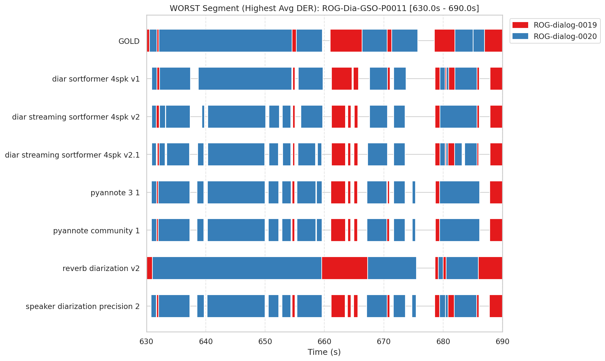

| Model                               | DER       | Miss     | FA       | Conf     | Pur       | Cov       | VRAM (GB)   |
|-------------------------------------|-----------|----------|----------|----------|-----------|-----------|-------------|
| reverb diarization v2               | **12.40** | **4.24** | 4.27     | 3.90     | 91.30     | 90.96     | 4.3         |
| diar sortformer 4spk v1             | 13.38     | 12.26    | 0.93     | 0.19     | **92.84** | **94.38** | 45.7        |
| speaker diarization precision 2     | 15.44     | 14.34    | 0.98     | 0.12     | 92.41     | 94.09     | **0.0**     |
| pyannote 3 1                        | 15.62     | 14.15    | 1.06     | 0.41     | 92.28     | 93.58     | 1.6         |
| pyannote community 1                | 15.73     | 14.15    | 1.06     | 0.53     | 92.16     | 93.51     | 1.6         |
| diar streaming sortformer 4spk v2   | 18.50     | 17.47    | 0.90     | 0.13     | 92.65     | 94.20     | 1.1         |
| diar streaming sortformer 4spk v2.1 | 20.17     | 19.18    | **0.88** | **0.11** | 92.40     | 94.33     | 1.1         |

---

### File: ROG-Dia-GSO-P0012

**Domain:** Intervju | **Quality:** 4 | **Device:** Pametni telefon Samsung Galaxy a53

> *Ena od sogovornic je prišla na obisk k drugi. Usedli sta se za mizo in pričeli s pogovorom.*

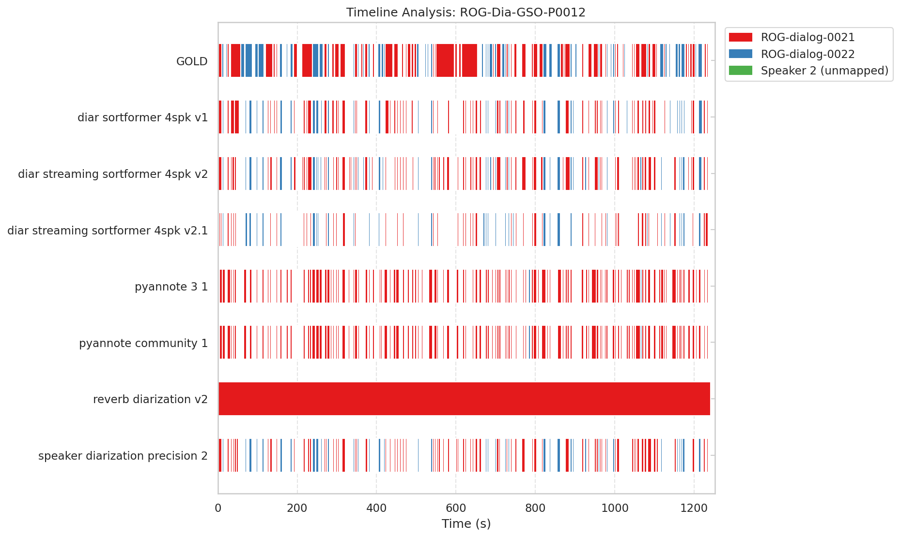

#### 60-Second Snippets (Zoom-in)
Below are 60-second zoomed-in windows showing where the models performed best and worst (based on average DER).

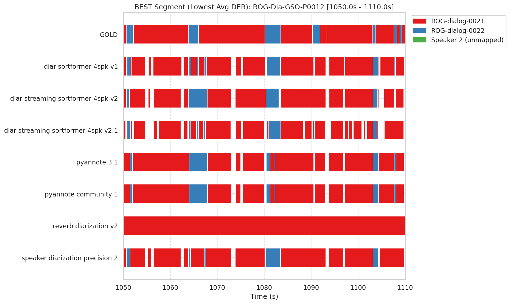

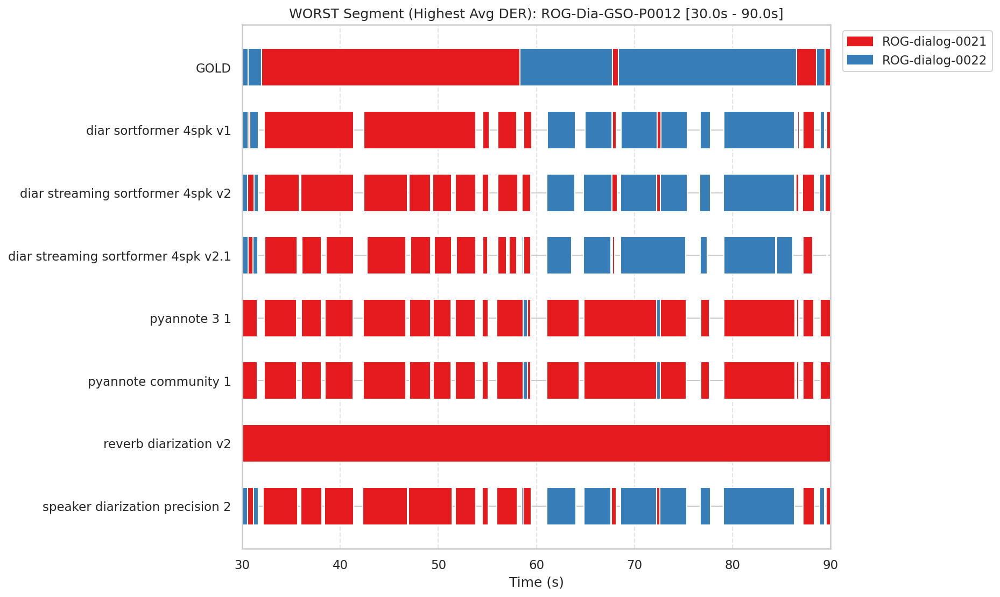

| Model                               | DER       | Miss     | FA       | Conf     | Pur       | Cov        | VRAM (GB)   |
|-------------------------------------|-----------|----------|----------|----------|-----------|------------|-------------|
| speaker diarization precision 2     | **16.33** | 14.67    | 1.20     | **0.46** | 84.69     | 87.01      | **0.0**     |
| diar streaming sortformer 4spk v2   | 16.44     | 14.27    | 1.54     | 0.63     | 84.09     | 85.88      | 1.2         |
| diar sortformer 4spk v1             | 18.02     | 16.07    | 1.34     | 0.61     | 84.59     | 87.79      | 51.9        |
| diar streaming sortformer 4spk v2.1 | 24.51     | 22.92    | 0.84     | 0.76     | **85.20** | 88.36      | 1.2         |
| reverb diarization v2               | 40.45     | **9.65** | **0.76** | 30.04    | 60.31     | **100.00** | 4.3         |
| pyannote community 1                | 42.31     | 15.32    | 1.51     | 25.47    | 59.17     | 90.25      | 1.6         |
| pyannote 3 1                        | 42.31     | 15.32    | 1.51     | 25.47    | 59.17     | 90.25      | 1.6         |

---

### File: ROG-Dia-GSO-P0016

**Domain:** Diskusija | **Quality:** 3 | **Device:** pametni telefon Huawei P30 PRO

> *Starejši moški in ženska imata diskusijo o svojem otroštvu, odraščanju na kmetih. *

> ⚠️ **ERRATA APPLIED**: Evaluation bounded to 1172.092s.

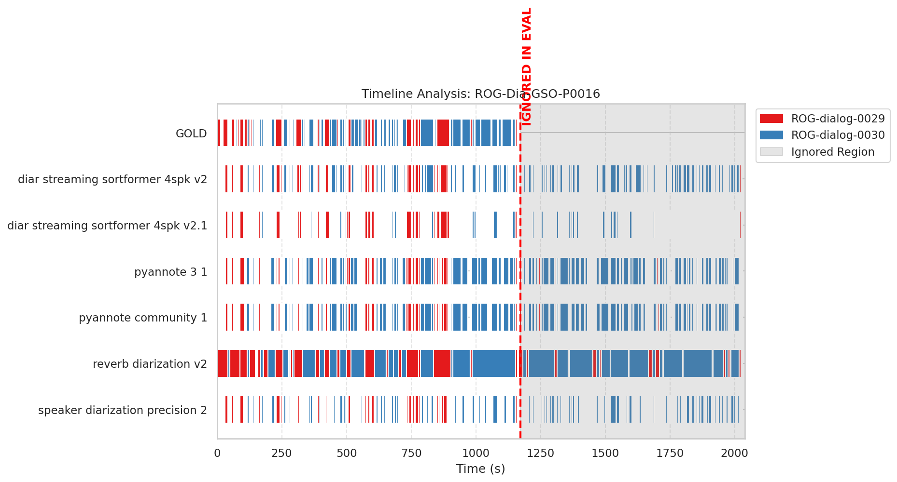

#### 60-Second Snippets (Zoom-in)
Below are 60-second zoomed-in windows showing where the models performed best and worst (based on average DER).

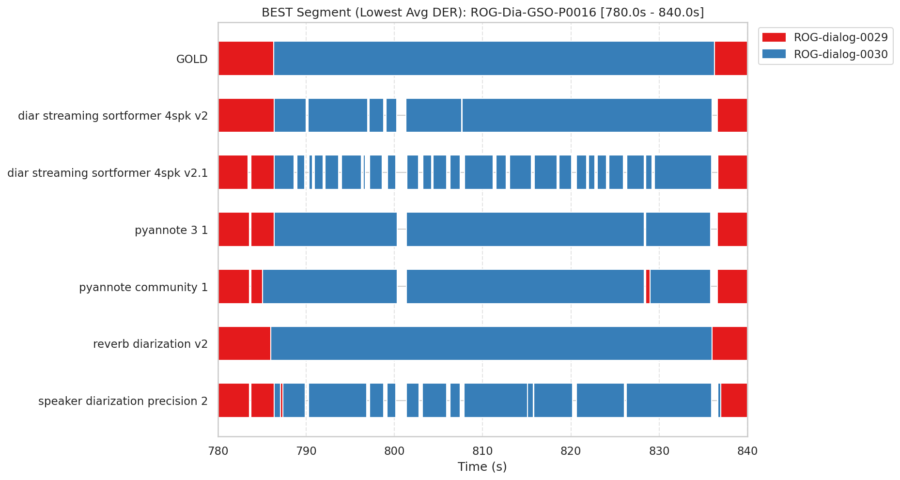

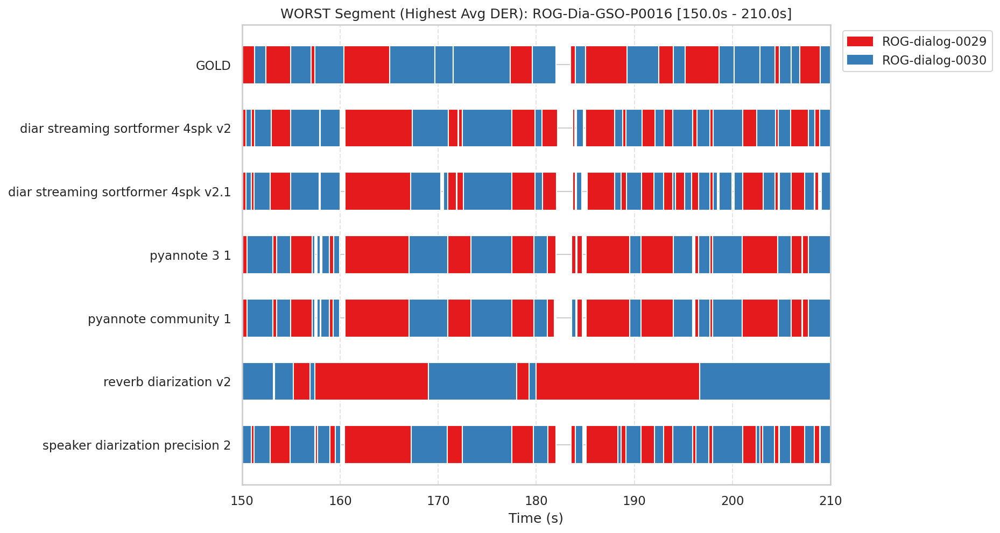

| Model                               | DER       | Miss      | FA       | Conf     | Pur       | Cov       | VRAM (GB)   | Status   |
|-------------------------------------|-----------|-----------|----------|----------|-----------|-----------|-------------|----------|
| diar streaming sortformer 4spk v2   | **13.43** | **11.58** | 1.36     | 0.49     | 81.18     | 83.06     | 1.6         | nan      |
| speaker diarization precision 2     | 15.05     | 13.23     | 1.39     | **0.42** | 80.94     | 83.05     | **0.0**     | nan      |
| pyannote 3 1                        | 15.07     | 11.60     | 1.66     | 1.81     | 80.45     | 81.95     | 1.6         | nan      |
| pyannote community 1                | 15.39     | 11.60     | 1.66     | 2.12     | 80.16     | 81.67     | 1.6         | nan      |
| reverb diarization v2               | 17.20     | 11.91     | **0.88** | 4.41     | **82.87** | 81.94     | 4.3         | nan      |
| diar streaming sortformer 4spk v2.1 | 19.27     | 17.57     | 1.21     | 0.50     | 81.25     | **83.67** | 1.6         | nan      |
| diar sortformer 4spk v1             | nan       | nan       | nan      | nan      | nan       | nan       | nan         | OOM/ERR  |

---

### File: ROG-Dia-GSO-P0018

**Domain:** Družabni pogovor | **Quality:** 5 | **Device:** telefon Samsung A52

> *Dobili smo se v župnišču, se pogovorili o prostoru snemanja, zahtevah posnetka. Govorki sta se odločili za spontan družabni pogovor brez vnaprej pripravljenih tem in vprašanj.*

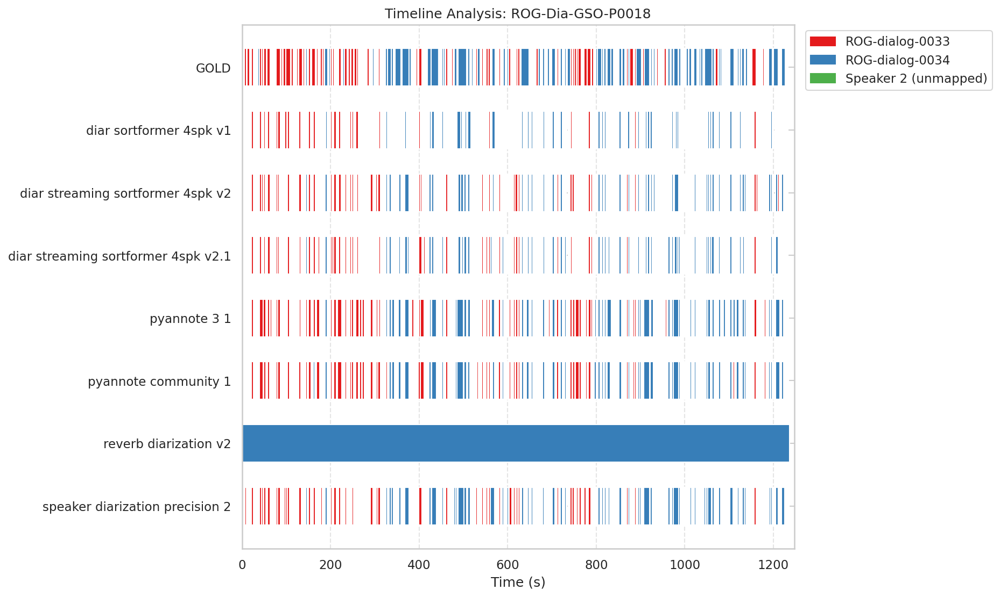

#### 60-Second Snippets (Zoom-in)
Below are 60-second zoomed-in windows showing where the models performed best and worst (based on average DER).

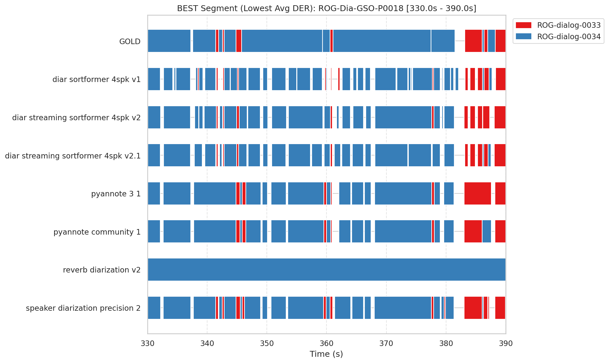

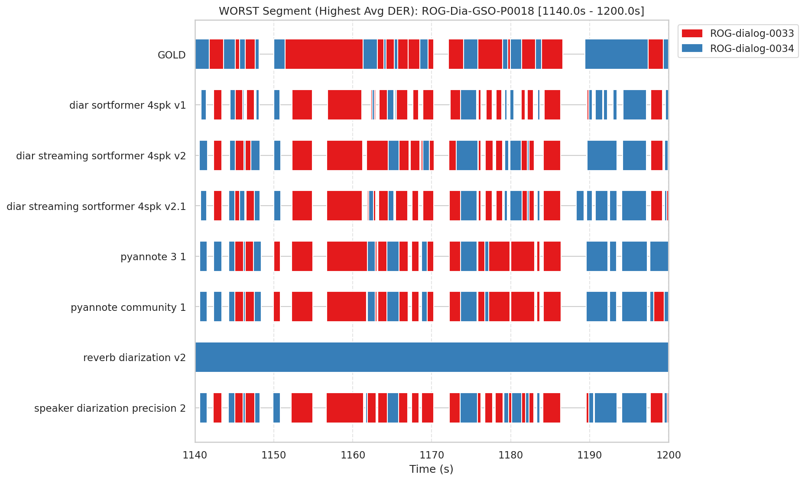

| Model                               | DER       | Miss      | FA       | Conf     | Pur       | Cov        | VRAM (GB)   |
|-------------------------------------|-----------|-----------|----------|----------|-----------|------------|-------------|
| speaker diarization precision 2     | **15.50** | 12.66     | **2.03** | **0.81** | **81.69** | 83.30      | **0.0**     |
| diar streaming sortformer 4spk v2   | 20.42     | 16.66     | 2.42     | 1.34     | 80.64     | 83.00      | 1.2         |
| pyannote 3 1                        | 20.89     | 13.32     | 2.62     | 4.95     | 77.66     | 78.68      | 1.6         |
| diar streaming sortformer 4spk v2.1 | 21.71     | 17.60     | 2.82     | 1.30     | 80.84     | 83.79      | 1.2         |
| pyannote community 1                | 22.82     | 13.32     | 2.62     | 6.89     | 75.82     | 77.08      | 1.6         |
| diar sortformer 4spk v1             | 27.26     | 22.70     | 2.93     | 1.63     | 79.69     | 82.40      | 51.6        |
| reverb diarization v2               | 50.52     | **11.09** | 2.84     | 36.59    | 52.31     | **100.00** | 4.3         |

---

### File: ROG-Dia-GSO-P0019

**Domain:** Pripoved | **Quality:** 4 | **Device:** Iphone 13 mini

> *Pogovor med sestro in bratom, ki sta se pogovarjala o potovanjih. Sestra je delila svojo izkušnjo potovanja v tujino, medtem ko jo je brat spraševal še o drugih vidikih potovanja – od priprav pred odhodom do krajev, ki jih je obiskala.*

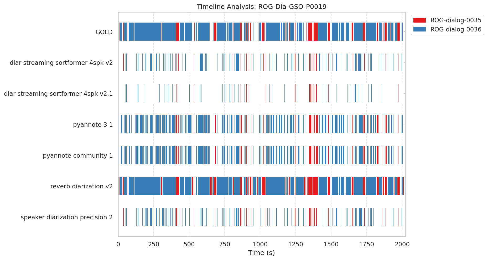

#### 60-Second Snippets (Zoom-in)
Below are 60-second zoomed-in windows showing where the models performed best and worst (based on average DER).

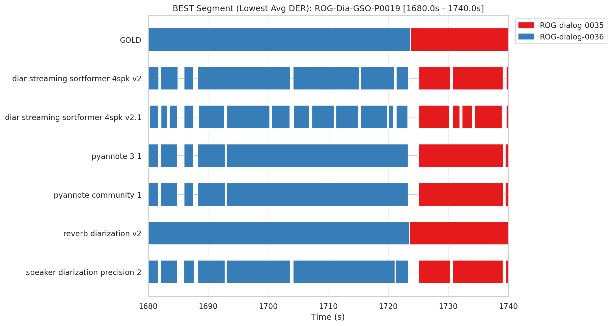

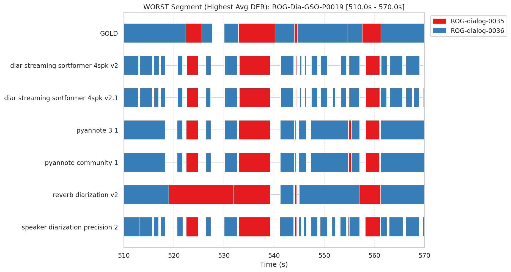

| Model                               | DER      | Miss     | FA       | Conf     | Pur       | Cov       | VRAM (GB)   | Status   |
|-------------------------------------|----------|----------|----------|----------|-----------|-----------|-------------|----------|
| reverb diarization v2               | **7.31** | **1.03** | 2.58     | 3.69     | 94.84     | 94.93     | 4.3         | nan      |
| pyannote 3 1                        | 12.42    | 11.98    | 0.39     | 0.05     | 98.59     | 98.90     | 1.6         | nan      |
| pyannote community 1                | 12.45    | 11.98    | 0.39     | 0.08     | 98.55     | 98.88     | 1.6         | nan      |
| speaker diarization precision 2     | 17.37    | 17.20    | 0.17     | **0.00** | **98.95** | 99.27     | **0.0**     | nan      |
| diar streaming sortformer 4spk v2   | 19.63    | 19.40    | 0.22     | 0.02     | 98.87     | 99.22     | 1.6         | nan      |
| diar streaming sortformer 4spk v2.1 | 23.43    | 23.27    | **0.16** | 0.00     | 98.94     | **99.29** | 1.6         | nan      |
| diar sortformer 4spk v1             | nan      | nan      | nan      | nan      | nan       | nan       | nan         | OOM/ERR  |

---

### File: ROG-Dia-GSO-P0021

**Domain:** Družabni pogovor | **Quality:** 4 | **Device:** Apple iPhone 15 Pro

> *Prijateljski pogovor med 2 osebama, ki se pogovarjata o splošnih temah; delo, prosti čas, hišni ljubljenčki, načrti za prihodnost, opis dela, itd*

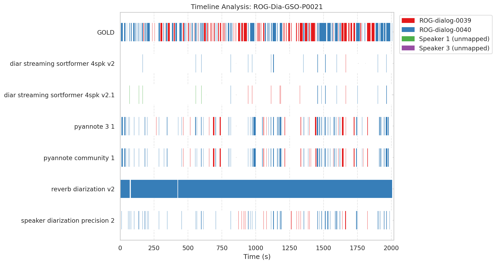

#### 60-Second Snippets (Zoom-in)
Below are 60-second zoomed-in windows showing where the models performed best and worst (based on average DER).

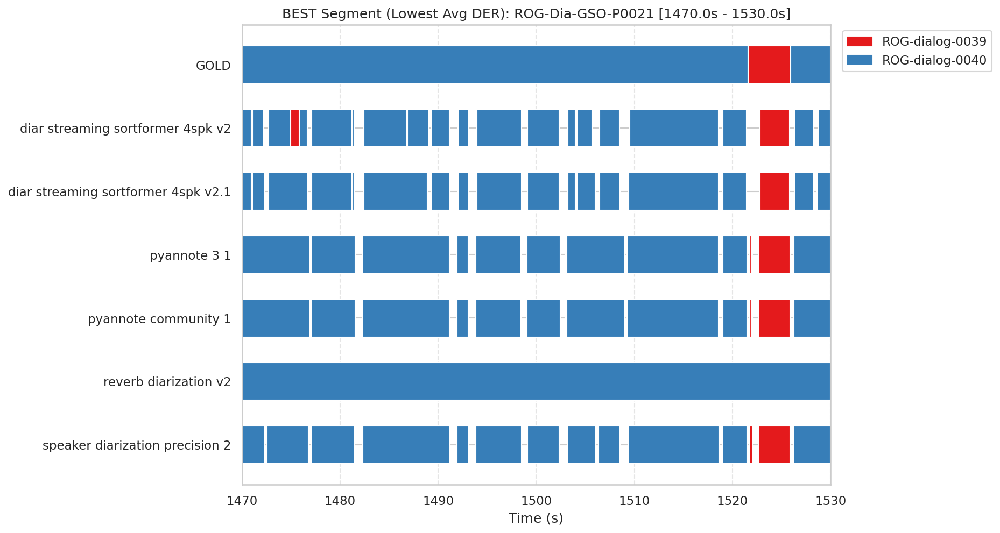

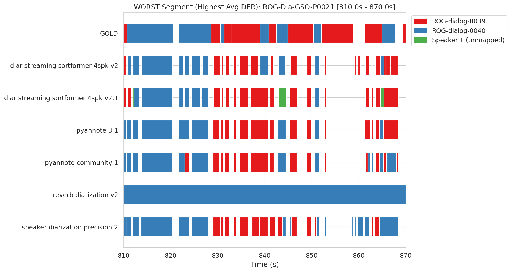

| Model                               | DER       | Miss     | FA       | Conf     | Pur       | Cov        | VRAM (GB)   | Status   |
|-------------------------------------|-----------|----------|----------|----------|-----------|------------|-------------|----------|
| speaker diarization precision 2     | **23.13** | 20.43    | 1.18     | **1.52** | **93.42** | 94.67      | **0.0**     | nan      |
| pyannote 3 1                        | 25.47     | 19.47    | 1.07     | 4.94     | 89.92     | 90.62      | 1.6         | nan      |
| pyannote community 1                | 26.32     | 19.47    | 1.07     | 5.78     | 88.92     | 90.03      | 1.6         | nan      |
| diar streaming sortformer 4spk v2   | 30.98     | 28.54    | **0.87** | 1.57     | 93.25     | 94.44      | 1.6         | nan      |
| reverb diarization v2               | 45.89     | **2.36** | 1.72     | 41.81    | 55.89     | **100.00** | 4.3         | nan      |
| diar streaming sortformer 4spk v2.1 | 60.22     | 27.44    | 1.32     | 31.46    | 82.09     | 54.38      | 1.6         | nan      |
| diar sortformer 4spk v1             | nan       | nan      | nan      | nan      | nan       | nan        | nan         | OOM/ERR  |

---

### File: ROG-Dia-GSO-P0022

**Domain:** Družabni pogovor | **Quality:** 5 | **Device:** Pametni telefon iphone 11 z aplikacijo Voice Record Pro z naročenimi nastavitvami. 

> *Pogovor med sorodnikoma o glasbenih skupinah in glasbenih izkušnjah.*

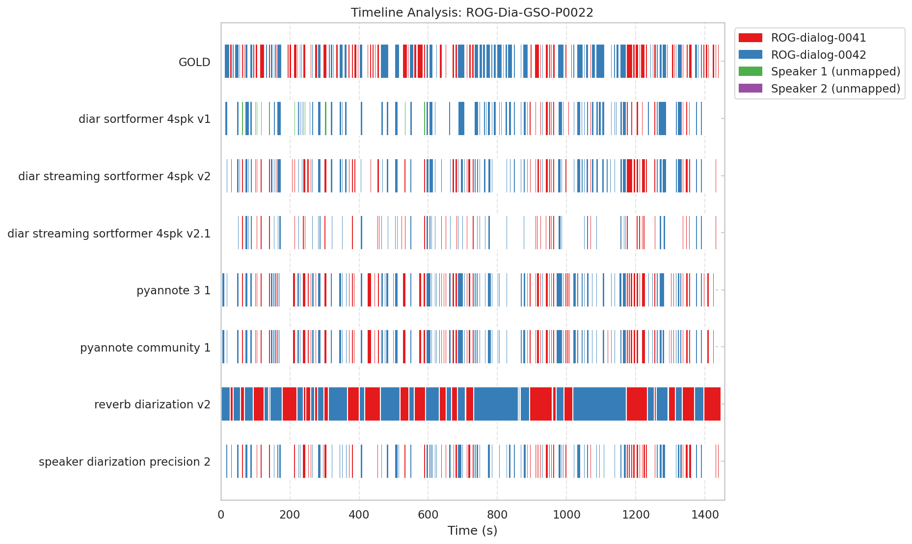

#### 60-Second Snippets (Zoom-in)
Below are 60-second zoomed-in windows showing where the models performed best and worst (based on average DER).

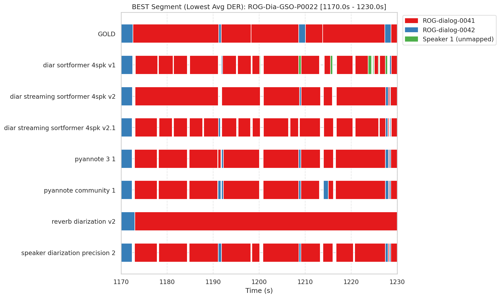

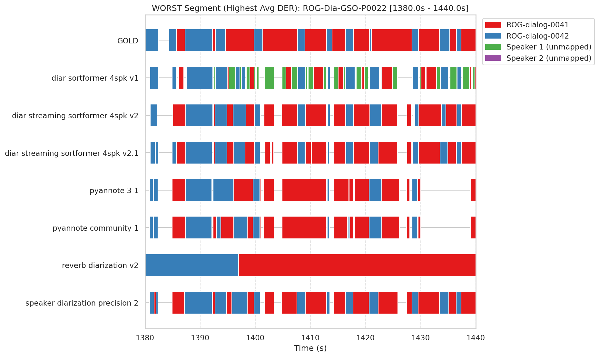

| Model                               | DER       | Miss     | FA       | Conf     | Pur       | Cov       | VRAM (GB)   |
|-------------------------------------|-----------|----------|----------|----------|-----------|-----------|-------------|
| speaker diarization precision 2     | **13.01** | 12.16    | 0.76     | 0.09     | 85.81     | 87.56     | **0.0**     |
| diar streaming sortformer 4spk v2   | 16.38     | 15.60    | **0.58** | 0.20     | 86.73     | 88.65     | 1.3         |
| pyannote 3 1                        | 16.77     | 13.53    | 1.07     | 2.17     | 84.24     | 84.79     | 1.6         |
| pyannote community 1                | 16.99     | 13.53    | 1.07     | 2.39     | 84.02     | 84.69     | 1.6         |
| reverb diarization v2               | 18.21     | **8.92** | 0.95     | 8.34     | 82.42     | 80.18     | 4.3         |
| diar streaming sortformer 4spk v2.1 | 19.12     | 18.40    | 0.64     | **0.08** | 86.10     | **88.85** | 1.3         |
| diar sortformer 4spk v1             | 35.48     | 17.05    | 0.92     | 17.51    | **87.11** | 71.72     | 69.9        |

---

### File: ROG-Dia-GSO-P0025

**Domain:** Navodila | **Quality:** 5 | **Device:** prenosni računalnik acer predator helios 300 z zunanjim mikrofonom RODE NT-USB

> *Pogovor o potovanju na Japonsko, iskanju novega stanovanja, službi in pripravi raznih Japonskih jedi*

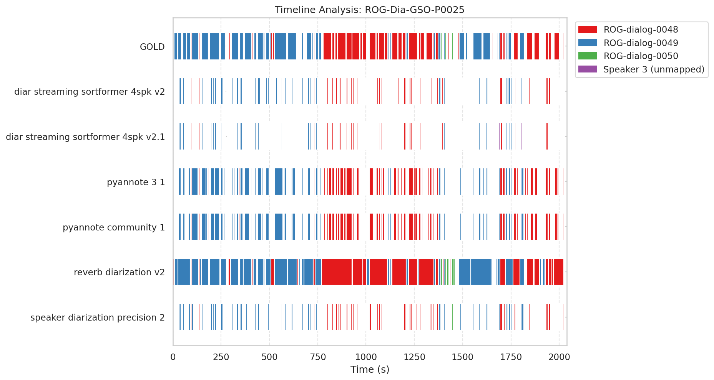

#### 60-Second Snippets (Zoom-in)
Below are 60-second zoomed-in windows showing where the models performed best and worst (based on average DER).

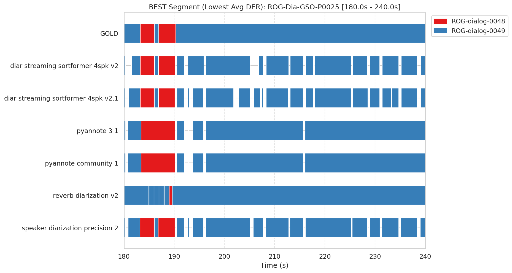

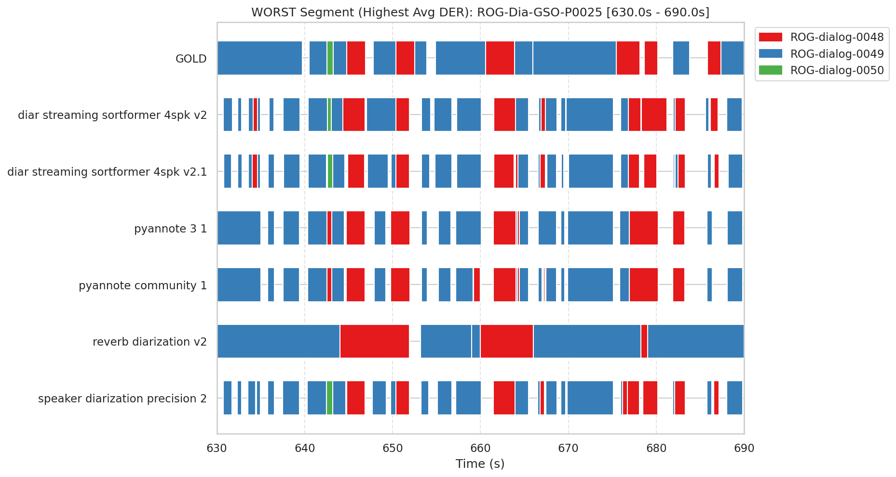

| Model                               | DER       | Miss     | FA       | Conf     | Pur       | Cov       | VRAM (GB)   | Status   |
|-------------------------------------|-----------|----------|----------|----------|-----------|-----------|-------------|----------|
| reverb diarization v2               | **13.85** | **3.45** | 5.99     | 4.42     | 91.66     | 91.60     | 4.3         | nan      |
| pyannote community 1                | 15.84     | 14.24    | 0.82     | 0.78     | 94.60     | 95.68     | 1.6         | nan      |
| pyannote 3 1                        | 15.88     | 14.24    | 0.82     | 0.82     | 94.55     | 95.41     | 1.6         | nan      |
| speaker diarization precision 2     | 19.93     | 18.88    | **0.77** | 0.28     | 94.77     | **95.93** | **0.0**     | nan      |
| diar streaming sortformer 4spk v2   | 22.58     | 21.16    | 1.23     | **0.19** | 94.38     | 95.67     | 1.6         | nan      |
| diar streaming sortformer 4spk v2.1 | 26.30     | 23.21    | 0.92     | 2.17     | **94.85** | 93.87     | 1.6         | nan      |
| diar sortformer 4spk v1             | nan       | nan      | nan      | nan      | nan       | nan       | nan         | OOM/ERR  |

---

